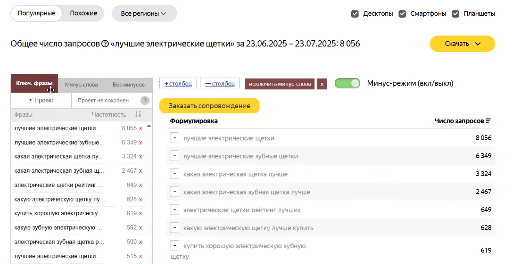
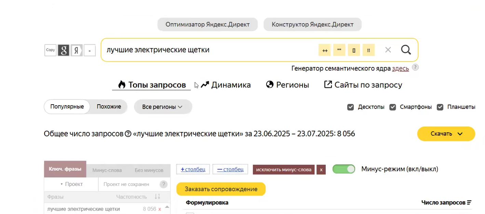

### 1\. Подготовка инструментов

-  **Установка расширения**: Установите расширение «UTA - Manager» для браузера.

   {width=1436px height=724px}

-  **Авторизация**: Войдите в расширение через Яндекс Почту.

-  **Интерфейс**: После установки и входа расширение интегрируется в интерфейс Яндекс Wordstat.

   {width=1339px height=688px}

### 2\. Принципы подбора ключевых фраз

-  **Тип запросов**: Для продвижения в «Топ-5» используйте преимущественно **информационные запросы**.

-  **Использование масок**: Собирайте семантику по основным маскам, комбинируя «лучшие / топ / рейтинг» с вашей категорией товара.

**Пример:**

*лучшие + категория товара*

*как выбрать + категория товара*

*топ + категория товара*

*рейтинг + категория товара*

:::lab 

*\*могут быть и другие маски из подобного пула*

:::

{width=1419px height=626px}

Нажимая на кнопку «плюсик» вы дополните список ключевых фраз.

{width=1297px height=678px}

:::tip 

Сначала можно собирать семантику в общий список, а уже позже разносить в гугл-таблице, так как нам нужно сохранить ее на будущее для расширения или перегруппировки.

:::

-  **Вопросные формы**: Используйте маски вида *«как выбрать \[категория\]»*.

:::note 

**Коммерческие запросы**: Старайтесь не брать фразы со словом *«купить»*, так как коммерческий трафик обходится дороже.

:::

:::tip 

Перед началом сбора ознакомьтесь с рейтингом, чтобы примерно понимать, какие запросы целевые, а какие - нет.

:::

### 3\. Процесс сбора и фильтрации

-  **Добавление в список**: Нажимайте на «плюсик» рядом с фразой в Wordstat, чтобы добавить её в общий список расширения.

-  **Анализ контента**: Перед сбором ознакомьтесь с содержанием статьи (рейтинга), чтобы понимать, какие запросы будут целевыми.

-  **Работа с брендами**:

   -  Не добавляйте бренды конкурентов, которые уже упоминаются в вашем «Топ-5» (это полезный трафик).

   -  Бренды, которых нет в статье, на старте лучше не добавлять, либо использовать их как дополнительный источник трафика, если охваты невелики.

### 4\. Организация данных в таблице

-  **Сохранение**: Перенесите собранные фразы вместе с частотностью в Google Таблицы для хранения и возможности дальнейшей перегруппировки.

-  **Группировка**: Распределите запросы по разным листам в зависимости от групп (масок).

-  **Минус-фразы**: Создайте отдельный лист для минус-фраз. При копировании из расширения удаляйте специальные символы, если они не требуются.

### 5\. Финальный результат

-  Итоговый файл должен содержать несколько листов с группами ключевых фраз и один лист с очищенным списком минус-слов.