## 1\. Перед началом работы

Перед началом работы вы должны получить ссылки.

**Первая ссылка** - прямая ссылка на запускаемый канал, ее можно взять из брифа или из чата.

**Вторая ссылка** - это та, которую мы добавляем в рейтинговую статью, она содержит метки **(UTM)**, по которым мы можем отследить трафик, а также идентификатор **(ibsid)** с помощью которого происходит проброс данных и мы фиксируем конверсии в Яндекс Метрике.

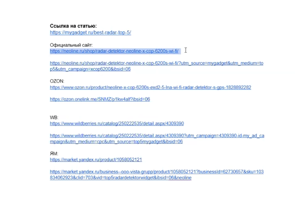{width=593px height=426px}

## 2\. Подготовка ссылок с метками

Прежде чем размещать ссылки на посадочной странице, их необходимо правильно подготовить для отслеживания трафика и конверсий.

### Работа с официальными сайтами и Wildberries

Для этих площадок можно использовать любые генераторы UTM-меток, например, «Тильда метки»:

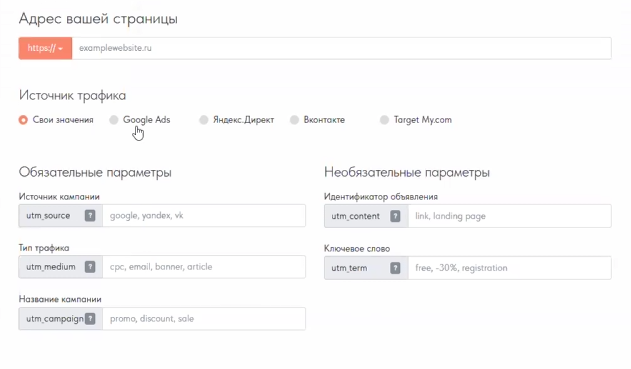{width=631px height=369px}

**1\.Вставьте прямую ссылку** на товар (без сторонних идентификаторов) из брифа или рабочего чата.

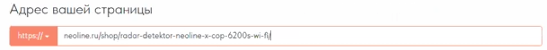{width=609px height=56px}

**2\. Пропишите стандартные значения меток**:

-  `utm_source`: `mygadget`.

-  `utm_medium`: `top5`.

-  `utm_campaign`: название модели товара (например, `xcop6200`).

**3\.Добавьте идентификатор (IBS ID)**: скопируйте получившуюся ссылку и в самом конце через разделитель (например, `&` или `/`) добавьте `ibs_id=06` (или актуальный номер вашего проекта).

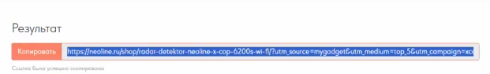{width=621px height=94px}

:::info 

Если мы запускаем новую категорию в проекте, нам необходимо узнать какой был предыдущий идентификатор и добавляем следующее значение *(прим.был 06 - будет 07)*.

:::

Ссылка готова, обратите внимание, что она похожа на ту, что изначально была подготовлена в примере на скриншоте.

Повторяем те же действия для WB. Ссылки отличаются, так как первоначальная ссылка могла генерироваться из блока внешнего трафика или с другими метками - такое возможно.

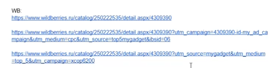{width=459px height=115px}

 

### Работа с Ozon

Обычные ссылки с метками для Ozon могут быть недействительны, поэтому их генерируют через личный кабинет клиента в блоке внешнего трафика.

**1\. Запросите ссылку у клиента**, отправив ему краткую инструкцию и стандартные метки (`my_gadget`, `top5`, название модели).

**2\.Проверьте наличие Диплинка (Deep Link)**:

-  **С диплинком**: короткая ссылка, которая сразу открывает мобильное приложение Ozon.

-  **Без диплинка**: развернутая полная ссылка на товар.

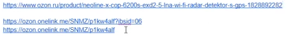{width=417px height=53px}

**3\.Особенности добавления IBS ID**:

-  Если ссылка **короткая**, перед идентификатором ставится **вопросительный знак** (`?ibs_id=06`). {width=206px height=17px}

-  Если ссылка **длинная (развернутая)**, используется стандартный разделитель (`&ibs_id=06`) или (`/ibs_id=06`).

После формирования, для удобства необходимо удалить лишние ссылки и оставить только корректную ссылку с ibsid.

### Работа с Яндекс Маркетом

Ситуация аналогична Ozon -- обычные ссылки часто не работают.

1. **Запросите генерацию ссылки** из блока внешнего трафика у клиента по инструкции.

2. К полученной ссылке также обязательно **добавьте идентификатор** `ibs_id`.

---

## 2\. Размещение ссылок на посадочной странице

После того как все ссылки с метками и идентификаторами готовы, переходите к их публикации на сайте.

### Редактирование через раздел «Записи»

В этом разделе меняются ссылки в тексте и сводных таблицах:

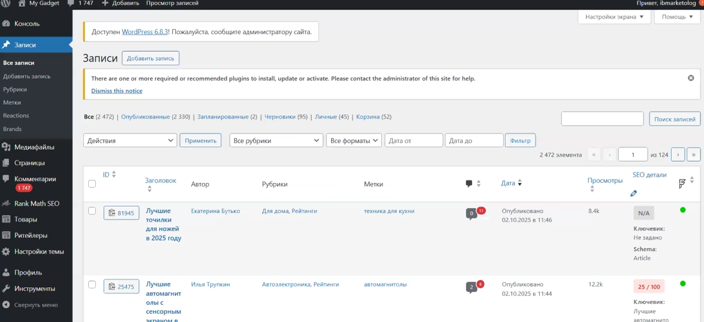{width=1174px height=538px}

**1\. Найдите нужную статью в списке записей** (например, «Лучшие радар-детекторы»).

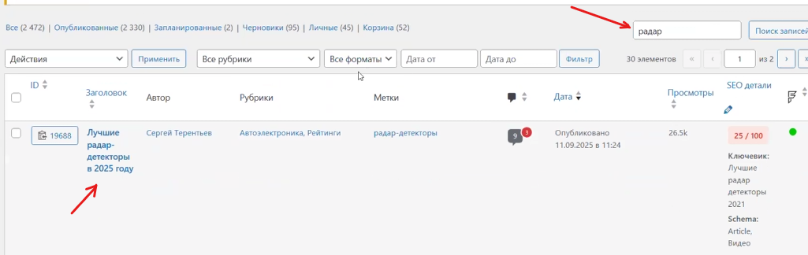{width=1025px height=324px}

[image:./podgotovka-ssylok-dlya-top-5-razmeschenie-v-stat-10.png:::0,0,100,100:100::1021px:128px:center]

**2\. В сводной таблице (в начале)**: удалите старую ссылку и вставьте новую подготовленную. Обязательно нажмите «Сохранить».

**3\. По ходу текста**: найдите все упоминания товара клиента и обновите ссылки на кнопках или гиперссылках.

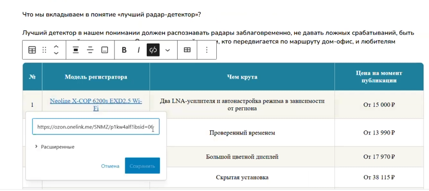{width=835px height=372px}

{width=279px height=222px}

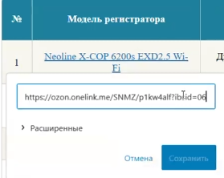{width=279px height=222px}

**4\. В таблице в конце и блоке «Итоги»**: проверьте актуальность ссылок там, особенно для модели на первом месте.

**5\.  После всех корректировок нажмите кнопку «сохранить» и подождать пока все сохраниться.**

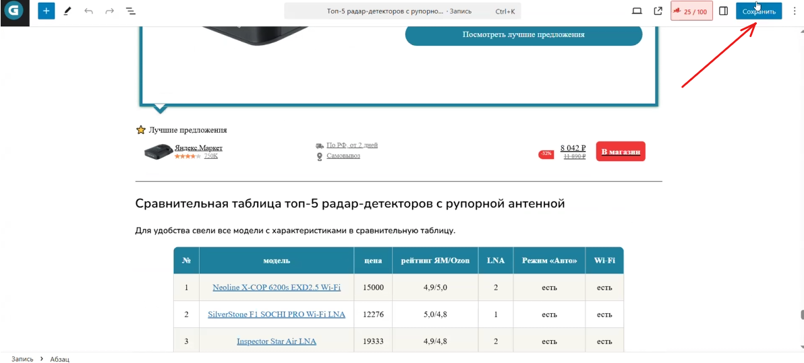{width=1192px height=539px}

### Редактирование через раздел «Товары» (Товарный виджет)

Здесь настраивается отдельный блок с карточкой товара:

**1\. Найдите строчку по названию товара.**

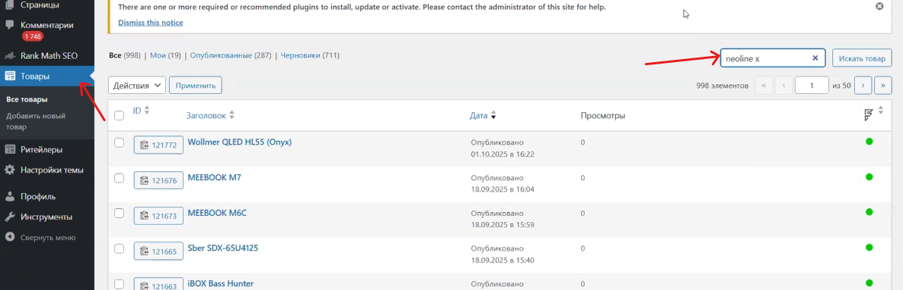{width=1186px height=383px}

**2\. Заполните поля для площадок**: вставьте конечные ссылки (с метками и ID) для официального сайта, Ozon, Wildberries и Яндекс Маркета.

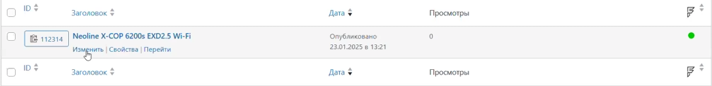{width=1044px height=128px}

После открытия ссылки проверьте, точно ли такое же название товара стоит в товарных виджетах, как и в таблице.

Пролистайте до конца. Вы найдете табличную часть с настройкой ссылок отдельно для официального магазина, OZON, WIldberries 

Вносим разные ссылки на нужные нам площадки. 

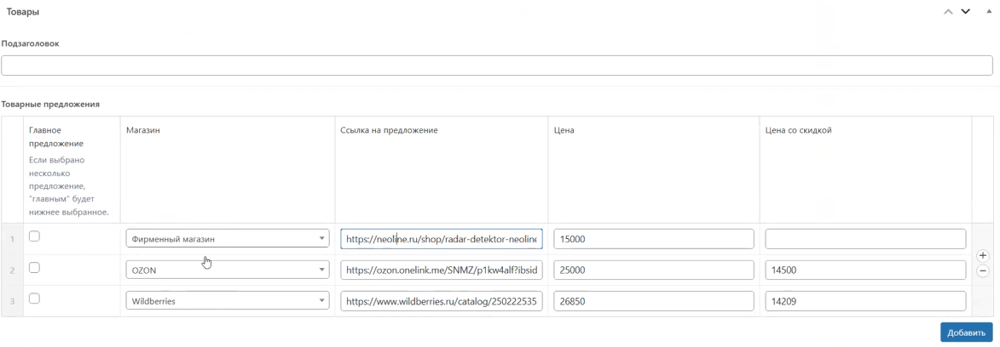{width=1173px height=408px}

**3\. Очередность кнопок**: первая ссылка в списке будет отображаться на основной большой кнопке виджета. Если в брифе указан приоритет (например, официальный сайт), ставьте его первым.

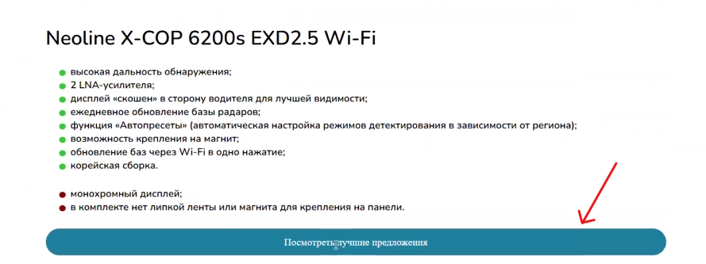{width=889px height=333px}

**4\. Проверка цен**: зайдите на каждую площадку через **режим инкогнито**. Это нужно, чтобы видеть актуальную цену без персональных скидок вашего аккаунта. Впишите актуальные цены и цены со скидкой в поля виджета.

После внесения всех изменений, также нажмите на кнопку «сохранить» и дождитесь внесения изменений.

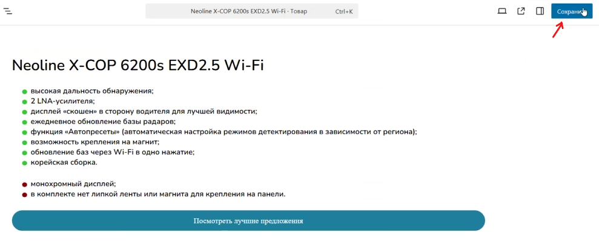{width=989px height=399px}

---

## 3\. Настройка целей в Яндекс.Метрике

Цели настраиваются строго после размещения ссылок на сайте.

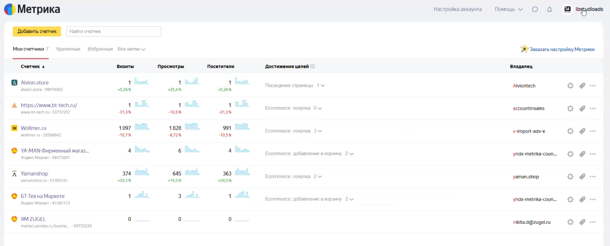{width=1179px height=477px}

### Порядок добавления целей

Рекомендуется идти по порядку расположения кнопок в статье сверху вниз.

**1\. Находим нужную статью в списке, переходим по ней.**  После прогрузки страницы переходим в «Цели».

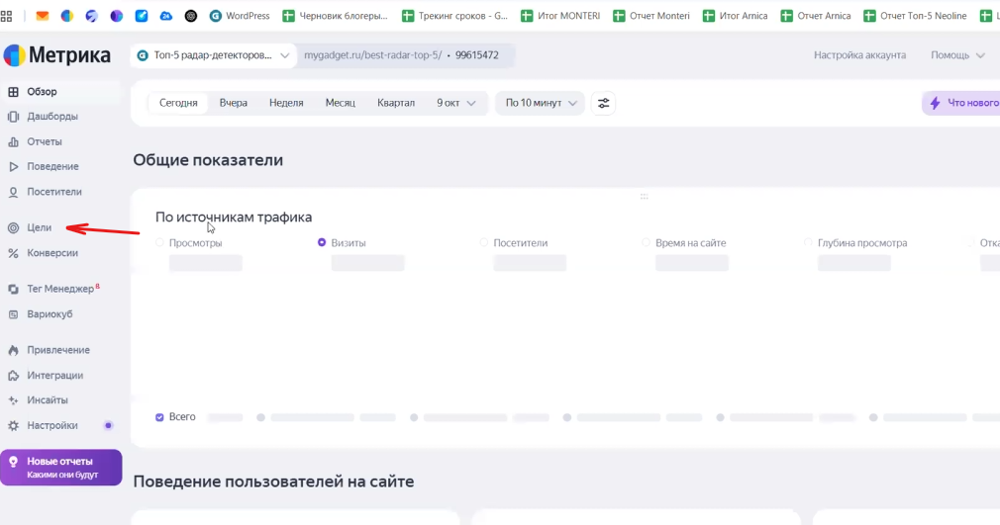{width=1010px height=531px}

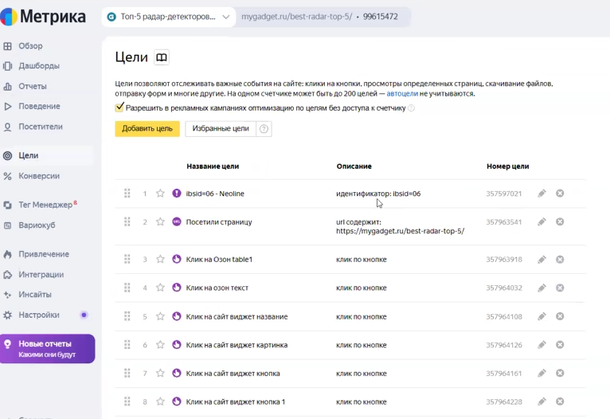{width=766px height=526px}

**2\. Для создания цели нажмите кнопку «Добавить цель».**

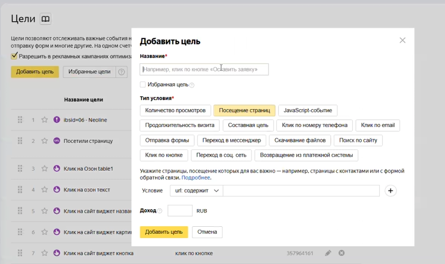{width=752px height=447px}

Добавлять цели лучше по порядку того, как идут ссылки в статье.  

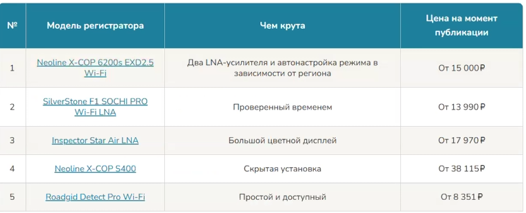{width=766px height=311px}

Так как в примере ссылка ведет на Ozon - мы можем назвать цель: `Ссылка Ozon - таблица 1`

**3\. Кнопки в сводной таблице и тексте**:

-  Назовите цель понятно: «\[Площадка\] \[Место\]» (например, *«Ссылка Ozon Таблица 1»* или *«Ссылка Сайт Текст 1»*).

-  Тип условия: **«Клик по кнопке»**.

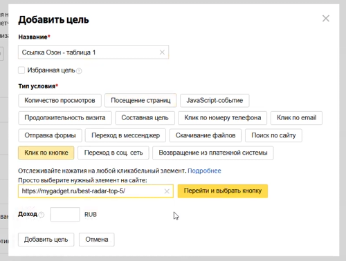{width=500px height=378px}

-  Выберите нужную ссылку. Нажмите «перейти и выбрать кнопку». Физически кликните на кнопку в интерфейсе настройки, чтобы система её запомнила. Нажмите «отслеживать клики».

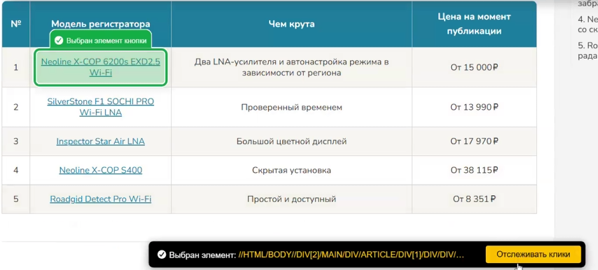{width=854px height=386px}

-  Нажмите «Добавить цель». И она автоматически появится в списке.

-  Продолжаем идти по статье и настраиваем цели для всех элементов в тексте (и в итогах) и в табличных частях.

**4\. Кнопки в товарном виджете**: В одном виджете обычно настраивается 5 целей (на каждый кликабельный элемент):

-  **Заголовок виджета** (ведет на основную площадку).

-  **Основная кнопка** (также ведет на основную площадку).

-  **Отдельные иконки маркетплейсов** (Ozon, Wildberries, Яндекс Маркет и др.).

-  Называйте их по порядку: *«Клик Сайт Виджет 1»*, *«Клик Сайт Виджет 2»* и т.д..

**5\. Цель на посещение страницы**:

-  Обязательно нужно добавить цель на посещение страницы.

-  Нажимаем добавить цель.

-  Тип условия: **«Посещение страницы»**.

-  Укажите URL статьи (можно без финального слеша).

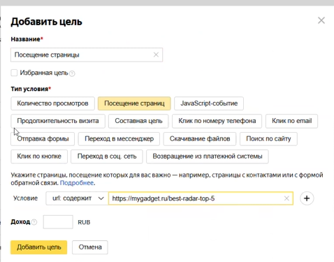{width=478px height=375px}

### Финальный этап

После сохранения всех целей проверьте их работоспособность. Если все сделано правильно, вы сможете отслеживать эффективность каждого рекламного канала и каждого конкретного места размещения в статье.