Данная система позволяет защитить рекламные кампании от скликивания ботами. Как показал анализ на проекте Alvion, после её внедрения бюджет экономится, а целевой трафик становится дешевле на 25% при сохранении прежнего количества конверсий.

### Этап 1: Согласование с командой/клиентом

-  Перед установкой необходимо согласовать подключение сервиса.

-  Напишите ответственному лицу (например, Николаю в чат "Arnica") о наличии инструмента и готовности его подключить.

-  В качестве аргумента укажите, что целевой трафик должен стать дешевле на 25%.

-  Дождитесь согласия на выполнение действий.

### Этап 2: Подключение сервиса в eLama

-  Откройте основную страницу сервиса eLama.

[image:./podrobnaya-instrukciya-po-podklyucheniyu-antifrod.png:::0,0,100,100:60::630px:560px:center]

-  Перейдите в раздел «Маркетплейс инструментов».

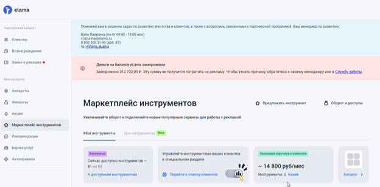{width=624px height=308px}

-  Убедитесь, что вы находитесь в основном аккаунте.

-  Найдите сервис «Бот Фактор» (Botfactor), перейдите на вкладку «Использовать» (или «Подключить») и нажмите кнопку «Добавить сайт».

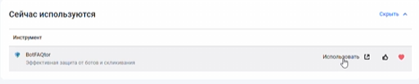{width=468px height=94px}

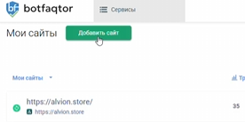{width=276px height=138px}

-  Введите нужный адрес сайта и укажите его название.

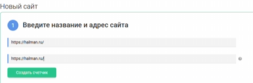{width=413px height=136px}

-  Нажмите кнопку «Создать счетчик».

### Этап 3: Настройка параметров защиты

-  В открывшемся окне выберите два инструмента: «Антибот для сайта» (блокировка будет происходить на стороне сайта) и «Защита от скликивания Яндекс Директ».

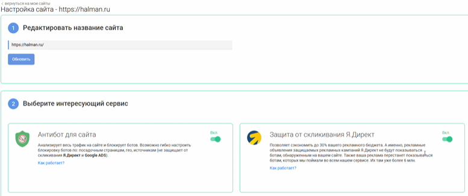{width=777px height=325px}

-  Остальные параметры оставьте автоматическими, ничего менять не нужно.

### Этап 4: Интеграция с Яндекс Метрикой

-  Для работы системе нужно дать доступ к Яндекс Метрике.

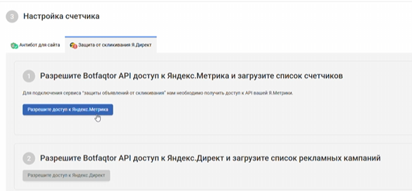{width=585px height=272px}

-  Убедитесь, что вы авторизованы в аккаунте Яндекса, у которого есть права на **редактирование** нужного счетчика (например, аккаунт IBStudioadv, а не просто доступ на просмотр).

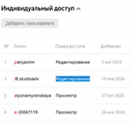{width=162px height=157px}

-  Разрешите доступ к Метрике из данного аккаунта.

-  Найдите нужный номер счетчика в списке, выберите его и нажмите «Подтвердить».

### Этап 5: Интеграция с Яндекс Директ (Особенности авторизации)

-  Следующим шагом необходимо разрешить доступ к Яндекс Директ.

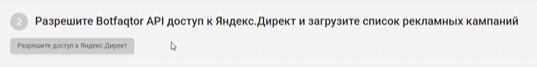{width=537px height=67px}

-  **Важный нюанс:** Если нужный рекламный кабинет Директа авторизован у вас в *другом* браузере, не нужно проходить авторизацию заново с вводом кодов. Просто скопируйте ссылку для авторизации Бот Фактора и откройте её в том браузере, где уже выполнен вход в нужный аккаунт Яндекс Директ.

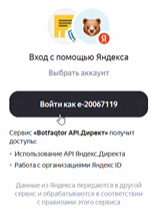{width=154px height=214px}

-  В этом браузере нажмите кнопку «Разрешить», после чего должна появиться ссылка-подтверждение.

:::lab 

*Примечание:* Авторизоваться в Бот Факторе под бесплатным аккаунтом можно только через интерфейс eLama, поэтому продолжайте процесс именно оттуда.

:::

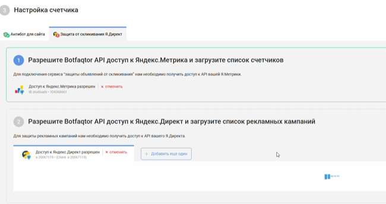{width=650px height=344px}

### Этап 6: Выбор рекламных кампаний

-  После того как страница прогрузится, система предложит выбрать рекламные кампании, в которых должен работать антифрод.

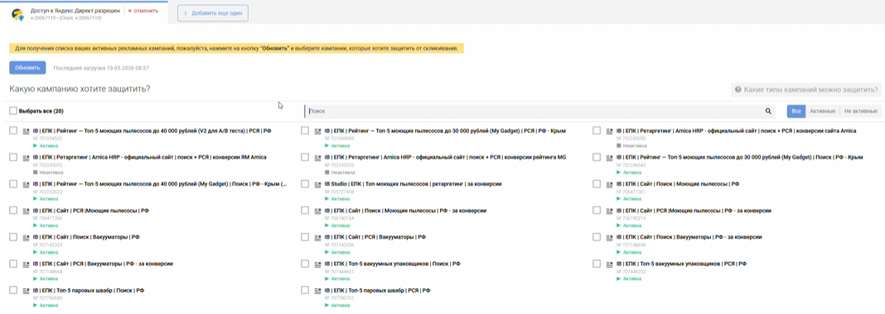{width=1068px height=380px}

-  В первую очередь выбирайте кампании, связанные с **прямой рекламой** , так как система на них уже протестирована.

-  Отметьте нужные кампании и нажмите «Сохранить».

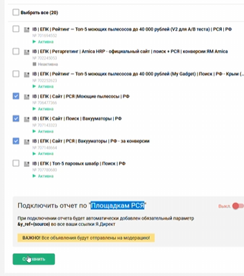{width=352px height=397px}

-  Дополнительные настройки на данном этапе пока пропускаем.

   ### Этап 7: Установка кода на сайт

-  Для регистрации трафика необходимо установить код счетчика непосредственно на сайт.

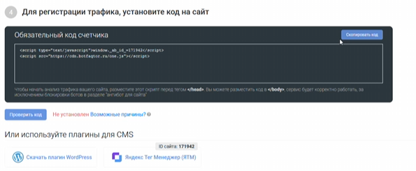{width=595px height=245px}

-  Уточните, на какой платформе (CMS-системе) разработан сайт.

-  Скопируйте код счетчика и отправьте его клиенту (например, Николаю).

-  Обязательно приложите для разработчика ссылку на инструкцию по добавлению кода на сайт, которая есть в интерфейсе. 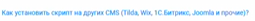{width=255px height=21px}

-  После того как разработчик сообщит об установке, нажмите в интерфейсе кнопку «Проверить».

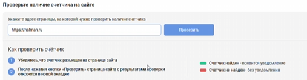{width=507px height=132px}

-  Если все сделано верно, должны появиться уведомления «счетчик установлен» и «счетчик найден». 

### Этап 8: Мониторинг эффективности

-  Еженедельные отчеты на почту могут быть неудобными, поэтому аналитику лучше проводить напрямую в интерфейсе Бот Фактора.

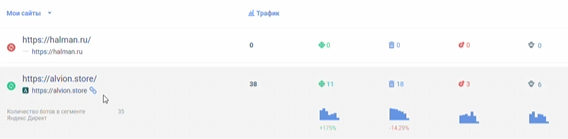{width=568px height=139px}

-  Проваливайтесь внутрь раздела , если нужен только Директ.

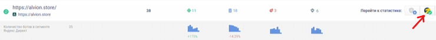{width=740px height=68px}

-  В статистике доступны различные срезы для оценки эффективности: посещения страниц, отправка форм, Ecommerce-покупки.

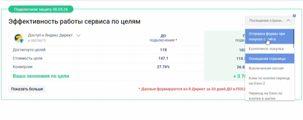{width=515px height=205px}

-  Оценивайте успешность по снижению стоимости достижения целей (например, удешевление уникального посещения страницы).

### Посмотреть видео-обучение можно тут:

[Первая часть.](https://mygadget.bitrix24.ru/bitrix/tools/disk/focus.php?objectId=426796&cmd=show&action=showObjectInGrid&ncc=1)

[Вторая часть. ](https://mygadget.bitrix24.ru/bitrix/tools/disk/focus.php?objectId=426794&cmd=show&action=showObjectInGrid&ncc=1)