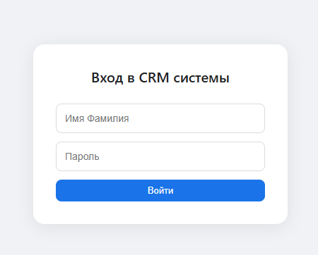
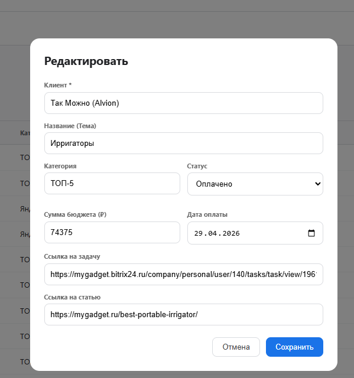
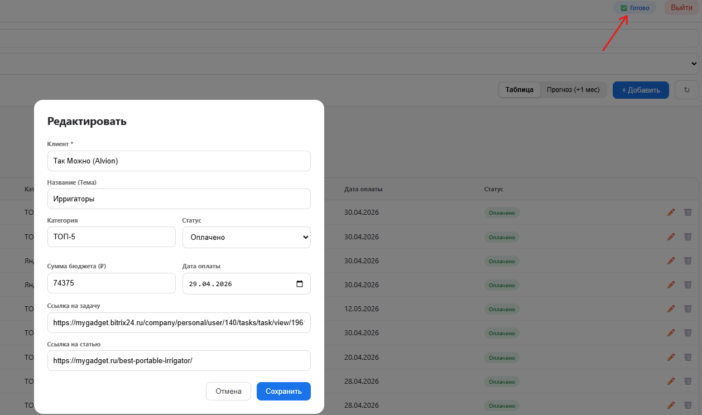
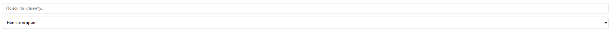
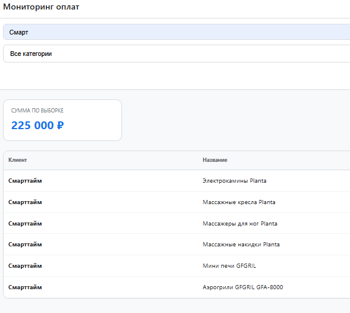
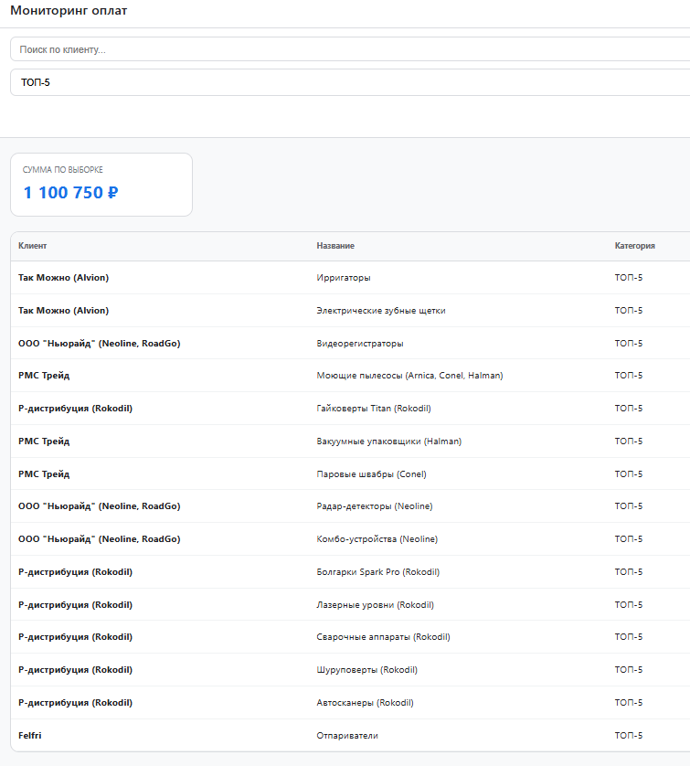
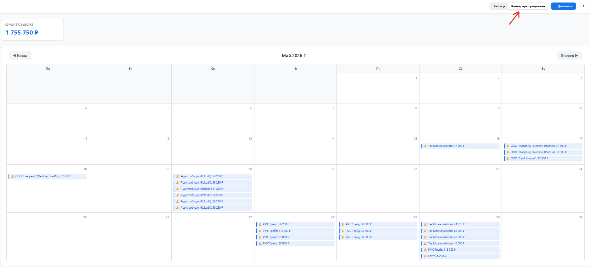
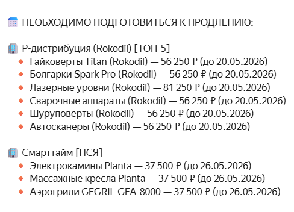

Данный модуль предназначен для работы с бюджетами клиентов. Информацию в систему необходимо заносить **сразу после оплаты** клиента.

### 1\. Получение доступа и авторизация

1. **Запросите доступ:** Напишите ответственному за выдачу доступов в таблицу (на данный момент это проджект-менеджер), чтобы получить ваш логин и пароль.

2. **Перейдите в модуль:** Откройте ссылку <https://ibstudio-ru.github.io/payment-tracker/payment_tracker.html>

3. **Войдите в систему:** Введите полученные логин и пароль, затем нажмите кнопку **«Войти»**. Перед вами загрузится таблица с уже действующими проектами

{width=450px height=362px}

### 2\. Редактирование данных

Для того чтобы обновить бюджет, дату или ссылку в существующем проекте:

1. Нажмите на **иконку карандаша** в строке нужного проекта.

   {width=599px height=640px}

2. Введите новые данные в нужные поля.

3. Нажмите кнопку **«Сохранить»**.

4. Обязательно дождитесь, пока индикатор в верхнем правом углу не покажет статус **«Готово»**.

{width=1830px height=39px}

{width=1258px height=744px}

### 3\. Добавление новой записи

Если вам необходимо добавить новую категорию, проект или клиента:

1. Нажмите кнопку **«Добавить»**.    {width=85px height=34px}

2. Заполните все требуемые поля.

3. Нажмите кнопку **«Сохранить»** и дождитесь статуса **«Готово»**.

:::quote 

Новая строка сразу появится в общей таблице. В дальнейшем её нужно будет только редактировать по инструкции из пункта 2.

:::

{width=115px height=50px}

### 4\. Использование фильтров

Для быстрого ориентирования в таблице предусмотрены следующие инструменты:

{width=1884px height=99px}

-  **Поиск по клиенту:** помогает быстро отсортировать таблицу и найти конкретного клиента.

{width=588px height=526px}

-  **Поиск по категориям:** позволяет вывести на экран всех клиентов, относящихся к выбранной категории.

{width=755px height=838px}

### 5\. Работа с календарем и датами продления

Раздел «Календарь» позволяет в удобной форме отслеживать клиентов, у которых планируется следующее списание или продление.

-  **Алгоритм расчета:** Продление рассчитывается с шагом в один месяц. Если дата оплаты 12.05, то в календаре клиент появится на 12.06 как напоминание о необходимости пополнить бюджет.

-  **Единая дата продления:** Если у клиента зафиксирована конкретная дата, **не редактируйте** запись до тех пор, пока он не совершит оплату. Ставьте новое (выбранное для постоянного продления) число только тогда, когда клиент снова вносит бюджет, чтобы не сбивать график и самих себя.

-  **Сдвиг дат:** Если возникают ситуации, требующие корректировки чисел и сдвига дат продления, просто внесите новую дату и актуальную сумму бюджета.

{width=1873px height=851px}

### 6\. Настройка уведомлений

Система автоматически рассылает напоминания о продлениях на привязанную электронную почту и в рабочую группу в Telegram.

-  Чтобы видеть эти сообщения, обратитесь к ответственному сотруднику с просьбой добавить вас в соответствующую рассылку.

{width=488px height=352px}