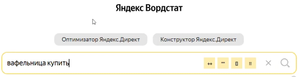
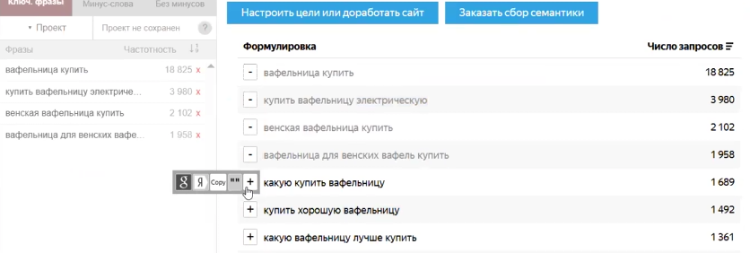
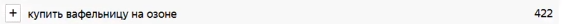
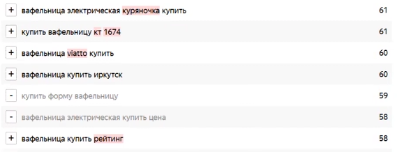
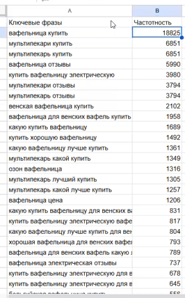
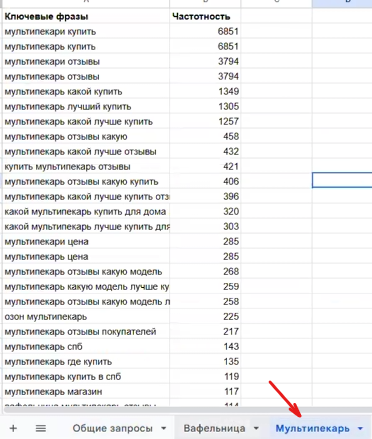
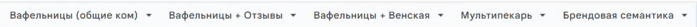

Разберем как собирать семантику по коммерческим запросам на примере вафельницы.

### Шаг 1. Предварительный анализ товара

Прежде чем нажимать кнопки в сервисах сбора слов, необходимо понять, что именно мы рекламируем.

**1\. Изучите модели:** Посмотрите характеристики товара (например, вафельницы).

**2\. Определите ключевые особенности:** например,

-  Тип панелей (съемные или несъемные).

-  Функционал (только вафли или «мультипекарь» для разных блюд).

-  Тип выпечки (венские, бельгийские или тонкие вафли-трубочки).

**3\. Сформулируйте «Маски»:** Это основные словосочетания, от которых вы будете отталкиваться (например, «вафельница» и «мультипекарь»).

---

### Шаг 2. Сбор и фильтрация запросов

Используйте сервис подбора слов (например, вордстат) для сбора коммерческих запросов.

**1\. Комбинируйте маску с коммерческим словом:** Введите в поиск «вафельница купить» или «вафельница цена». Также можно «вафельница отзывы». Можно также добавлять гео-запросы, например «вафельницы Москва».

{width=618px height=159px}

**2\. Отбор подходящих фраз:** Просматривайте список и добавляйте (нажимая на «плюсик») те, что соответствуют вашему товару (например, «венские» или «бельгийские», если прибор печет именно их).

{width=836px height=282px}

**3\. Сбор маркетплейсов:** Обязательно соберите запросы, связанные с площадками, на которых представлен товар (например, «вафельница вайлдберриз» или «озон»).

{width=563px height=24px}

**4\. Глубина сбора:** Рекомендуется собирать до 20–30 запросов по частотности. Слишком низкочастотные фразы (с малым количеством поисков) на старте брать нецелесообразно.

---

### Шаг 3. Минусация (Отсеивание лишнего)

Это самый важный этап, чтобы не тратить деньги на нецелевых клиентов. 

**Минусуйте (кликните левой кнопкой мыши на слово) следующее:**

-  **Чужие бренды:** Если вы продаете бренд «Планта», сразу убирайте запросы с «Редмонд», «Тифаль», «Полярис» и др.

-  **Неподходящие характеристики:** Если у вас несъемные панели, фраза «со съемными панелями» -- это минус-слово. Если вафельница электрическая, убирайте «для плиты» и «чугунная».

-  **Информационные запросы:** Убирайте слова «рецепт», «книга рецептов», «как выбрать», «какой мощности», «лучшие».

-  **Б/У и неподходящие магазины:** Убирайте «Авито», «ДНС», «Фикс Прайс», «СССР» и другие неподходящие магазины.

{width=569px height=218px}

---

### Шаг 4. Брендовая семантика

Отдельно соберите запросы, которые включают название вашего бренда и моделей.

**1\. Цель:** Создать отдельную рекламную кампанию только по названию вашего бренда.

**2\. Поиск по моделям:** Ищите запросы по артикулам и сериям (например, «вафельница \[название бренда\] 050»).

---

### Шаг 5. Кластеризация (Группировка)

Скопируйте собранные фразы и вставьте в гугл таблицу. После того как слова собраны в таблицу, их нужно разделить на логические группы для создания объявлений.

{width=266px height=428px}

**1\. Разделение по маскам:** Сначала отделите «мультипекари» от «вафельниц».

Поставьте фильтр на столбик с ключевыми фразами и введите в строке поиска слово «мультипекарь».

Скопируйте появившиеся запросы и перенесите на отдельный лист.

{width=372px height=439px}

Удалите в общих запросах все запросы по мультипекарю, выберите все оставшиеся запросы - они остались только с вафельницами. 

Мультипекари не содержат в себе признаков дополнительной кластеризации - то есть, нет характеристик товара, которые бы сильно влияли на выбор товара, например у каминов есть напольные,  настенные, встраиваемые или не встраиваемые и т.д.  По перечисленным на примере каминов характеристикам мы разбиваем семантику, для того чтобы сделать объявления более релевантными, и делим модели, чтобы неподходящие в соответствующую группу не попали.

**2\. Выделение узких групп:** Если запросов много, они не низкочастотные, выделите их по конкретным признакам:

-  **Группа «Венские»:** Все запросы про венские вафли.

-  **Группа «Отзывы»:** Запросы для тех, кто ищет мнение покупателей на маркетплейсах.

-  **Группа «Общие»:** Все остальные коммерческие запросы (купить, цена, заказать).

---

### Шаг 6. Структура рекламной кампании

Решите, как вы распределите эти группы в кабинете Яндекс.Директ:

-  **Вариант А:** Одна кампания, внутри которой две группы: «Мультипекари» и «Вафельницы».

-  **Вариант Б:** Две разные кампании (одна для вафельниц, другая для мультипекарей), если нужно более тонко управлять бюджетом и объявлениями.

-  **Брендовые запросы:** Запускается отдельная РК с оплатой за трафик, оптимизация на более низкий уровень ДРР. 

{width=697px height=27px}

В дополнительный лист можно сразу же добавить минус-фразы, чтобы они были в одном месте.

:::note 

**Важно:** Всегда проверяйте, чтобы в группу не попали нецелевые запросы, иначе вы будете вести людей на товар, который им не подходит.

:::