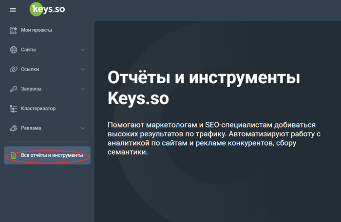
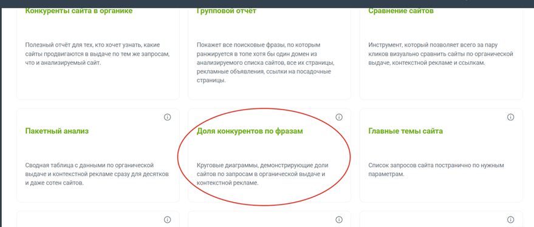
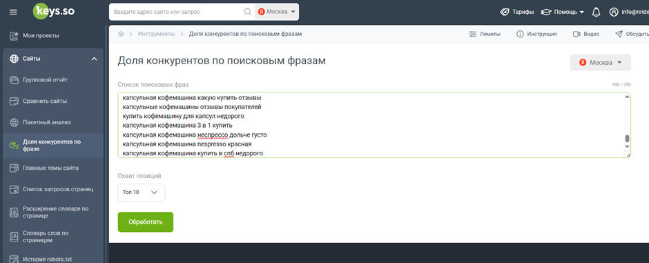
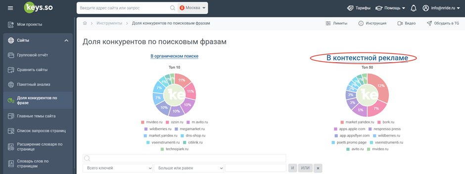
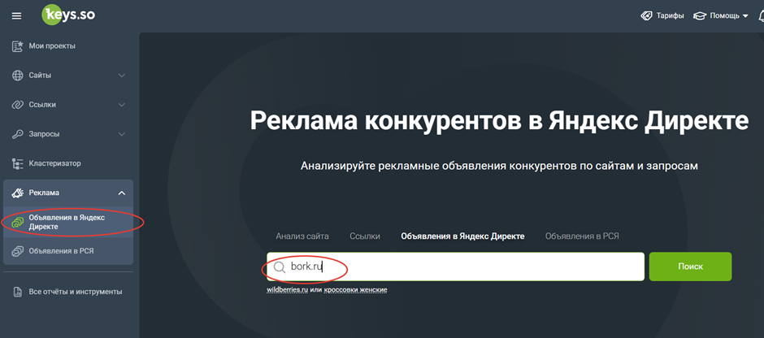
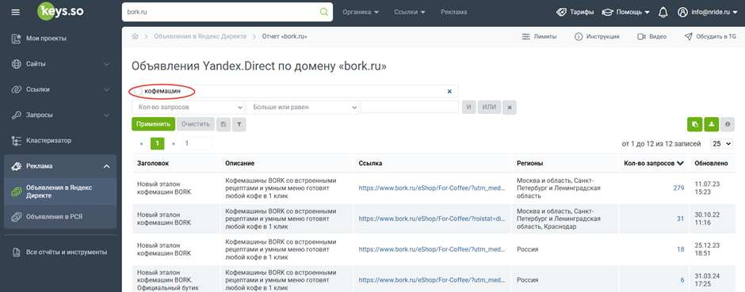
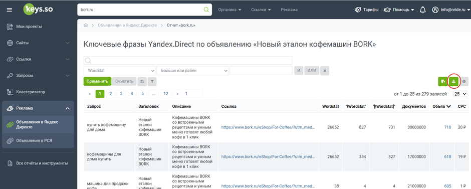
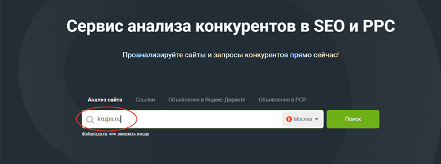
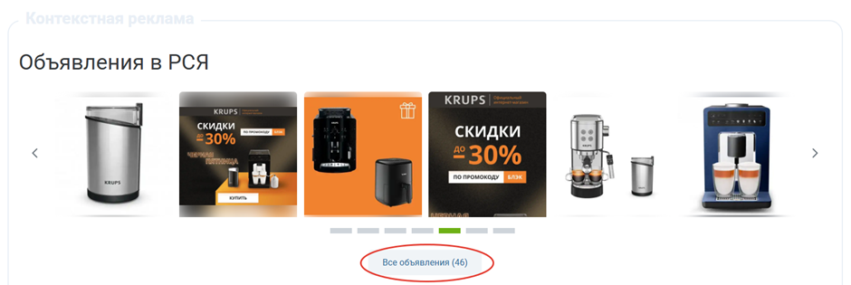
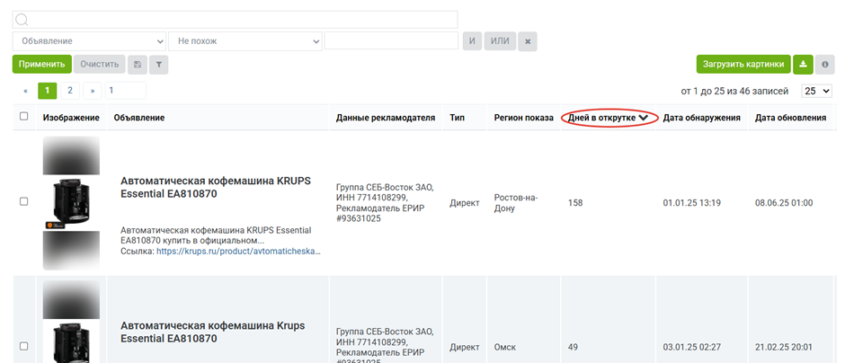

Данная инструкция описывает пошаговый алгоритм работы по анализу конкурентов перед запуском прямой рекламы в Яндекс Директ.

### 1\. Поиск главных конкурентов и их доли на рынке

-  Перейдите по пути: «Все отчеты» -> «Доля конкурентов по фразам».

{width=700px height=456px}

{width=879px height=375px}

-  В специальное поле добавьте собранный список поисковых запросов для ваших рекламных кампаний и нажмите кнопку «Обработать».

-  На открывшейся странице кликните на вкладку «В контекстной рекламе» и опуститесь к появившейся таблице.

{width=940px height=381px}

-  Перейдите по каждой ссылке из таблицы и составьте список сайтов, которые являются вашими прямыми конкурентами (будет достаточно отобрать 7–10 сайтов).

{width=940px height=352px}

-  Отдельно отберите и сохраните ссылки, которые ведут на Промостраницы (ПСЯ) -- они понадобятся для других целей.

-  Пример для Stelvio:

   [bork.ru](http://bork.ru)

   [nespresso.press](http://nespresso.press)

   [kofeteka.ru](http://kofeteka.ru)

   [krups.ru](http://krups.ru)

   [delonghi.ru](http://delonghi.ru)

   [garlyn.ru](http://garlyn.ru)

   [nespresstor.ru](http://nespresstor.ru)

   [ns-premium.ru](http://ns-premium.ru)

   [franko.su](http://franko.su)

   ПСЯ:

   Bork: <https://bork-ps.promo.page/media/kakaia-kofemashina-luchshe--avtomaticheskaia-ili-rojkovaia-65fd4eeec668d871545a09f5_3_1>

   De'Longhi: <https://delonghi.promo.page/promo>

   Poetti: <https://poetti.promo.page/>

### 2\. Анализ объявлений и запросов конкурентов в контекстной рекламе

-  Откройте раздел «Реклама» -> «Объявления в Яндекс Директе» и введите один из доменов, которые вы отобрали на предыдущем шаге.

{width=940px height=416px}

-  Если бренд конкурента продает сразу несколько категорий товаров, а вам нужна аналитика только по одной, введите название нужной категории в строку поиска внутри отчета.

{width=940px height=369px}

-  Проанализируйте полученный список объявлений: изучите заголовки, описания, ссылки, регионы и количество запросов. Обращайте внимание на призывы к покупке, упоминания промоакций, гарантий, бесплатной доставки, а также на то, как конкурент настраивает гео (на всю Россию или точечно на крупные города). Также обратите внимание на структуру запросов конкурента (есть ли там "мусор", широкие или узкие запросы).

-  Кликните на число в столбце количества запросов, чтобы открыть их список, и нажмите кнопку «Выгрузить».

{width=940px height=377px}

-  Откройте скачанную таблицу, пролистайте список запросов и сохраните те маски, которые потенциально подходят для вашей кампании, но еще не были использованы (например, «кофеварка купить»).

### 3\. Аналитика креативов конкурентов в РСЯ

-  Перейдите на главную страницу сервиса аналитики и вбейте в поиск название домена конкурента.

{width=730px height=272px}

-  Опуститесь до раздела «Объявления в РСЯ» и нажмите кнопку «Все объявления».

{width=940px height=315px}

-  В открывшейся сводной таблице сделайте сортировку по столбцу «Дней в открутке». Это позволит найти креативы, которые работают дольше всего, а значит, являются потенциально более эффективными.

{width=940px height=404px}

-  Оцените остальные креативы и сделайте выводы для себя. Например, обращайте внимание на фон промоматериалов (например, белый), дополнительные элементы на фото (например, только срок гарантии), текстовое наполнение (название модели, объем резервуара, бесплатная доставка, бонусы) и распределение по регионам (например, запуск каждого креатива на отдельный город-миллионник).

   ### 4\. Внимание: Оценка рекламного бюджета

-  Не стоит опираться на анализ бюджета конкурентов, так как этот прогноз является недостоверным.

-  Система оценивает только общую частотность ключевых фраз и прогнозируемый CTR, но при этом совершенно не учитывает реальный объем трафика, который выкупает конкурент.

### 5\. Итоги: Как использовать полученные данные

-  **Сайты конкурентов:** Их можно использовать для точной настройки интересов при запуске собственных кампаний в РСЯ.

-  **Объявления и запросы:** На основе внешнего вида объявлений, запросов и регионов продвижения конкурентов можно собрать дополнительные ключевые фразы и сформулировать преимущества для своих рекламных текстов.

-  **Промоакции:** Если конкуренты активно используют акции, их стоит добавить в свои объявления. Если это невозможно, информацию об акциях конкурентов можно использовать для донесения до клиента причин низкой результативности его рекламной кампании.

-  **Дополнительные площадки:** Узнав, что конкуренты используют ПСЯ, Дзен и другие платформы, вы можете передать эту информацию клиенту и предложить запуск услуг, направленных на повышение узнаваемости бренда и рост брендовых запросов.

-  **РСЯ-креативы:** Анализ визуала конкурентов поможет вам выделить самые важные моменты и внедрить их в свои собственные изображения для РСЯ.

   DOCX