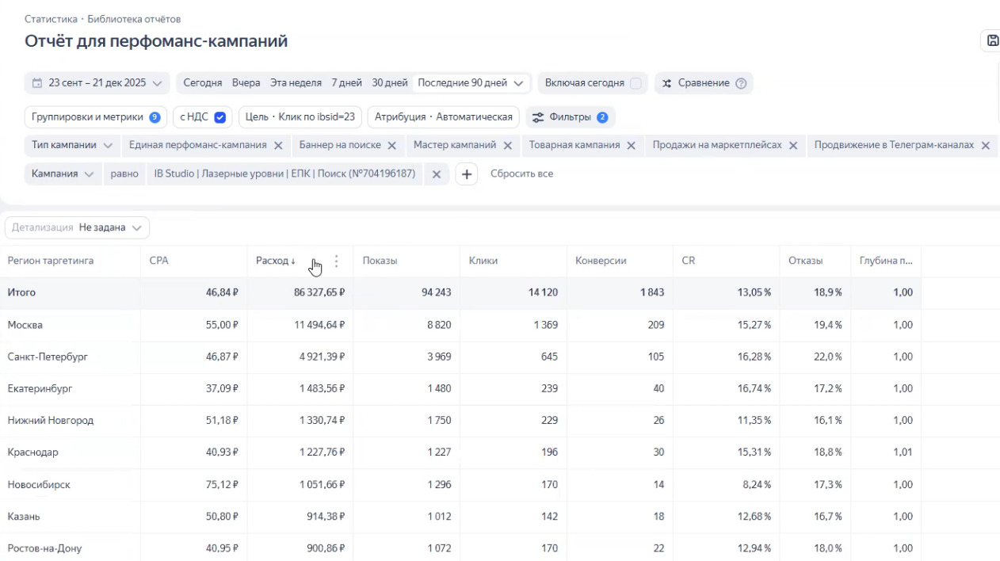
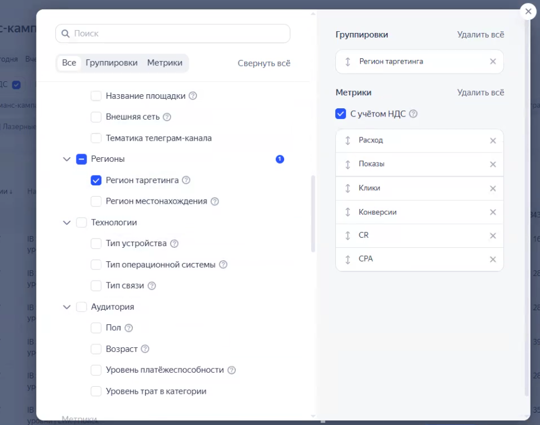
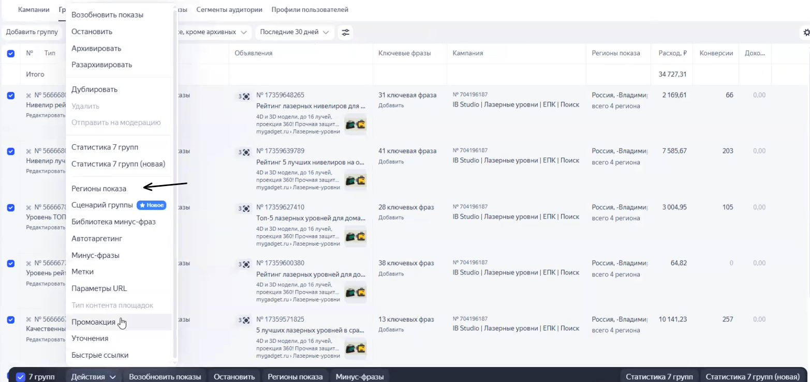
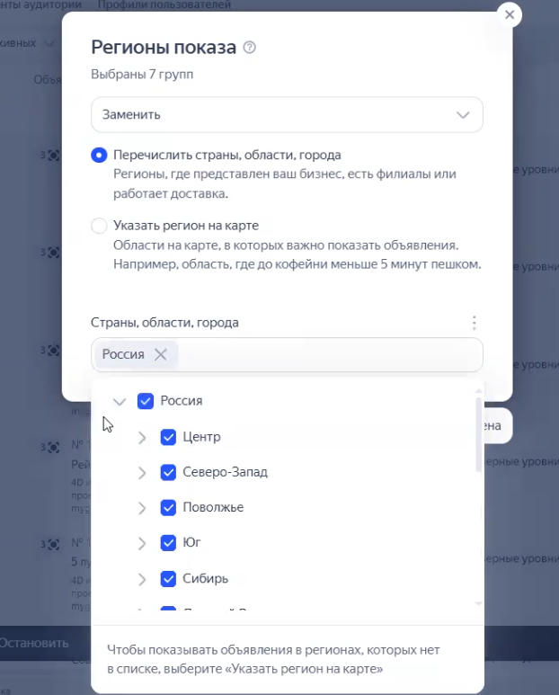
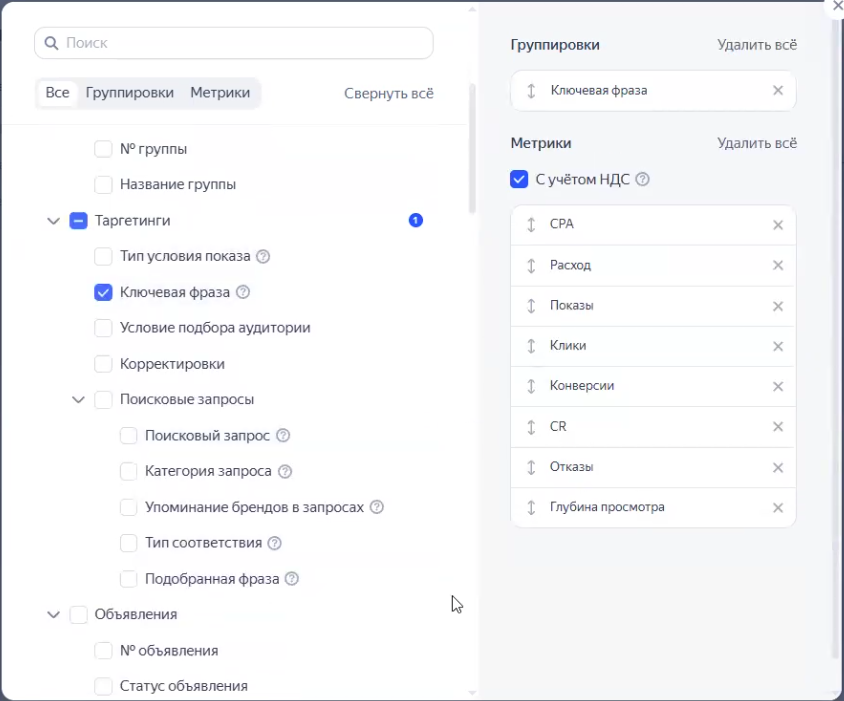

Данная инструкция пошагово описывает процесс аналитики и внесения корректировок в кампании Яндекс Директа. Работа проводится в новом интерфейсе «Мастер кампаний».

### Этап 1: Подготовка отчета и базовая настройка

Для принятия верных решений необходимо собрать репрезентативную статистику.

1. Откройте новый «Мастер кампаний» и выберите нужную рекламную кампанию.

2. Выберите период анализа за **весь пройденный период** (например, за весь квартал), чтобы накопленных данных было достаточно для выводов.

3. Включите отображение данных **«с НДС»**. Цель кампании подтянется автоматически.

4. В поле детализации установите значение **«не задано»**.

5. Добавьте в отчет дополнительные метрики: обязательно выведите столбец **«Отказы»**, также можно добавить **«Глубину просмотра»**.

:::note 

**Критически важно:** установите фильтр сортировки по **уменьшению расхода**. Анализировать строки с маленькой выборкой (где было потрачено мало денег) нельзя -- выводы будут недостоверными.

:::

{width=1262px height=708px}

### Этап 2: Оптимизация в разрезе регионов

Регионы таргетинга и фактическое местонахождение пользователей могут отличаться в зависимости от настроек, поэтому анализировать нужно оба показателя.

-  Переключите срез отчета на регионы показа.

{width=918px height=722px}

-  Ищите города или области с аномально высокой ценой достижения цели. Часто дорогими оказываются сибирские регионы (например, Новосибирск или Омск) из-за высокой стоимости логистики и сложностей с доставкой товара.

-  Если вы видите, что расход по региону большой, а конверсии слишком дорогие, этот регион необходимо исключить.

-  Перейдите в настройки групп объявлений и отключите показы для найденных неэффективных городов.

{width=1565px height=739px}

{width=622px height=773px}

### Этап 3: Оптимизация в разрезе условий показа (Автотаргетинг)

На этом этапе оценивается эффективность распределения трафика между заданными фразами и автоматическими алгоритмами.

-  Переключите отчет на срез по условиям показа.

[image:./podrobnaya-instrukciya-po-optimizacii-reklamnykh-5.png:::0,0,100,100:69::893px:719px:center]

-  Оцените, какая доля расхода и конверсий приходится на **автотаргетинг**.

-  Не пытайтесь искусственно расширять аудиторию автотаргетинга за счет добавления новых категорий запросов (например, широких или альтернативных) -- это неизбежно приведет к росту стоимости конверсии.

### Этап 4: Оптимизация ключевых фраз

Главная задача этого этапа -- точечно исключить слова, которые тратят бюджет, но приносят слишком дорогие заявки.

-  Переключите срез отчета на **«Ключевые фразы»**. Убедитесь, что сортировка по убыванию расхода всё ещё включена.

{width=844px height=701px}

-  Ищите фразы со стоимостью конверсии, которая сильно превышает среднюю по кампании.

:::note 

Обращайте внимание на коммерческие запросы (например, «купить хороший лазерный уровень») -- из-за высокой конкуренции в аукционе они часто стоят дороже информационных. Если цена заявки по ним выходит за рамки допустимого (даже при небольшой частотности), их нужно отключать.

:::

### **Как удалить неэффективную фразу:**

-  Посмотрите, к какой группе объявлений относится найденная фраза (например, «Лучший уровень» или «Нивелиры лучшие»).

-  Перейдите в инструмент **«Комбинатор»**.

-  Найдите точную фразу в нужной группе (например, «лазерный нивелир какой выбрать лучше») и удалите её.

-  Сохраните изменения.

### **Работа с пустыми тратами:** 

Если вы видите фразу с ощутимым расходом (например, 17 кликов), но без конверсий, оцените объем выборки. Если статистика еще небольшая, трогать фразу пока не нужно.

### **Особенность свежих кампаний:**

Если кампания запущена недавно (имеет небольшой общий расход) и львиная доля показов пришлась на автотаргетинг, то выборка по конкретным ключевым фразам будет слишком маленькой. В таком случае отложите чистку ключей: подождите, пока наберется статистика за больший промежуток времени, чтобы сделать объективные выводы и дополнительно закавычить или удалить нецелевые запросы.