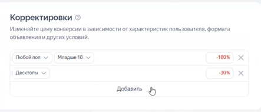
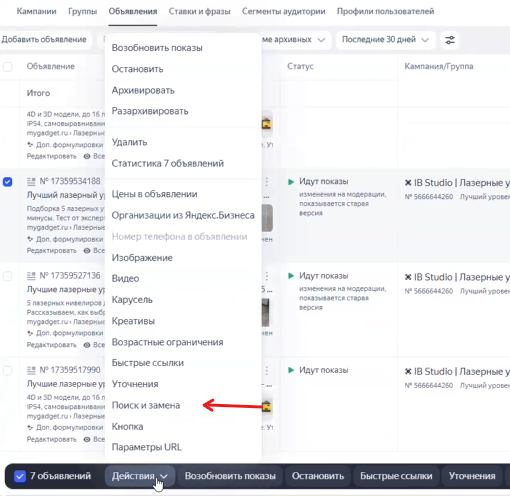

Данная инструкция описывает пошаговый процесс внесения корректировок в поисковые рекламные кампании Яндекс Директа. Эту оптимизацию необходимо проводить регулярно -- раз в 1–2 недели.

Инструкция написана максимально подробно для комфортной работы с новым функционалом.

### Этап 1: Подготовка отчета в Мастере кампаний

Для начала работы необходимо собрать правильную статистику в кабинете.

1. Откройте новый интерфейс «Мастера кампаний».

2. В настройках отображения выберите пункт «с НДС».

3. Укажите период анализа за последние 2 недели (например, с 8 по 22 число).

4. В поле «Детализация» выберите «не задано».

5. Выставьте максимум полезных показателей для анализа, но на первое место обязательно выведите **«Стоимость конверсии»**. Саму цель выбирать не нужно, она подгружается автоматически.

### Этап 2: Оптимизация по типам устройств

{width=443px height=190px}

Хотя устройства не относятся напрямую к социально-демографическим характеристикам, их анализ всегда проводится на этом этапе.

1. Выберите срез по типам устройств и посмотрите среднюю стоимость достижения цели по кампании (например, 47 рублей).

2. Найдите устройства, конверсия с которых обходится значительно дороже среднего. Например, если планшеты показывают стабильно высокую цену заявки при наличии конверсий, ставку на них нужно понизить.

3. **Как внести изменения:** \* Перейдите в настройки самой рекламной кампании (в самый низ страницы, раздел «Корректировки»).

   -  Добавьте понижающую корректировку для планшетов (например, минус 30%).

   -  Если устройства (например, десктопы) стоят чуть дороже среднего, но разброс небольшой, трогать их не нужно -- это допустимо.

### Этап 3: Оптимизация по возрасту, полу и платежеспособности

1. **Пол и возраст:** Переключите срез статистики на «Возраст» или «Пол».

   -  Если какая-то категория (например, старше 55 лет) обходится немного дороже среднего, но съедает лишь около 10% расхода -- это допустимо, корректировки не нужны.

   -  **Важное правило:** всегда смотрите на объем расхода. Если в категории «неопределенный пол 25–34» стоимость конверсии аномально высокая, но денег туда потрачено очень мало, трогать настройки не нужно -- выборка слишком мала для выводов. Вносите правки только при сильном отклонении цены и большом расходе.

2. **Платежеспособность:** Переключитесь на срез по уровню платежеспособности.

   -  Оцените общую выборку. Как правило, большая часть расхода приходится на аудиторию, чья платежеспособность «неизвестна».

   -  Если это так, вносить корректировки в известные сегменты нет смысла, так как выводы будут недостоверными.

### Этап 4: Анализ семантики групп (Подготовка к чистке контента)

Перед тем как менять тексты и заголовки, нужно проверить, не является ли сама группа ключевых слов изначально дорогой.

1. Выведите в отчет название группы.

2. Посмотрите стоимость конверсии в разрезе групп. Если одна группа (например, «Лучший уровень») значительно дороже остальных, значит, там работает дорогая семантика.

3. Эту информацию нужно просто держать в уме, чтобы позже несправедливо не забраковать нормальный заголовок, который просто находится в «дорогой» группе.

### Этап 5: Оптимизация заголовков

1. Добавьте в отчет столбец «Заголовки» и «Номер объявления» (чтобы быстро находить их для правок).

2. Ищите заголовки, стоимость конверсии по которым сильно превышает среднюю (например, выше 50 рублей) и по которым есть нормальный расход.

3. Проанализируйте, что именно не сработало. Например, если дорого обходится заголовок с упоминанием «проекция 360», это свойство нужно убрать из заголовка.

4. **Как переписать заголовок:** \* Обязательно сохраняйте базовую маску ключевого слова (например, «нивелир лучший» или «лазерные нивелиры»), чтобы не сломать релевантность.

   -  Измените дополнительные слова: укажите актуальный год («надежная модель 2025») или добавьте преимущества, упомянутые в вашей статье (например, прочность и точность -- «топ точных и прочных моделей»).

   -  Внесите новый заголовок в настройки кампании и сохраните.

### Этап 6: Оптимизация текстов объявлений

Мы стараемся тестировать разные модели текстов: рациональные (с упором на характеристики), эмоциональные (с упором на боли) и экономические (акции и цена). Если какая-то модель показывает плохие результаты, ее нужно заменить.

1. Выведите в отчет срез по «Текстам».

2. Найдите текст с самой высокой стоимостью конверсии. Часто неэффективными оказываются самые простые тексты (например, сухое перечисление «Подборка 5 лазерных уровней»).

3. **Как заменить тексты массово:**

   -  Перейдите на уровень объявлений, выберите все объявления с плохим текстом и нажмите кнопку «Поиск и замена».

   -  {width=510px height=496px}

4. **Как составить эффективный текст:**

   -  **Добавьте ценовую сегментацию:** Напишите актуальную вилку цен (например, «от 9 до 13 тысяч рублей»), чтобы сразу отсечь нецелевую аудиторию.

   -  **Используйте слова-триггеры:** Люди доверяют фактическим доказательствам. Замените сухое «подборка» на слова «Тест 5 моделей» или «Протестировали».

   -  **Закройте потребности пользователя:** Укажите сценарии использования товара (например, универсальность: «в разных условиях: дом, дача, выезды»).

5. Соберите новый текст с учетом ограничений по символам, вставьте его в инструмент замены и сохраните изменения.

{width=403px height=429px}

На этом регулярная оптимизация объявлений и социально-демографических настроек завершена.