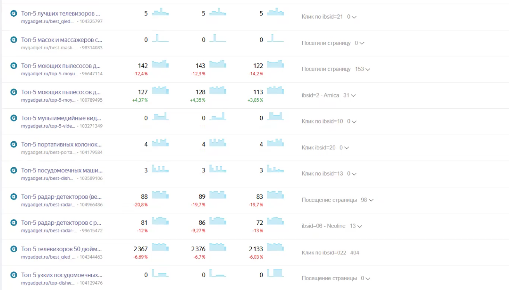
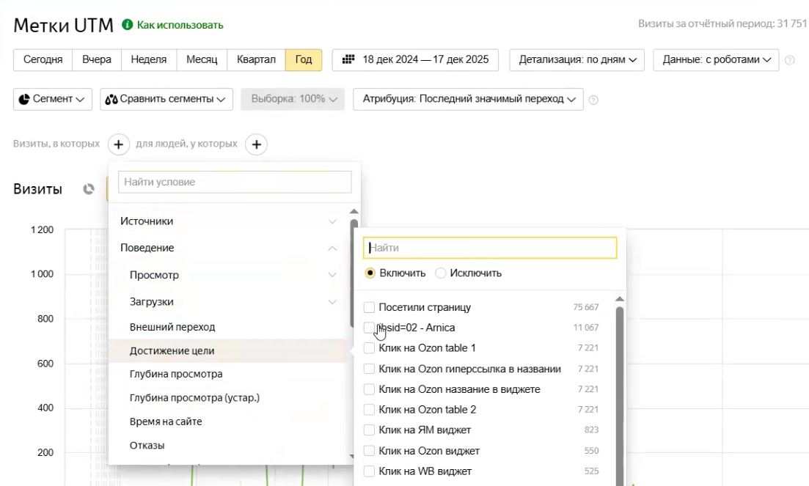
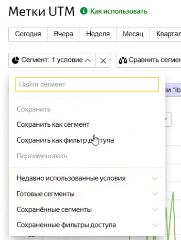
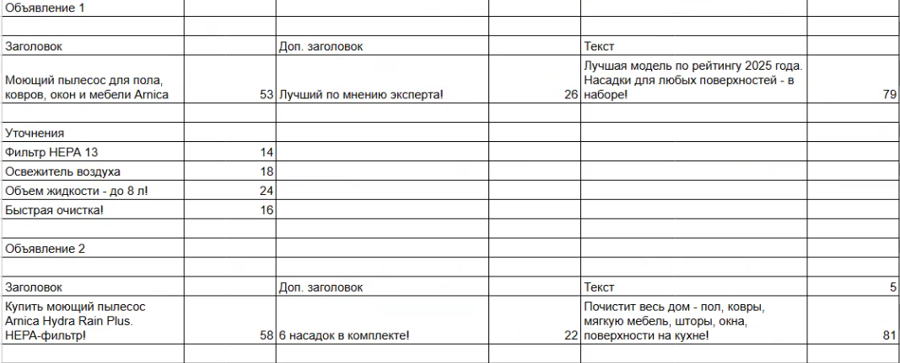
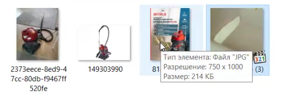

Данная инструкция описывает процесс создания аудиторного сегмента в Яндекс Метрике на основе читателей статьи и последующего запуска ретаргетинговой кампании в Яндекс Директ.

### 1\. Подготовка к запуску

-  Для работы потребуется доступ к счетчикам Метрики тех статей, которые были запущены на выбранную категорию товара.

{width=1310px height=747px}

-  Заранее подготовьте тексты объявлений, выделив в сводную таблицу заголовки, дополнительные заголовки, тексты и уточнения.

-  Подготовьте визуальные промо-материалы: 3 изображения разного формата и 1 видеоролик.

### 2\. Создание сегмента в Яндекс Метрике

-  Перейдите в нужный счетчик Яндекс Метрики и откройте отчеты «Метки UTM».

-  Выберите максимально широкий период формирования отчета, например, один год.

-  Настройте фильтр аудитории: выберите «Визиты, в которых»- «Поведение» - «Достижение цели».

   {width=1103px height=663px}

-  Укажите основную цель вашей статьи (например, `IBSID_02`) и нажмите «Применить».

[image:./podrobnaya-instrukciya-po-sozdaniyu-segmenta-i-za-3.png:::0,0,100,100:100::1093px:235px:center]

-  Проверьте размер собранной аудитории (например, 4755 человек) и нажмите кнопку «Сохранить как сегмент».

{width=373px height=496px}

-  Задайте сегменту понятное название (например, «Аудитория для ретаргетинга, достижение цели IBSID_02») и сохраните его.

-  Проделайте аналогичные действия во всех остальных счетчиках, если у вас запущено несколько версий статьи.

-  Созданные сегменты автоматически станут доступны в кабинете Яндекс Директа, на который выданы доступы.

### 3\. Подготовка текстов объявлений

{width=1067px height=432px}

-  Обязательно акцентируйте внимание во всех элементах объявлений на тех преимуществах, которые упоминались в прочитанной пользователем статье (например, очистка любых поверхностей, 6 насадок в комплекте, наличие HEPA-фильтра, объем бака).

-  Используйте разные модели заголовков: в одном перечислите форматы работы и бренд, во втором сделайте акцент на конкретном фильтре и призыве «купить», в третьем используйте формулировку «лучший пылесос 2025 года».

-  Дополнительные заголовки также должны отличаться и не дублировать основной (например, «лучший по мнению эксперта», «много насадок в комплекте», «официальные магазины»).

-  Тексты объявлений должны дополнять заголовки новыми преимуществами (например, высокая мощность, работа в труднодоступных местах, легкая очистка).

-  Подготовьте 4–5 коротких уточнений на основе характеристик товара. Специальные символы из уточнений лучше убрать, чтобы не возникало системных ошибок.

-  Быстрые ссылки можно не использовать, если трафик ведется напрямую на маркетплейс (например, Ozon).

### 4\. Подготовка визуалов (Креативы)

{width=554px height=218px}

-  Поскольку трафик ведется на продающую страницу, используйте в основном промо-материалы, а не нативные фото.

-  Подберите 3 разнообразных изображения: инфографика с маркетплейса, товар на белом фоне и одно максимально качественное, яркое пользовательское фото для тестирования.

-  Подготовьте короткое видео квадратного формата (например, из карточки товара), на котором показан процесс работы устройства и упоминается бренд.

### 5\. Создание кампании в Яндекс Директ

[image:./podrobnaya-instrukciya-po-sozdaniyu-segmenta-i-za-7.png:::0,0,100,100:90::1214px:587px:center]

-  Перейдите в режим эксперта и создайте «Единую перформанс-кампанию».

-  Задайте название кампании по стандарту: название агентства, модель кампании, название статьи, пометка «ретаргетинг» и тип оплаты.

-  Укажите ссылку на продвигаемый товар (обязательно с UTM-метками).

[image:./podrobnaya-instrukciya-po-sozdaniyu-segmenta-i-za-8.png:::0,0,100,100:73::648px:479px:center]

-  Привязку к организации можно пропустить, чтобы не отвлекать внимание пользователя при рекламе на маркетплейсе.

-  Выберите геотаргетинг: Россия.

-  Установите стратегию: «Максимум конверсий» с оплатой за конверсии и ограничением по доле рекламных расходов (ДРР), например, 10%.

[image:./podrobnaya-instrukciya-po-sozdaniyu-segmenta-i-za-9.png:::0,0,100,100:67::620px:721px:center]

-  Подключите Ozon Performance API (при наличии доступа), чтобы система автоматически подгрузила счетчик и цель «покупка на Ozon».

-  В настройках кампании отключите автоматическое применение рекомендаций, не добавляйте минус-фразы и обязательно включите мониторинг сайта.

### 6\. Настройка группы и создание объявлений

-  Назовите группу объявлений (например, «Ретаргетинг») и исключите из геотаргетинга Республику Крым.

[image:./podrobnaya-instrukciya-po-sozdaniyu-segmenta-i-za-10.png:::0,0,100,100:65::613px:682px:center]

-  Пропустите настройки тематических слов и интересов, но в блоке «Сегменты аудитории» добавьте те сегменты, которые вы ранее создали в Метрике.

[image:./podrobnaya-instrukciya-po-sozdaniyu-segmenta-i-za-11.png:::0,0,100,100:91::1006px:513px:center]

-  В блоке создания объявлений вставьте ссылки с UTM-метками, тексты и заголовки из подготовленной таблицы.

-  Загрузите первое изображение, задайте для него смарт-центры (наиболее оптимальные рамки обрезки) и добавьте подготовленное видео.

-  Добавьте кнопку (например, «Узнать цену») со ссылкой на товар и впишите уточнения.

-  Сохраните объявление, после чего нажмите «Дублировать».

-  В дубликате замените тексты, заголовки и изображение на вторые варианты (видео можно оставить прежним).

-  Сделайте еще один дубль для третьего варианта визуала и текста, после чего сохраните всю кампанию.