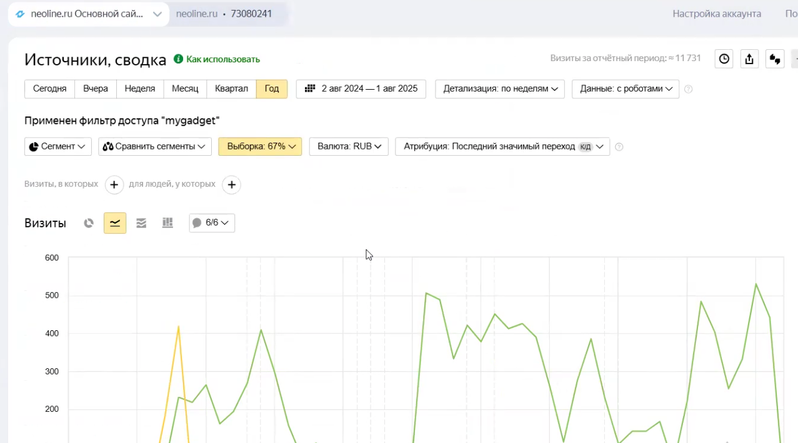
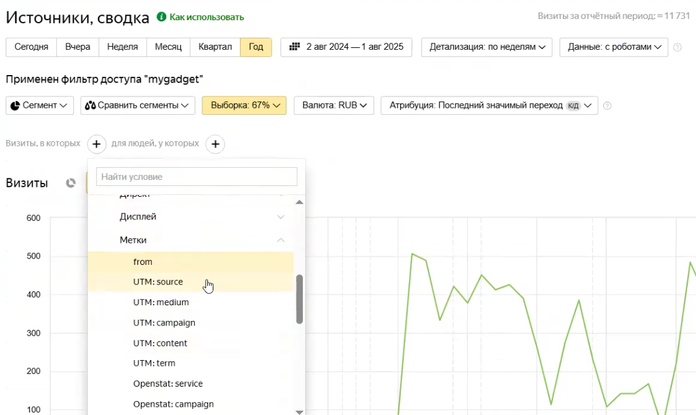
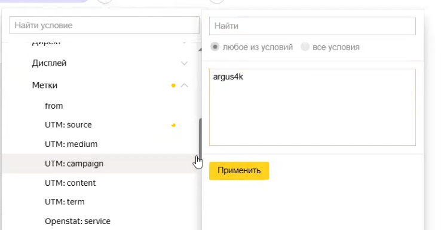
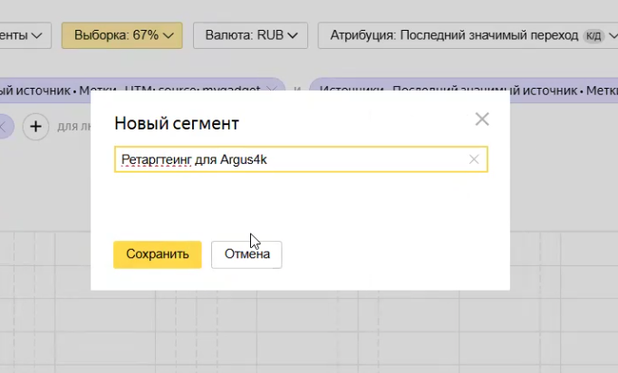

Данная инструкция описывает процесс выделения аудитории пользователей, которые перешли на сайт с нашей статьи, интересовались конкретным товаром, но еще не совершили покупку. Этот сегмент в дальнейшем используется для запуска ретаргетинговой рекламной кампании.

### 1\. Подготовка к работе

-  Для начала необходим доступ к счетчику Яндекс Метрики, который размещен на сайте клиента или на платформе Яндекс.Маркет.

{width=1277px height=711px}

-  Откройте интерфейс Яндекс Метрики, перейдите в раздел **«Отчеты»**, затем выберите пункт **«Источники»** и откройте вкладку **«Сводка»**.

### 2\. Настройка условий (фильтров) для сегмента

Чтобы выделить нужную аудиторию, вам потребуется задать три ограничения. Это делается через нажатие на иконку «плюсик» (в строке «Визиты, в которых»).

**Условие 1: Переход с нашего источника**

-  Нажмите на плюсик и пройдите по следующему пути: **Источники** -> **Последний значимый источник** -> **Метки**.

{width=1101px height=658px}

-  Чтобы узнать, какую метку вписывать, откройте нужную рекламную статью и кликните по ссылке на товар (например, на видеорегистратор NewLine Argus 4K).

-  Скопируйте из ссылки метку источника (например, `MyGadget`), вставьте её в поле фильтра Метрики и нажмите «Применить».

**Условие 2: Интерес к конкретному товару**

-  Снова нажмите на плюсик для добавления второго условия и пройдите по аналогичному пути через **Метки**.

{width=738px height=385px}

-  Скопируйте из ссылки на товар точное название модели, чтобы оно совпадало точь-в-точь.

-  Вставьте скопированную метку модели в фильтр и нажмите «Применить».

**Условие 3: Отсутствие заказа**

-  Добавьте третье условие через плюсик.

-  Пройдите по пути: **Электронная коммерция** -> **Заказы в визите**.

-  В появившемся списке выберите вариант **«Заказов не было»**.

:::quote 

**Примечание к объему аудитории:** Если реклама шла недавно (например, всего 3 недели) или приостанавливалась из-за того, что закончился бюджет, собранная аудитория может оказаться небольшой. Это не страшно: при запуске кампании можно будет добавить похожий сегмент (lookalike) или немного подождать, пока накопится больше целевых пользователей.

:::

### 3\. Сохранение и проверка сегмента

-  После того как все три фильтра настроены, над графиком появится кнопка **«Сегмент: 3 условия»**. Нажмите на неё.

-  В выпадающем списке выберите действие **«Сохранить как сегмент»**.

-  Задайте сегменту понятное имя (например, «Ретаргетинг для Argus 4K») и нажмите кнопку **«Сохранить»**.

{width=682px height=412px}

Чтобы перепроверить, что сегмент успешно создан, и при необходимости посмотреть его название, перейдите в верхнем меню Метрики в раздел **«Настройки»**, а затем откройте вкладку **«Сегменты»**. Здесь будут отображены все созданные вами аудитории.

(Для дальнейшего использования этого сегмента при настройке ретаргетинга потребуется зайти в Яндекс Директ и в разделе «Конверсии» -> «Источники конверсии» убедиться, что у вас есть доступ к нужному счетчику).