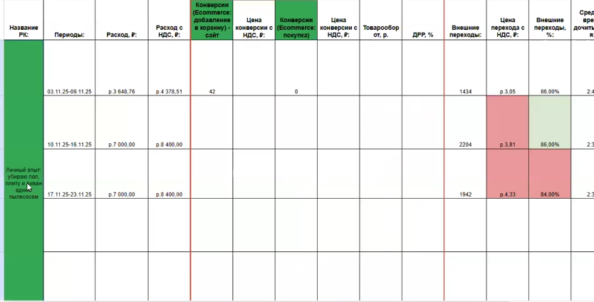
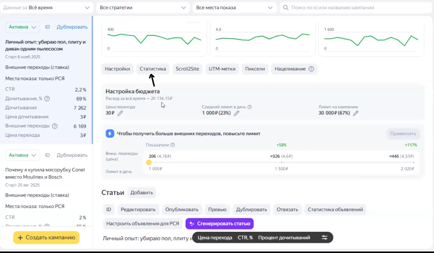
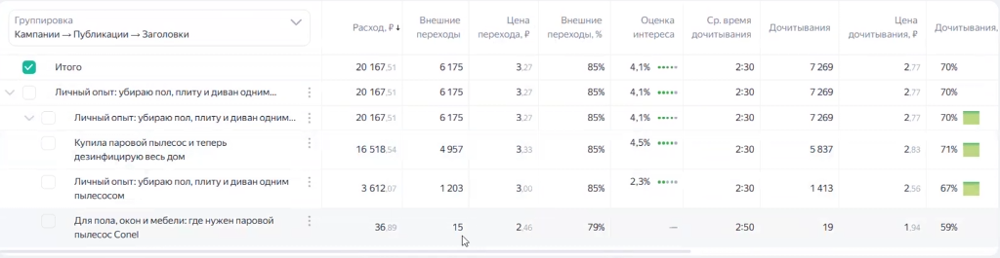

Данная инструкция описывает еженедельный алгоритм проверки работы статей в Яндекс ПромоСтраницах, сбор статистики и формирование гипотез для улучшения показателей (на примере недавно запущенных статей).

### 1\. Доступ и навигация в кабинете

1. Авторизуйтесь в рабочем Яндекс.Аккаунте (например, IB Studio Ads).

2. Перейдите по рабочей ссылке в кабинет ПромоСтраниц.

3. В левом меню выберите нужный аккаунт клиента (например, Connel). *Примечание: новые актуальные кабинеты обычно находятся в нижней части списка, под разделительной плашкой (так как они заведены через Elama)*.

4. Перейдите в раздел **«Кампании»** - **«Текущие»**. Здесь отображаются все активные или временно приостановленные статьи.

### 2\. Сопоставление с таблицей отчета

-  Откройте отчетную таблицу (Google Sheets) для нужного проекта.

-  Выберите статью для оптимизации, скопируйте ее название и найдите соответствующую кампанию в кабинете Яндекса.

{width=834px height=424px}

{width=861px height=534px}

-  *Нюанс:* Названия в таблице и в кабинете могут иногда отличаться (если заголовок меняли при прошлой оптимизации). В таком случае сопоставляйте статью по прямой ссылке, которая указана в конце отчетной таблицы.

### 3\. Сбор статистики и анализ (Группировка)

Выделите нужную кампанию и нажмите кнопку **«Статистика»** (будьте аккуратны при прокрутке страницы, чтобы случайно не переключиться на другую кампанию). Установите период (например, «За все время», если статья свежая, или за последнюю неделю).

{width=867px height=506px}

{width=1024px height=265px}

**А. Анализ общей оценки интереса**

-  **Оценка интереса** показывает, какой процент дочитавших пользователей положительно ответили на опрос в конце статьи. Чем выше процент, тем лучше.

-  Если интерес низкий (особенно ниже 2%), изучите ответы читателей:

   -  *«Не вызывает доверия»* -- скорее всего, в статье слишком много рекламных студийных фото и не хватает живых пользовательских материалов.

   -  *«Мало пользы для меня»* -- читатель не нашел ответов на свои вопросы. Необходимо обсудить с редакцией добавление полезной информации.

   -  *«Не для меня»* -- ошибка в таргетинге. Нужно зайти в **«Настройки»** - **«Интересы и привычки»** и скорректировать аудиторию.

   -  *Высокая цена:* Если негативных ответов нет, возможно, сам товар слишком дорогой для аудитории (например, вертикальный пылесос за 40 тыс. рублей).

**Б. Анализ вовлеченности (Дочитывания и Переходы)**

-  **Среднее время дочитывания:** Норма -- до 2 минут. Если время больше (например, 2,5 мин), а процент дочитываний падает (ниже 65%), статью нужно сокращать. Бесшовный переход (Scroll2Site) на сайт магазина находится в самом конце, поэтому важно, чтобы люди туда доходили.

-  **Внешние переходы:** Норма -- от 80% (75-80% -- допустимо). Если переходов мало, причины могут быть следующими:

   -  Нет промокода или акции (скидки сильно мотивируют на переход).

   -  Непривлекательный или неубедительный визуал.

-  **Тепловая карта (карта оттока):** Обязательно проверяйте, где люди закрывают статью.

   -  Если есть «красные» зоны оттока на **лид-абзаце** (вступлении), значит, он слишком длинный. Запишите гипотезу: *«Сократить лид-абзац, разделив его на две части»*.

**В. Анализ обложек (Креативов) и Заголовков**

-  **Цена перехода:** Это главный показатель эффективности. Сравнивайте стоимость перехода на Ozon между разными креативами. Отклонение в 15% -- норма, но если одна обложка дает переходы по 3-4 рубля, а другая по 7,5 рубля -- дорогую нужно отключать.

-  **Разнообразие обложек:** Если на старте загружено 3 одинаковые обложки (схожий план, промо-фото), оставьте одну ведущую, а две замените на альтернативные варианты (например, пользовательские фото, другой план) для тестирования.

-  **Разнообразие заголовков:** Оставьте в работе разные по смыслу заголовки. Например: одни с упоминанием бренда (собирают горячую аудиторию), другие -- информационные без бренда, третьи -- с разными сценариями использования (для полов, для окон, дезинфекция).

-  **Охват:** Следите, чтобы показы распределялись по всем вариантам. Если крутится только один заголовок/обложка, это рискованно, так как при падении его эффективности не будет запасных вариантов со статистикой. Иногда алгоритм нужно "встряхнуть", заменив вариант, который он крутит.

-  **CTR (кликабельность):** Относитесь к этому показателю спокойно. Низкий CTR на широкой аудитории -- это нормально, так как оплата в ПСЯ идет только за дочитывания или переходы, а не за показы.

### 4\. Анализ визуала в статье

Просмотрите статью глазами читателя.

-  Ищите фотографии, доказывающие эффективность товара (например, густой пар из парового пылесоса).

-  Отмечайте слабый визуал, где "ничего не понятно" (например, когда пылесосят чистый диван или собирают невидимую шерсть).

-  **GIF-анимация:** Статичные "студийные" фото часто проигрывают. Как показывает практика (на примере кейса с аэрогрилями), добавление GIF-ок с реальным процессом готовки/работы резко увеличивает вовлеченность и продажи. Если визуал слабый -- пишите гипотезу на замену фото на GIF (но только на качественные видео без сильной тряски, иначе при конвертации качество станет ужасным).

### 5\. Фиксация гипотез

После полного анализа зафиксируйте все выводы в виде четких гипотез в таблице отчета в столбце «Комментарии» для последующей реализации.