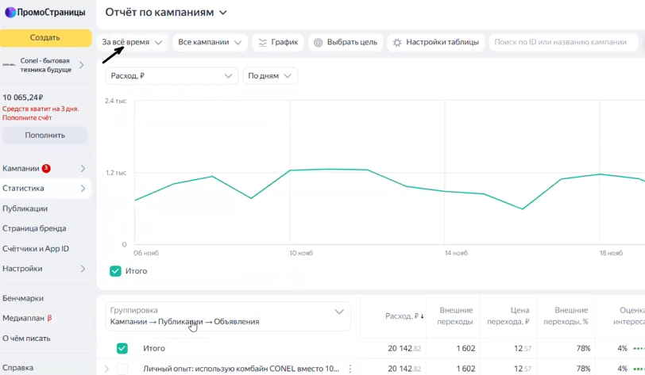
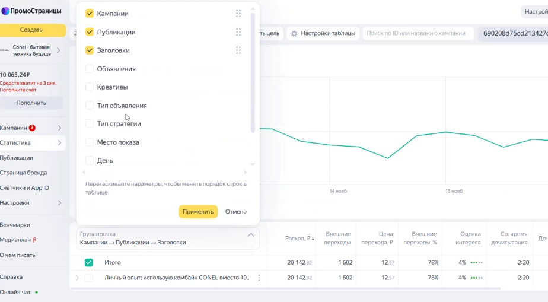

Данная инструкция объединяет правила работы со статистикой ПСЯ и алгоритм еженедельной оптимизации статей (поиск слабых мест, работа с визуалом, выдвижение гипотез).

### 1\. Зона ответственности и работа с таблицей отчета

Сбор числовых метрик (расход, клики, CTR и т.д.) осуществляет другой специалист. **Ваша главная задача** -- проанализировать эти цифры в кабинете и заполнить столбец **«Комментарий» (Гипотезы по правкам)**.

-  Добавляйте новые гипотезы в новую строку сверху таблицы.

-  **Не удаляйте** старые гипотезы и **не закрашивайте** их (например, зеленым) после выполнения. Оставляйте белый фон. История правок должна сохраняться для отслеживания динамики (чтобы понимать, что повлияло на результат, и при необходимости откатить изменения назад).

### 2\. Подготовка и навигация в кабинете

1. Зайдите в рекламный кабинет ПромоСтраниц, выберите нужного клиента.

2. Перейдите в раздел **«Кампании»** - **«Текущие»** и выберите нужную статью.

3. Нажмите кнопку **«Статистика»**.

4. Выберите период. Если кампания свежая (идет около 2,5 недель), выставляйте фильтр «За все время». В остальных случаях анализируйте данные за прошедшую неделю.

{width=812px height=473px}

{width=924px height=509px}

### 3\. Анализ обложек и заголовков

В разделе группировки данных **не используйте** фильтр «Объявление» (он смешивает заголовки и обложки, что мешает объективной оценке). Анализируйте их строго по отдельности:

**А. Анализ заголовков (Группировка - Заголовки)**

-  Ориентируйтесь на **«Оценку интереса»** (норма -- от 4% и выше) и **«Дочитывания»** (плохие показатели система сама подсвечивает желтым).

-  Сопоставляйте интерес с **«Ценой перехода»**. Выбирайте вариант с оптимальным балансом: высокой вовлеченностью и адекватной стоимостью (в идеале, для некоторых категорий цена может быть 3-5 руб., но в среднем 12-15 руб. -- тоже приемлемо).

-  *Рабочий лайфхак:* Лучше всего работают заголовки с конкретными цифрами (например, «10 в 1», «5 причин выбрать...», «5 лайфхаков»). Старайтесь использовать этот формат.

**Б. Анализ креативов (Группировка - Изображения)**

-  Оценивайте картинки по тому же принципу (дочитывания, интерес, цена перехода).

-  Если несколько обложек показывают низкие результаты (низкий интерес, дорогие клики), пишите гипотезу на их замену: *«Заменить 2 из 3 обложек на альтернативные форматы»*.

### 4\. Глубокий анализ содержания статьи

Если общие показатели статьи проседают (например, процент дочитываний ниже 59%), необходимо искать проблему внутри контента.

-  **Анализ лид-абзаца:** Откройте тепловую карту (карту оттока). Если в самом начале статьи происходит большой отвал аудитории, проверьте объем вступления. Если лид-абзац в мобильной версии занимает весь первый экран (требует долгой прокрутки) -- его нужно сокращать. Фиксируйте это в гипотезах.

-  **Время дочитывания:** Если среднее время чтения превышает 2:00–2:40 минут, а процент дочитываний низкий, это сигнал, что статья слишком затянута. Напишите гипотезу: *«Обратить внимание на время чтения, при необходимости сократить текст статьи»*.

-  **Смысловое соответствие визуала тексту:** Внимательно прочтите текст и посмотрите на картинки под ним. Они должны строго соответствовать описанию.

   -  *Пример ошибки:* В тексте расписано про титановые ножи, а на фото просто стоит комбайн в студии.

   -  *Пример ошибки:* Написано, что сок получается без мякоти, но на студийном фото просто лежат апельсины и стоит стакан, где ничего толком не видно.

   -  *Решение:* Если визуал не передает суть, пишите правку для редакции: *«Заменить фото Х. Не передает суть абзаца. Найти живое пользовательское фото или сделать GIF в процессе работы (чтобы было видно перемолотое зерно/нарезанный салат)»*. Избегайте трясущихся или некачественных домашних видео, так как при конвертации в GIF их качество сильно упадет.

### 5\. Внесение изменений в кабинете

После того как гипотезы зафиксированы, их нужно реализовать:

1. **Для изменения текста или фото внутри статьи:** нажмите кнопку **«Редактировать»** на карточке публикации.

2. **Для изменения заголовков и обложек (на входе):** нажмите кнопку **«Настроить объявление»**.

3. *Примечание:* Звездочка рядом с заголовком в настройках теперь означает не основной тестируемый заголовок, а тот, который будет отображаться на «Странице бренда» при клике на логотип. На статистику самой кампании это не влияет.

### 6\. Контроль лимитов

Иногда рекламная кампания может внезапно остановиться, хотя на общем балансе кабинета есть деньги.

-  Это происходит из-за срабатывания индивидуального лимита кампании (мы ставим их специально, чтобы одна статья не «съела» весь бюджет кабинета).

-  Если лимит исчерпан, просто зайдите в настройки кампании, увеличьте сумму лимита (например, еще на 30 000 руб.), и показы автоматически возобновятся.