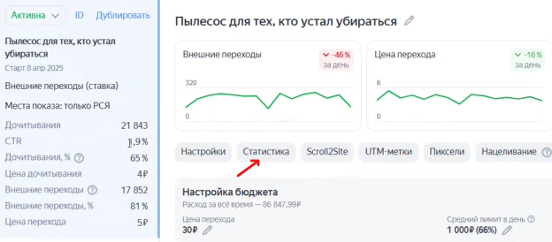
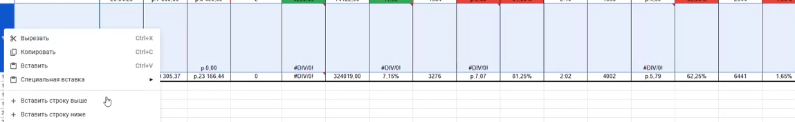
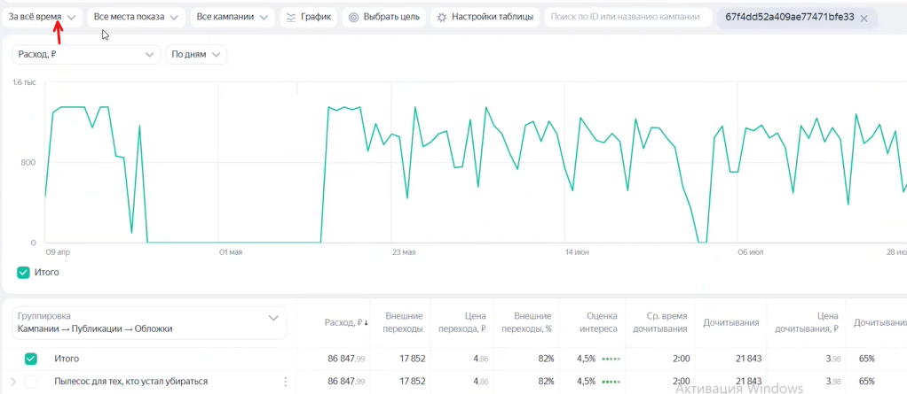
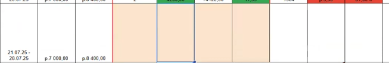
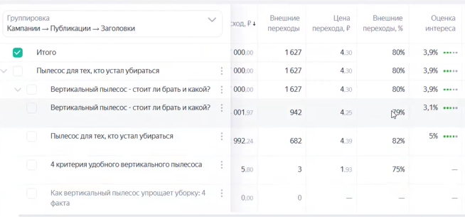
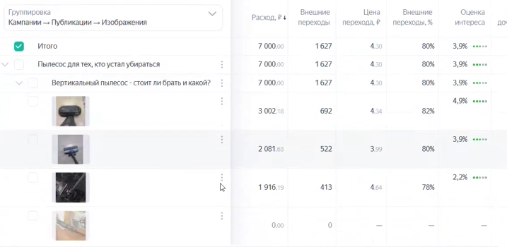
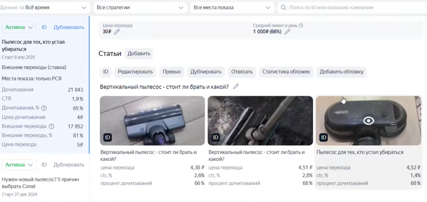
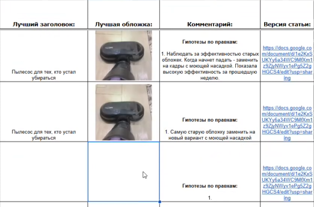

Данная инструкция описывает еженедельный процесс сбора статистики и аналитики для клиентских проектов в Яндекс ПромоСтраницах.

### 1\. Подготовка и доступ к данным

-  Зайдите в рекламный кабинет промо-страниц и выберите нужного клиента из списка.

-  Перейдите в раздел текущих кампаний, чтобы увидеть активные запуски.

-  Найдите нужную статью (например, про пылесос) и нажмите на кнопку «Статистика».

{width=624px height=274px}

### 2\. Заполнение базового отчета

-  В вашем файле отчета найдите нужную статью и  добавьте новую строку, чтобы зафиксировать статистику за новую неделю.

{width=1149px height=177px}

-  В рекламном кабинете установите необходимый период (например, предыдущую неделю).

{width=1022px height=445px}

-  Начинайте переносить данные из кабинета в таблицу.

-  Ячейки с данными, которые рассчитывают стоимость перехода, обычно содержат формулы, поэтому их можно просто «протянуть» вниз.

### 3\. Оформление и данные о продажах

-  Если реклама ведет трафик на маркетплейсы, статистика по продажам не подтягивается в кабинет автоматически.

-  Такие ячейки в отчете временно выделяйте цветом до момента передачи данных от клиента (обычно эти данные запрашиваются в чате в понедельник или вторник).

{width=653px height=107px}

-  Остальные показатели в таблице оформляйте цветовой разметкой: если метрика улучшилась -- выделяйте зеленым цветом, если ухудшилась -- красным, если осталась без изменений -- оставляйте белый фон.

### 4\. Анализ и выбор лучшего заголовка

-  В кабинете выберите группировку по параметру «Заголовок» для сравнения их эффективности.

{width=654px height=305px}

-  Если настроена интеграция (например, с Яндекс.Маркетом) и видны конверсии, лучшим считается заголовок с наиболее дешевой конверсией.

-  Если прямых конверсий нет, ориентируйтесь на метрику «Оценка интереса».

-  Обязательно сопоставляйте оценку интереса с ценой перехода: если интерес высокий, но цена перехода завышена в несколько раз, выбирайте более дешевый и сбалансированный вариант.

### 5\. Анализ и выбор лучшей обложки

-  В меню группировки выберите «Изображение» (система оценивает обложку в комплексе с заголовком, но здесь мы изолируем именно визуальную часть).

{width=717px height=350px}

-  Используя те же принципы (оценка интереса и цена перехода), определите лучшую картинку.

-  Если лучшая обложка уже использовалась в отчете ранее, просто скопируйте ее.

-  Если это новая обложка, найдите ее в настройках текущей кампании или в разделе статистики обложек, сделайте снимок экрана и вставьте в отчет.

{width=849px height=403px}

### 6\. Завершение работы

-  Проверьте форматирование отчета: верните на место элементы, если они сдвинулись при добавлении новой строки.

-  Исходя из собранной статистики, сформулируйте и запишите гипотезы для оптимизации на следующую неделю.

-  Для правильной постановки гипотез по правкам можно использовать дополнительную инструкцию по оптимизации промо-страниц.

{width=522px height=345px}