### Этап 1: Подготовка и проверка верстки статьи

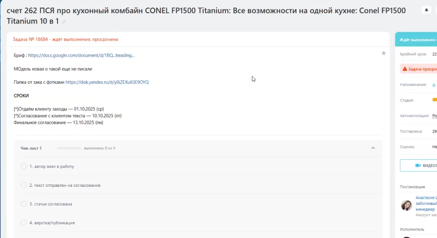{width=884px height=483px}

Работа начинается с получения задачи в Bitrix, откуда необходимо взять ссылку на бриф (для понимания аудитории) и согласованный текстовый документ.

-  **Авторизация:** Зайдите на Яндекс Почту [`ibstudioads@yandex.ru`](mailto:ibstudioads@yandex.ru), перейдите в кабинет ПромоСтраниц и выберите нужный аккаунт клиента из списка.

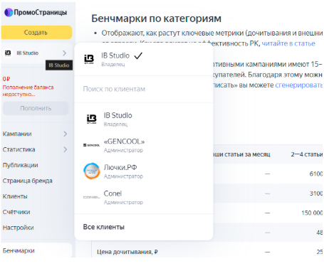{width=455px height=374px}

-  **Поиск статьи:** Откройте раздел «Публикации» и нажмите «Отредактировать» на новой сверстанной статье.

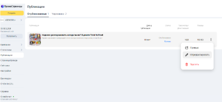{width=451px height=208px}

-  **Сверка текста:** Сравните текст в кабинете с исходным документом -- должно совпадать не только содержание, но и оформление.

-  **Заголовки и стили:** Основные заголовки должны быть размечены как H2, подзаголовки -- как H3. Перечисления оформляйте маркированными списками. Все важные элементы выделяйте жирным шрифтом.

-  **Изображения:** У всех картинок должно быть текстовое описание. Если идет несколько фото подряд, их необходимо объединить в галерею.

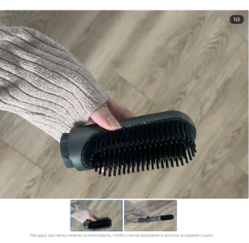{width=315px height=307px}

-  перечисления, используемые в тексте, должны раскрываться через маркированные списки, как на примере

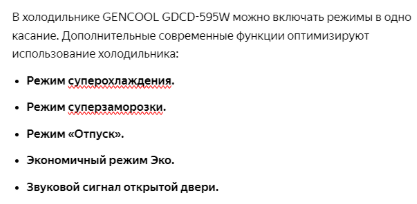{width=417px height=204px}

-  все важные элементы статьи должны быть выделены жирным шрифтом, стиль текста который есть в файле со статьей должен быть перенесен при верстке в полном объеме.

### Этап 2: Настройка ссылок, Scroll2Site и Call-to-Action (CTA)

1. **Количество и распределение:** На всю статью должно быть 3–4 ссылки, размещенные равномерно. Например: лид-абзац -- ссылка на Яндекс Маркет, следующий абзац без ссылок, далее -- ссылка на Ozon.

2. **Оформление ссылок:** Ссылка должна быть вшита в название продвигаемой модели, в том числе в самом первом абзаце.

3. **Метки (UTM):** Ссылки обязательно должны содержать разметку. Стандартный вид: `utm_source=MyGadget`, `utm_medium=promostranicy_yandexa`, `utm_campaign=категория_или_название_статьи`. Для Ozon ссылки формируются с автоматическими метками через блок внешнего трафика маркетплейса.

4. **Концовка и CTA:** В последнем абзаце разместите призыв к действию и укажите выгоду (скидку). Промокод должен стоять на отдельной строке, чтобы его было легко скопировать. CTA должен учитывать платформу посадочной страницы (например, если промокод только для Ozon, это нужно указать).

5. **Настройка Scroll2Site:** Проверьте блок перехода в конце статьи. Нужно загрузить скриншот мобильной версии (720х1200px) и ПК версии (1280х800px). Ссылка в Scroll2Site должна вести на релевантную площадку (если на скрине Яндекс Маркет, ссылка тоже должна вести на него).

### Этап 3: Обложки, заголовки и пиксели аудиторий

Нажмите «Настроить обложку и сохранить» в правом верхнем углу.

-  **Заголовки и тексты:** Выберите от 3 до 5 заголовков из файла. Хорошо работают варианты с цифрами, лайфхаками и ранним упоминанием товара. Описание должно логично стыковаться со всеми выбранными заголовками.

-  **Обложки:** после того как верстка проверена и исправлена по необходимости, переходим по кнопке “Настроить обложку и сохранить” в правом верхнем углу экрана;

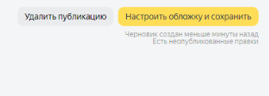{width=339px height=121px}

-  первым делом выбираем картинки, которые указаны как обложки в файле со статьей, обложек должно быть 3-5 штук на старте работы РК;

-  стиль обложек выбираем исходя из читабельности заголовков и корректного отображения картинок, используемых в качестве обложек;

-  заголовки должны быть перенесены из файла со статьей в полном объеме, минимум 3, максимум 5 штук;

-  проверяем, чтобы описание статьи было совместимо со всеми заголовками и описывало суть статьи;

-  быстрые ссылки должны соответствовать разделам статьи и основному заголовку, размещенному в статье;

-  обязательно ставим галочку на “Формировать описание автоматически”;

-  возвращаемся наверх и переходим в раздел “Пиксели”

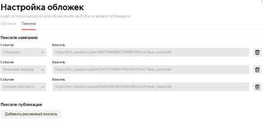{width=437px height=211px}

-  в новой вкладке браузера открываем сайт <https://audience.yandex.ru/> и переходим на вкладку “Пиксели” в верхнем горизонтальном меню по центру;

-  затем нажимаем на кнопку “Создать пиксель” и пишем название в соответствии с нужным нам действием читателя и указываем название статьи. Например,  “Gencool - ПСЯ - 5 причин выбрать - внешний переход”

-  В открывшемся окне копируем код пикселя и возвращаемся во вкладку с кабинетом ПСЯ

-  Выбираем одно из 3 событий, которое соответствует названию пикселя и вставляем код в строку, как на примере

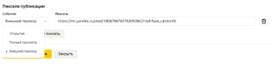{width=457px height=108px}

-  Создаем и размещаем 2 оставшихся кода пикселей и нажимаем на кнопку “Сохранить в кампанию”..

### Этап 4: Создание и запуск рекламной кампании (РК)

-  Как только в задаче отметили маркетолога и написали, что статья готова - можно приступать к запуску РК.

-  Для начала в нужном аккаунте найдите новую статью:

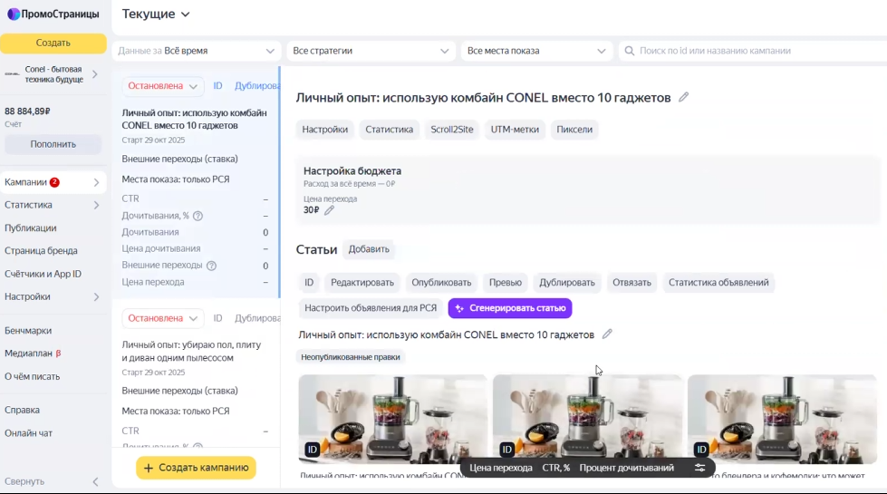{width=979px height=545px}

-  **Нажмите «Редактировать»** и проверьте содержание статьи до запуска *(подробно инструкция описана выше).*

-  После проверки: Выберите нужную статью - нажмите на «Настройки»

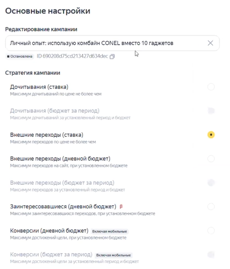{width=460px height=537px}

-  **Бюджет и стратегия:** Выберите стратегию «Внешние переходы (ставка)». Установите дневной лимит (в среднем 1000 руб.), лимит на саму кампанию (например 30000 руб.)  и ограничение цены перехода в 30 руб. на старте.

-  **Таргетинг:** Настройте параметры (пол, возраст) согласно брифу. При необходимости возраст можно слегка расширить на старте (например, с 50 до 55 лет).

-  **В блоке «Интересы и привычки»** добавьте около трех релевантных интересов. Сегменты оставьте пустыми, если нет готовых баз от клиента.

-  **Места показа:** Выбирайте строго под задачу. Для охвата -- только РСЯ, для продаж -- только Поиск. Смешивать их не рекомендуется.

-  **UTM-метки кампании:** UTM метки на уровне кампании оставляем стандартными и обязательно ставим галочку на пункте “Заменять UTM-метки, ранее проставленные в ссылках публикаций, на текущие настройки”. Исключение - Озон в качестве посадочной страницы. В этом случае формируем ссылки из блока внешнего трафика Озон и стандартные UTM метки со стороны промостраниц отключаем.

-  **Финальный запуск:** Добавьте пиксели на уровне кампании.

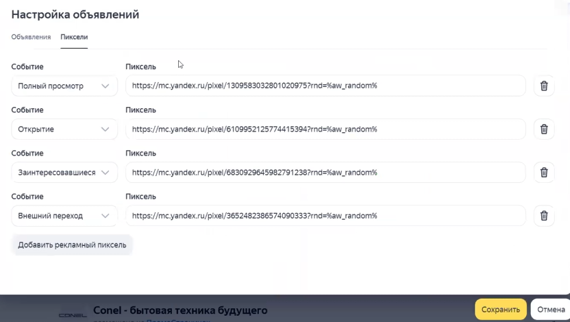{width=832px height=470px}

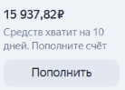{width=466px height=355px}

Нажмите «Создать кампанию», затем кнопку «Добавить», прикрепите вашу статью и активируйте запуск.

### Этап 4.1.:Пополнение баланса кабинета

[image:./instrukciya-po-zapusku-i-vedeniyu-rk-psya-13.png:::0,0,100,100:::138px:99px:left]

-  Способ пополнения кабинета зависит от того, подключен клиент к Elama или нет. В случае, если клиент не подключен к Elama, необходимо пройти следующие шаги:

-  Для пополнения баланса кабинета необходимо в левом верхнему углу нажать кнопку “Пополнить”:

-  Далее прописать сумму с учетом НДС. Для определения суммы рассчитываем количество оставшихся дней до конца периода сопровождения и умножаем на 1200 руб. (ежедневная сумма списания с учетом НДС).

-  В открывшемся окна нажимаем на предложенную ссылку для проверки данных рекламодателя:

[image:./instrukciya-po-zapusku-i-vedeniyu-rk-psya-14.png:::0,0,100,100:::313px:220px:right]

-  Проверяем, чтобы корректно было указано Юр.лицо клиента и сумма пополнения. В случае, если рекламодатель не тот, нажимаем на стрелку и выбираем верный вариант. После нажимаем на кнопку “Выставить счет” и отправляем скачанный файл в клиентский чат на оплату.

В случае если мы подключаем клиента к Elama, необходимо воспользоваться данной [инструкцией](https://docs.google.com/document/d/1OZbA65bGDZm1ApTKQVJ1UY73OmC2WA0M4MSlQVVJ7GY/edit?usp=sharing). Если клиент уже подключен через нас к Elama и необходимо пополнить кабинет, авторизуемся в кабинете, выбираем нужного клиента в списке и переходим к п.18.

### Этап 5: Еженедельная аналитика и оптимизация

Переходим по [ссылке](https://docs.google.com/spreadsheets/d/1OQhIrMaXpV3mdI1vocA4OQ1aakI4DPTLdYAi1t741Uk/edit?gid=1302932049#gid=1302932049) и делаем копию шаблона отчета на последнем листе, удаляем лишние листы и заполняем файл данными прошлой недели из раздела “Статистика”, путь на примере

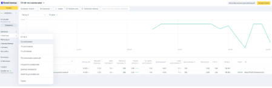{width=449px height=145px}

-  переходим в Тепловую карту, выбирая нужную нам статью, как на примере

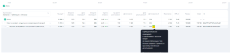{width=456px height=105px}

Затем проходим всю статью по тепловой карте, выбираем раздел “карта оттока” и определяем проблемное место. Жёлтым и красным в карте оттока отмечены части текста, которые в момент ухода читателя из статьи находились внизу его экрана.

Эти области и те, которые находятся над ними -- слабые места статьи, и их стоит скорректировать. Для лид-абзаца нормальный уровень оттока - 20-25%, если выше - необходимо корректировать. Для внесения правок в проблемные части статьи необходимо обратиться к редакции в задаче.

-  далее в той же статистике определяем неэффективные обложки (для этого необходимо в “Группировке” выбрать “Изображение”) и меняем их на новые версию в настройках из 2 пункта. Мы стараемся тестировать пользовательские (домашние) фото товара (без лиц пользователей), по нашему опыту они дают наибольший % переходов при показах объявлений. Новые варианты можно выбрать из тех, что предоставил клиент или поискать в отзывах на маркетплейсах.

Как определить неэффективные обложки: ctr ниже 1% либо гораздо ниже других вариантов в статье, цена перехода выше более чем на 30% в отличии от других вариантов. Исключение - оценка интереса аудитории гораздо выше, чем у других обложек.

-  аналогичную аналитику проводим с заголовками, выбрав в “Группировке” “Заголовки”, при необходимости также заменяем в настройках публикации.

-  еженедельно проверяем оценку интереса аудитории за прошедший период. Кликаем на оценку, чтобы посмотреть подробности. Если общая оценка интереса ниже 4%, ищем причину среди ответов читателей, которых не заинтересовал материал. Далее обсуждаем проблему с редакцией. Если большинство ответов - “не вызывает доверия” - возможно есть смысл добавить в статью больше пользовательских материалов в формате gif.

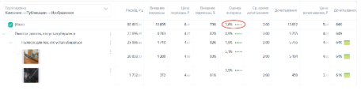{width=456px height=124px}

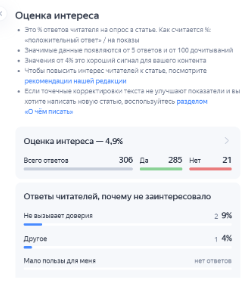{width=250px height=291px}

Для базовой оценки эффективности написанной статьи можно использовать [инструкцию ](https://docs.google.com/document/d/1YHutuQxzbnC06Sp8Bgy1hmY3tZMMLCjMB9IDVGCSTJg/edit?usp=sharing)и при необходимости подсвечивать слабые места редакции.

-  после того, как статья наберет 1000 просмотров, отправляем её на бесплатный аудит администрации ПСЯ, заполнив форму по [ссылке](https://yandex.ru/support2/promopages/ru/support/support). Так мы получим новые гипотезы для правок в текст и РК, которые могут улучшить показатели.

-  для оценки показателей (общих и прошлой недели) мы опираемся на бенчмарк ПСЯ и указанные в них показатели для продвигаемой нами категории товара в статье. Бенчмарк находится на главной странице, после входа в рекламный кабинет

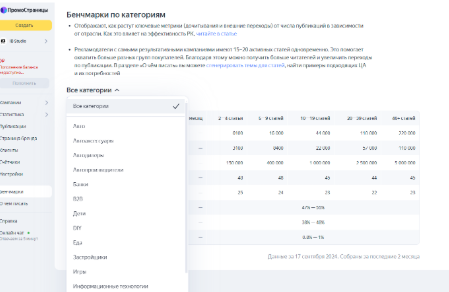{width=449px height=292px}

Если показатели ниже бенчмарок, значит, нужно проводить оптимизацию дальше и тестировать новые гипотезы по улучшению текущей ситуации.

-  Тестируемые гипотезы для следующей недели нужно указывать в отчете в столбце с заголовком “Комментарий” + фиксировать версии статей в соседнем столбце, для того чтобы можно было понять, повлияла ли правка в положительную сторону или нужно вернуть все как было ранее.