Данная инструкция описывает процесс проверки статей на актуальность информации (цены, ссылки, верстка) и базовый анализ активности пользователей.

### 1\. Подготовка к работе

-  Для начала работы откройте проверяемую статью и создайте новый пустой документ.

{width=644px height=233px}

[image:./instrukciya-po-auditu-statey-i-analizu-metriki-2.png:::0,0,100,100:83::829px:129px:center]

-  Все найденные недочеты необходимо фиксировать именно в этом новом документе, чтобы у вас все было собрано в одном месте.

-  Это гораздо удобнее, чем писать правки в чат, так как редактор или верстальщик сможет легко пройтись по вашему списку и ничего не забыть исправить.

### 2\. Проверка текста, цен и ссылок

Главная задача аудита -- пройтись по статье, посмотреть адекватность текста, проверить все ссылки и ценники.

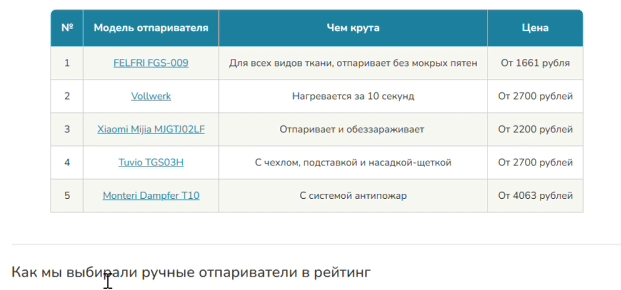{width=621px height=290px}

-  **Базовая проверка текста:** Читайте текст по диагонали. Если замечаете грубые или жесткие ошибки, обязательно фиксируйте их для редактора.

-  **Проверка таблиц:** В самом начале проверьте сводную таблицу и прокликайте все ссылки.

-  **Сравнение цен:** Сравнивайте цены в статье с реальными. Если модель немного подорожала или подешевела, цену можно оставить, но кардинальные отличия в несколько тысяч рублей (особенно в дорогостоящих категориях) нужно обязательно контролировать и обновлять.

-  **Наличие товара:** Если товара нет в наличии или он снят с продажи у продавца, укажите, что нужно заменить ссылку (например, на другой маркетплейс) или попросите редактора заменить саму модель на другую.

-  Сделайте скриншот экрана и вставьте в документ.

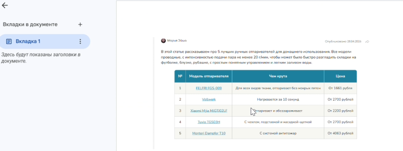{width=816px height=307px}

-  Впишите все правки, которые относятся к данной части.

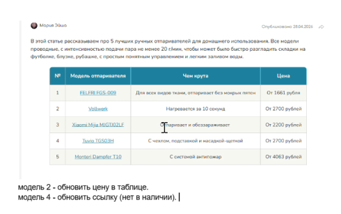{width=490px height=307px}

### 3\. Проверка верстки и виджетов

-  Обязательно проверяйте все кнопки в статье, так как иногда они могут слетать и становиться некликабельными.

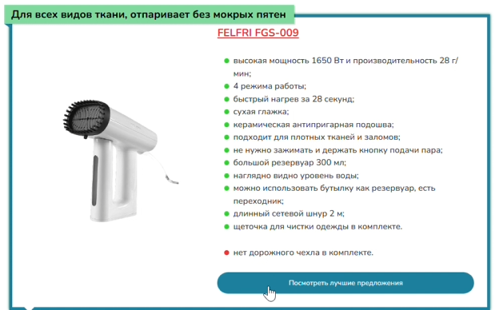{width=619px height=388px}

-  Следите за визуалом: если не отображается картинка или есть проблемы с текстом, делайте скриншот и отправляйте с пометкой «нужно поправить верстку».

-  Проверяйте цены в товарных виджетах. Если на одном маркетплейсе (например, Wildberries) цена значительно выше, чем на Ozon, напишите требование: «обновить цены в виджете у обоих маркетплейсов».

-  Если товара нет в продаже по ссылке в виджете на Яндекс.Маркете, попросите верстальщика поменять ссылку в виджете на Ozon или Wildberries.

### 4\. Правила фиксации ошибок

-  При обнаружении любой проблемы делайте скриншот экрана и вставляйте его в ваш документ.

-  Пишите четкие комментарии к скриншотам, например: «модель 2 -- обновить цену в таблице» или «модель 4 -- обновить ссылку, нет в наличии».

-  Уточняйте расположение элемента (например, укажите «нижняя таблица»), чтобы у верстальщика не возникло вопросов о том, где именно нужно внести изменения.

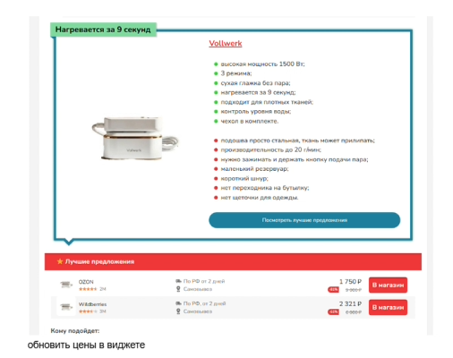{width=506px height=400px}

### 5\. Анализ в Яндекс Метрике (Карта ссылок и Карта кликов)

После проверки статьи на ошибки можно переходить к анализу поведения пользователей.

-  **Доступ к отчету:** Зайдите в Яндекс Метрику и выберите нужный счетчик.

В левом меню нажмите на вкладку «Поведение» и перейдите в раздел «Карта ссылок».

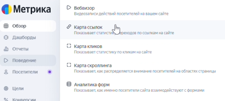{width=438px height=198px}

-  **Настройка периода:** Нажмите на стрелочку и выберите необходимый отчетный период (например, с даты запуска статьи). (Если мешает плашка - отдалите  страницу ctrl + колесико мышки)

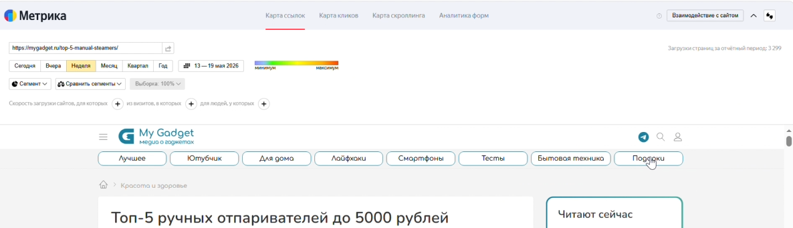{width=1186px height=342px}

-  **Оценка переходов:** В отчете отображается статистика переходов. Чем «краснее» строчка или плашка, тем больше к ней внимания и кликов пользователей. Если цвет синий или зеленый -- переходов по минимуму, желтый -- среднее значение.

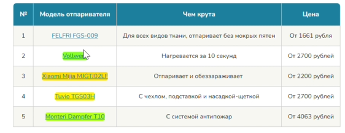{width=562px height=218px}

:::note 

Система может не всегда правильно подтягивать данные из-за сбоев или иных причин!

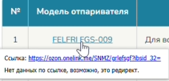{width=211px height=101px}

Чтобы примерно понимать количество переходов необходимо перейти в Конверсии и найти нужную цель:

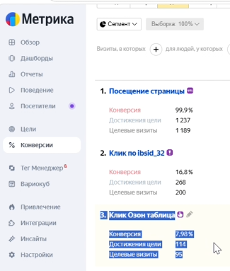{width=325px height=383px}

:::

-  **Анализ конкурентных моделей:** Обращайте внимание на распределение кликов. Если четвертая или пятая модель имеет красную плашку выделения, это означает, что они перетягивают слишком много внимания, и их стоит рассмотреть к замене.

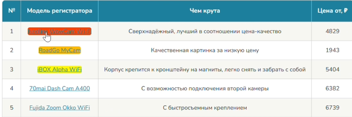{width=685px height=228px}

-  **Фиксация данных:** Выписывайте в свой документ количество переходов по каждой модели, опираясь на показатели Карты ссылок. Также делайте скриншоты.

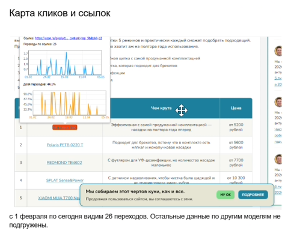{width=504px height=400px}

-  **Карта кликов:** Для дополнительной проверки рядом находится раздел «Карта кликов». Он показывает тепловую карту чувствительности и демонстрирует сами нажатия пользователей на экране.

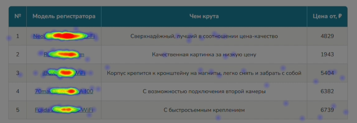{width=720px height=248px}

Также фиксируйте эту информацию в документе.

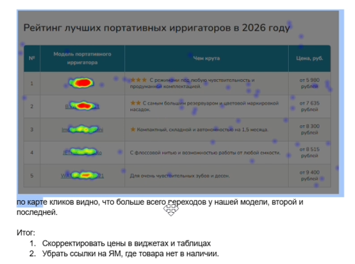{width=499px height=371px}

-  **Подведение итогов:** В конце вашего документа с аудитом напишите общий итог (например, что нужно скорректировать цены или изменить модель).

### Видео-урок можно посмотреть здесь:

[Ссылка](https://mygadget.bitrix24.ru/bitrix/tools/disk/focus.php?objectId=426906&cmd=show&action=showObjectInGrid&ncc=1)