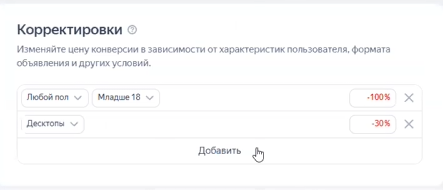
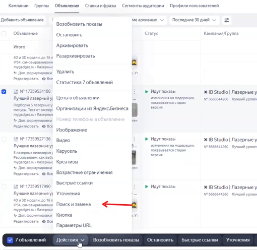
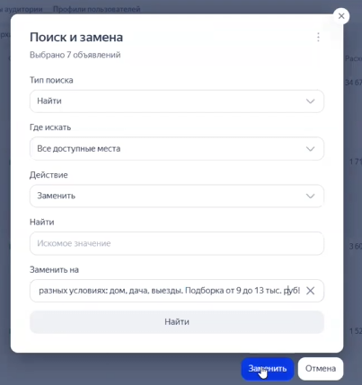

Данная инструкция описывает процесс анализа и внесения корректировок в рекламные кампании (на примере поиска) один раз в 1-2 недели. Оптимизация проводится на основе данных о типах устройств, поле, возрасте, платежеспособности аудитории, а также текстах и заголовках объявлений.

### 1\. Подготовка и выгрузка статистики

-  Откройте новый интерфейс «Мастера кампаний».

-  Выберите период анализа: последние 1-2 недели.

-  В настройках детализации выберите «не задано» и включите отображение данных «с НДС».

-  Выставите максимум полезных показателей для анализа, на первое место поставьте «Стоимость конверсии» (саму цель выбирать не нужно, она подтягивается автоматически).

### 2\. Оптимизация по типам устройств

Хотя тип устройства не относится напрямую к соц-дему, его анализ необходим.

-  В отчете выберите срез по типу устройства и оцените стоимость конверсии.

-  Определите среднюю стоимость достижения цели (например, 47 руб.) и найдите устройства, где эта стоимость значительно превышает среднюю (например, планшеты).

-  Для внесения изменений перейдите в настройки рекламной кампании (в самый низ, раздел «Корректировки»).

{width=443px height=190px}

-  Добавьте понижающую корректировку для неэффективных устройств. Например, если было мало конверсий, но они дорогие, можно снизить ставку на 30%.

-  Если десктопы обходятся немного дороже среднего, но в допустимых пределах, корректировки вносить не нужно.

### 3\. Оптимизация по полу и возрасту

-  Переключите отчет на срез «Пол и возраст».

-  Проанализируйте разные группы. Например, если мужчины и женщины старше 55 лет обходятся чуть выше средней цены, но на них уходит около 10% расхода -- это допустимо.

-  Оценивайте объем выборки: если по определенной группе (например, «неопределенный пол 25-34» или «мужской пол неопределенного возраста») расход был маленьким, выводы делать рано и трогать их не нужно.

-  Вносите корректировки только при наличии сильного разброса цен и достаточной статистики.

### 4\. Оптимизация по уровню платежеспособности

-  Переключите отчет на срез «Уровень платежеспособности».

-  Оцените объем выборки. Если большая часть расхода приходится на аудиторию с *неизвестной* платежеспособностью, вносить правки в остальные сегменты (даже если они дорогие) не имеет смысла, так как данные будут недостоверны.

### 5\. Оптимизация содержания объявлений (Заголовки и Тексты)

Анализ контента объявлений проводится в разрезе групп, чтобы исключить влияние семантики на стоимость конверсии.

#### Этап А: Анализ стоимости в разрезе групп

-  Добавьте в отчет название группы объявлений и номер объявления.

-  Посмотрите среднюю стоимость цели по кампаниям в разрезе групп. Если одна группа (например, «лучший уровень») значительно дороже остальных, это означает, что сама семантика группы дорогая. Учитывайте это при оценке заголовков внутри этой группы.

#### Этап Б: Оптимизация Заголовков

-  Добавьте в отчет столбец «Заголовки».

-  Ищите заголовки, стоимость конверсии по которым превышает среднюю (например, выше 50 рублей). Опять же, учитывайте размер выборки -- если расход небольшой, не спешите с правками.

-  Проверьте, какие заголовки не работают. Например, если неэффективна связка с упоминанием «проекции 360», ее нужно заменить.

-  Замените неэффективные заголовки. Обязательно сохраняйте ключевое слово группы (например, «нивелир лучший») и подбирайте новые преимущества из вашей статьи (например, упоминание точности, прочности, года или выгоды).

-  Внесите изменения в настройки нужных объявлений и сохраните.

#### Этап В: Оптимизация Текстов

-  Продублируйте отчет и выберите срез «Тексты».

-  Найдите самые дорогие тексты (например, стандартное перечисление «подборка 5 лазерных уровней»).

-  Для быстрой замены используйте инструмент массовых изменений: выберите нужные объявления, нажмите «Поиск и замена».

{width=510px height=496px}

-  Сформулируйте новый текст, используя разные модели. Например, если простое перечисление не сработало, добавьте:

   -  Сегментацию по цене (например, «от 9 до 13 тысяч рублей», предварительно проверив актуальность цен на рынке).

   -  Слова-триггеры, подтверждающие качество («протестировали», «тест 5 моделей»).

   -  Закрытие болей (например, «в разных условиях: дом, дача, выезды»).

-  Замените старый текст на новый в интерфейсе через массовую замену.

{width=403px height=429px}