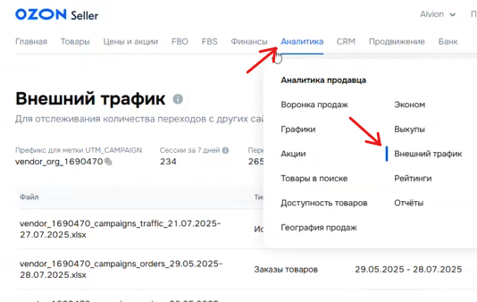

### 1\. Подготовка отчетной таблицы

-  Откройте рабочий файл со статистикой на нужном листе клиента.

[image:./instrukciya-po-sboru-ezhenedelnoy-statistiki.png:::0,0,100,100:67::905px:401px:left]

-  Создайте новые строки для отчетного периода.

-  Установите актуальные даты (например, с 21-го по 27-е число).

-  Проверьте структуру столбцов: данные должны разделяться по типам кампаний (**Поиск** и **РСЯ**).

### 2\. Сбор данных из Яндекс.Директа

[image:./instrukciya-po-sboru-ezhenedelnoy-statistiki-2.png:::0,0,100,100:68::831px:397px:left]

-  Авторизуйтесь в соответствующем кабинете Яндекс.Директа.

-  Установите отчетный период в «Статистике».

-  Выпишите показатели по каждой кампании (Поиск / РСЯ):

   -  **Расход** (сумма с НДС).

   -  **Количество кликов**.

### 3\. Сбор данных из Яндекс.Метрики

-  Зайдите в счетчик Метрики, привязанный к проекту.

-  Перейдите в раздел  **Конверсии**.

[image:./instrukciya-po-sboru-ezhenedelnoy-statistiki-3.png:::0,0,100,100:80::809px:421px:center]

-  Установите тот же период дат.

-  Найдите цели, отвечающие за переходы на маркетплейс (обычно содержат в названии `JavaScript`, `Переход по ссылке` или `ibsid`).

-  **Важно:** При подсчете «Кликов на Ozon» суммируйте уникальные клики из виджетов, исключая дубли (ориентируйтесь на `ibsid`).

   -  *Пример:* Если данные в разных виджетах дублируются, выбирайте только одно корректное значение.

-  Занесите данные в таблицу отдельно для Поиска и РСЯ.

### 4\. Сбор данных из кабинета Ozon (Внешний трафик)

Если есть прямой доступ к кабинету селлера:

-  Перейдите в раздел **Аналитика** -> **Внешний трафик**.

{width=534px height=338px}

-  Нажмите **Сформировать отчет** (тип отчета: «Источники трафика»).

{width=785px height=49px}

-  Выберите нужный диапазон дат, нажмите «Сформировать» и скачайте Excel-файл по готовности.

[image:./instrukciya-po-sboru-ezhenedelnoy-statistiki-6.png:::0,0,100,100:::305px:321px:left]

В файле примените фильтр по столбцу источников трафика:

-  Отфильтруйте кампании на **Поиске**: выпишите количество заказов и сумму продаж.

-  Отфильтруйте кампании **РСЯ**: выпишите количество заказов и сумму продаж.

-  Сравните количество переходов в отчете Ozon с данными Метрики для проверки достоверности трекинга.

### 5\. Работа при отсутствии доступа к кабинету маркетплейса

Если доступа к кабинету Ozon/Wildberries нет:

-  Самостоятельно данные в кабинете не смотрим.

-  Отчет запрашивается у клиента напрямую.

-  После получения файла данные вносятся в таблицу по аналогичной схеме.

---

:::quote 

**Примечание:** Данная статистика является достаточной для еженедельного контроля эффективности в рамках работы с клиентами «Топ-5».

:::