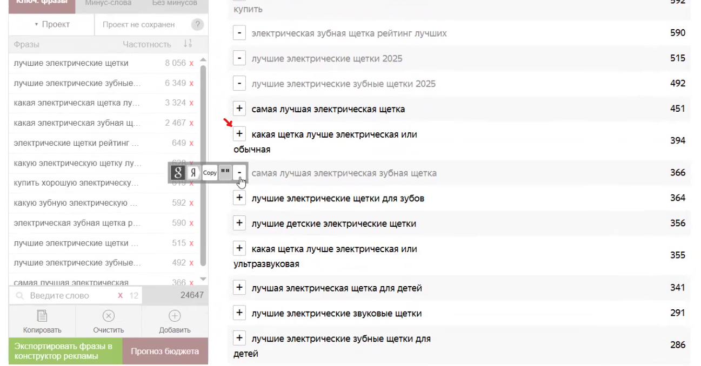
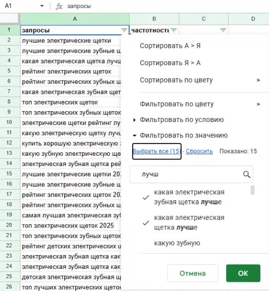
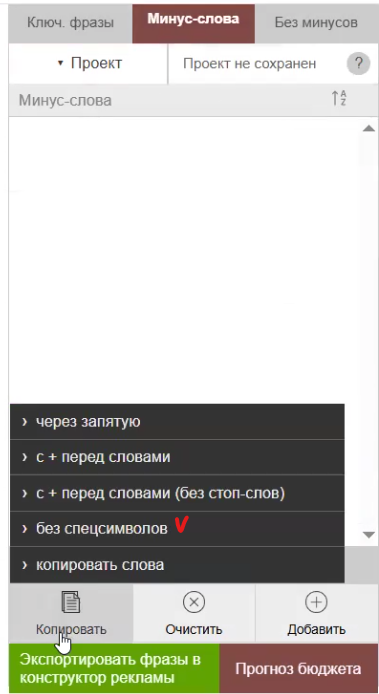
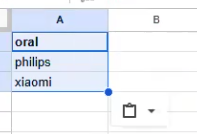
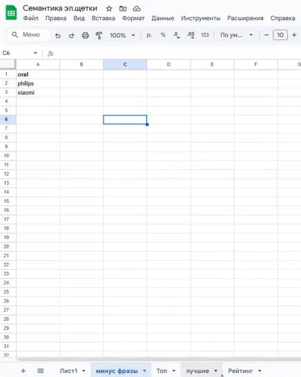

*Время прочтения - 5 мин. Норма выполнения - 180 мин.*

### 1\. Подготовка инструментов

-  **Установка расширения**: Установите расширение «UTA - Manager» для браузера.

   {width=1436px height=724px}

-  **Авторизация**: Войдите в расширение через Яндекс Почту.

-  **Интерфейс**: После установки и входа расширение интегрируется в интерфейс Яндекс Wordstat.

   {width=1339px height=688px}

### 2\. Принципы подбора ключевых фраз

-  **Тип запросов**: Для продвижения в «Топ-5» используйте преимущественно **информационные запросы**.

-  **Использование масок**: Собирайте семантику по основным маскам, комбинируя «лучшие / топ / рейтинг» с вашей категорией товара.

**Пример:**

*лучшие + категория товара*

*как выбрать + категория товара*

*топ + категория товара*

*рейтинг + категория товара*

:::lab 

*\*могут быть и другие маски из подобного пула*

:::

{width=1419px height=626px}

Нажимая на кнопку «плюсик» вы дополните список ключевых фраз.

{width=1297px height=678px}

:::tip 

Сначала можно собирать семантику в общий список, а уже позже разносить в гугл-таблице, так как нам нужно сохранить ее на будущее для расширения или перегруппировки.

:::

-  **Вопросные формы**: Используйте маски вида *«как выбрать \[категория\]»*.

:::note 

**Коммерческие запросы**: Старайтесь не брать фразы со словом *«купить»*, так как коммерческий трафик обходится дороже.

:::

:::tip 

Перед началом сбора ознакомьтесь с рейтингом, чтобы примерно понимать, какие запросы целевые, а какие - нет.

:::

### 3\. Организация данных в таблице

-  **Сохранение**: Перенесите собранные фразы вместе с частотностью в Google Таблицы для хранения и возможности дальнейшей перегруппировки.

[image:./instrukciya-po-sboru-semantiki-dlya-top-5.png:::0,0,100,100:71::1031px:1198px:center]

-  **Группировка**: Распределите запросы по разным листам в зависимости от групп (масок).

Создайте фильтр в гугл-таблице, для удобного поиска групп.

[image:./instrukciya-po-sboru-semantiki-dlya-top-9.png:::0,0,100,100:72::783px:635px:center]

В фильтре введите маску, которую хотите выделить.

{width=525px height=568px}

Нажмите «Выбрать все» и затем «ОК». Вы получите отфильтрованную базу, которую можно скопировать и перенести на отдельный лист.

[image:./instrukciya-po-sboru-semantiki-dlya-top-11.png:::0,0,100,100:53::351px:370px:center]

Повторите данное действие до полного формирования всех групп.

-  **Минус-фразы**: Необходимо добавить мину-фразы. Нажмите на слово, чтобы оно добавилось в список.

:::info 

**Работа с брендами**:

-  Не добавляйте бренды конкурентов, которые уже упоминаются в вашем «Топ-5» (это полезный трафик).

-  Бренды, которых нет в статье, на старте лучше не добавлять, либо использовать их как дополнительный источник трафика, если охваты невелики.

:::

[image:./instrukciya-po-sboru-semantiki-dlya-top-14.png:::0,0,100,100:68::859px:662px:center]

-  Создайте отдельный лист для минус-фраз. При копировании из расширения выбирайте вариант «без спецсимволов», так как они не требуются.

{width=379px height=694px}

Вставьте минус-фразы на новый лист.

{width=197px height=134px}

### 5\. Финальный результат

-  Итоговый файл должен содержать несколько листов с группами ключевых фраз и один лист с очищенным списком минус-слов.

{width=436px height=545px}