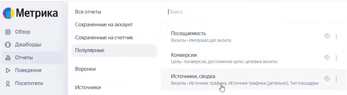
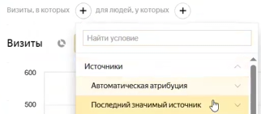
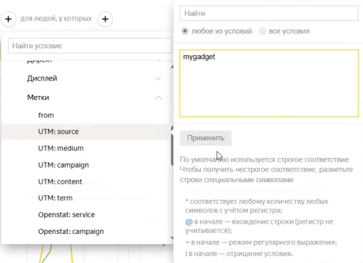
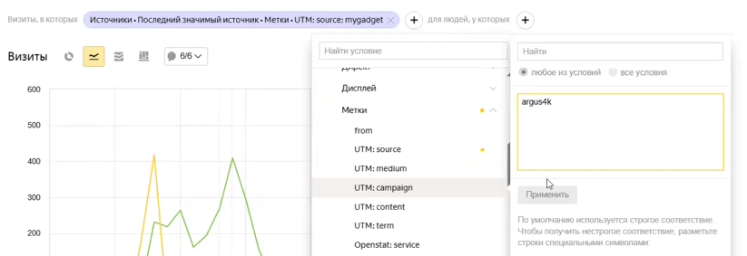
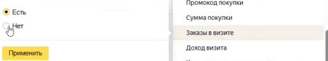
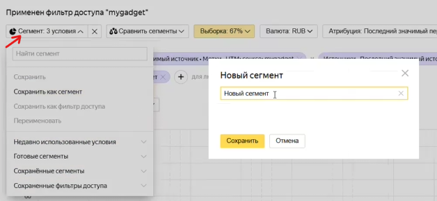
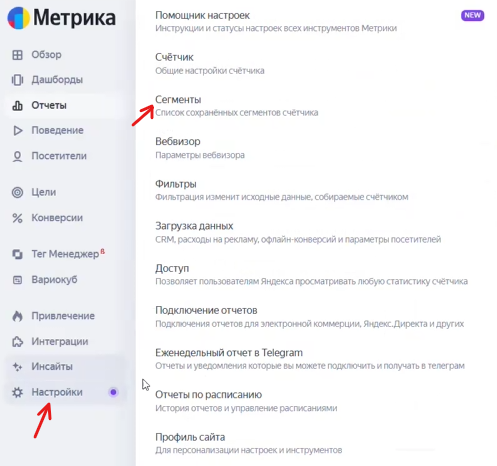

Данный алгоритм позволяет выделить пользователей, которые перешли с вашего ресурса по ссылке на конкретный товар, но еще не совершили покупку.

### 1\. Подготовительный этап

-  **Проверка доступа:** Убедитесь, что у вас есть доступ к счетчику Яндекс.Метрики, установленному на целевом сайте или в Яндекс.Маркете.

[image:./instrukciya-po-sozdaniyu-segmenta-auditorii-v-yan.png:::0,0,100,100:91::846px:395px:center]

-  **Сбор данных из UTM-меток:** Перейдите на страницу вашей статьи или ресурса, где размещена ссылка на товар. Кликните по ссылке и скопируйте значения UTM-меток (например, `utm_source` и `utm_campaign`), чтобы использовать их для фильтрации.

### 2\. Настройка фильтров (сегментация)

Перейдите в личный кабинет Яндекс.Метрики, выберите нужный счетчик и откройте отчет **«Источники, сводка»**. Далее последовательно добавьте три условия через нажатие на иконку «плюс» в разделе **«Визиты, в которых»**:

{width=682px height=187px}

#### Условие №1: Источник перехода

-  Выберите путь: **Визиты, в которых** **-> Источники** -> **Последний значимый источник** -> **Метки**.

{width=322px height=141px}

-  Укажите метку вашего ресурса (например, `mygadget`) и нажмите «Применить».

{width=461px height=334px}

#### Условие №2: Конкретный товар

-  Снова перейдите в **Метки**, но выберите второе значение, отвечающее за конкретную модель товара (например, название модели видеорегистратора `argus4K`).

{width=823px height=283px}

-  Важно вводить название точь-в-точь так, как оно указано в ссылке.

#### Условие №3: Отсутствие заказа

-  Выберите путь: **Электронная коммерция** -> **Заказы в визите**.

{width=463px height=86px}

-  Установите значение: **«Нет»**.

### 3\. Сохранение сегмента

-  После применения всех фильтров над графиком появится надпись **«Сегмент: 3 условия»**.

{width=628px height=290px}

-  Нажмите кнопку **«Сохранить как»**.

-  Введите понятное название, например: *«Ретаргетинг для Argus4K»*.

-  Нажмите **«Сохранить»**.

### 4\. Проверка и управление сегментами

-  Для просмотра всех созданных групп пользователей перейдите в раздел **«Настройка»** -> **«Сегменты»**.

{width=497px height=466px}

-  В этом списке можно проверить названия сегментов и количество аудитории в них.

---

:::quote 

**Важное примечание:** Если аудитория получилась слишком маленькой (например, из-за недавнего старта кампании или остановки бюджета), при запуске рекламы в Яндекс.Директе рекомендуется использовать опцию **«Похожий сегмент» (look-alike)** или дождаться накопления данных.

:::