### Этап 1: Подготовка сегментов в Яндекс.Метрике

Для запуска ретаргетинга необходимо собрать аудиторию, которая уже посещала статью и проявила интерес.

**1\. Выбор счетчиков:** Перейдите в счетчики Метрики, установленные на страницах с первой и второй версиями статьи.

{width=560px height=476px}

**2\. Настройка отчета:**

-  Откройте отчет **«Источники» -> «Метки UTM»**.

   {width=675px height=134px}

-  Выберите максимально широкий период (например, **1 год**), особенно если это первый запуск ретаргетинга.

-  Видим под графиком количество накопленной аудитории.

   {width=741px height=471px}

**3\. Сохранение сегмента:**

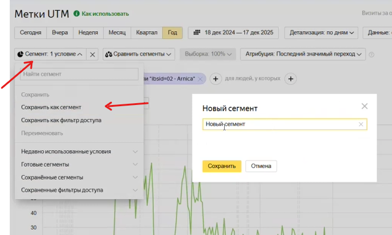{width=642px height=385px}

-  Нажмите **«Сохранить как сегмент»**.

-  Присвойте понятное название (например, «Аудитория для ретаргетинга достижение цели ibsid=01»).

**4\. Фильтрация по целям:**

-  Установите фильтр: **Визиты, в которых -> Поведение -> Достижение цели**.

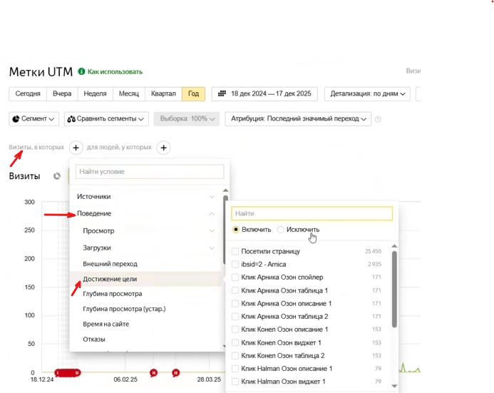{width=693px height=551px}

-  Выберите корректный `ibsid` вашей статьи (например, `ibsid=2-Arnica`).

-  Сохраните второй сегмент.

**5\. Проверка:** Убедитесь, что сегменты появились в списке сохраненных. Они автоматически подгрузятся в Яндекс.Директ на аккаунтах с доступом к счетчикам.

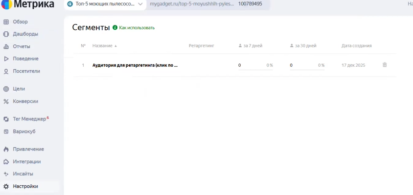{width=844px height=400px}

---

### Этап 2: Подготовка рекламных объявлений

Необходимо повторно изучить статью. Важно акцентировать внимание на преимуществах, которые упоминались в статье, чтобы «освежить» память пользователя.

Например, возьмем статью по пылесосам бренда Arnica.

#### Основные акценты для пылесоса (бренд Arnica):

-  **Универсальность:** Чистит любые поверхности.

-  **Комплектация:** 6 насадок в комплекте (включая турбощетку и насадки для влажной уборки).

-  **Чистота воздуха:** HEPA-фильтр 13 класса (задерживает аллергены и бактерии).

-  **Удобство:** Легкая очистка и возможность использования как освежителя воздуха.

-  **Вместительность:** Бак для жидкости до 8 литров.

#### Структура элементов:

-  **Заголовки:** Используйте разные модели (вставьте самые главные характеристики: упоминание поверхностей, акцент на HEPA-фильтр или статус «лучший пылесос 2025 года»). Обязательно указывайте бренд или полное название модели. Начинайте заголовок со слова «Купить».

-  **Доп. заголовки:** Не должны дублировать основной заголовок. Указывайте экспертность («лучший по мнению эксперта») или надежность магазина. 

-  **Тексты:** Дополняйте преимущества, не упомянутые в заголовке (например, мощность или работу в труднодоступных местах).

-  **Уточнения:** Добавьте 4–5 кратких преимуществ (HEPA-фильтр, быстрая очистка и т.д.).

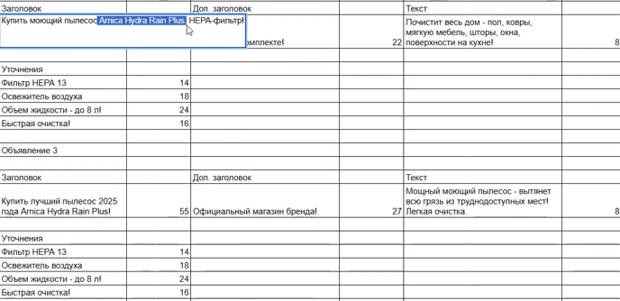{width=688px height=334px}

---

### Этап 3: Подбор визуальных материалов

Поскольку реклама ведет на маркетплейс (Ozon), лучше использовать качественные промо-материалы, а не любительские фото.

**1\. Изображения:** Подготовьте минимум 3 варианта:

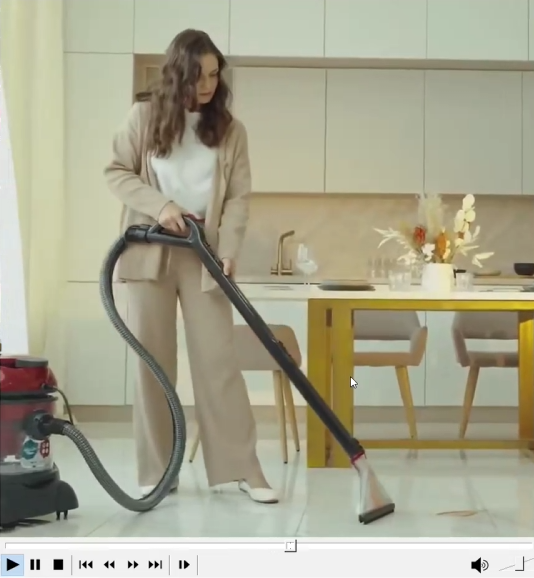{width=276px height=374px}

-  Промо-фото с инфографикой.

-  Пылесос на чистом белом фоне.

-  Качественное «лайфстайл» фото (пользовательское, но яркое).

**2\. Видео:** Используйте короткие ролики (например, из карточки товара на Ozon), показывающие процесс уборки. Оптимальный формат -- квадратный.

[image:./instrukciya-po-zapusku-retargetingovykh-rk-v-yand-8.png:::0,0,100,100:36::534px:578px:center]

---

### Этап 4: Настройка кампании в Яндекс.Директ

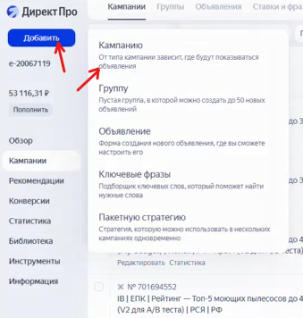{width=339px height=356px}

**1\. Создание:** Режим эксперта -> **Единая перформанс-кампания (ЕПК)**.

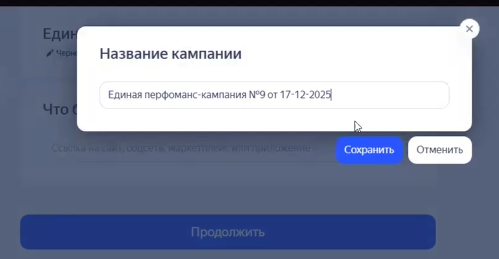{width=590px height=337px}

**2\. Название:** По стандарту агентства (Агентство | Модель | Статья | Ретаргетинг | Оплата за конверсию).

{width=499px height=259px}

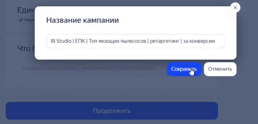{width=505px height=244px}

**3\. Ссылка:** Укажите ссылку на товар на Ozon с обязательным добавлением **UTM-меток** для отслеживания ретаргетинга.

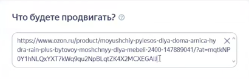{width=410px height=130px}

**4\. Организация:** можно поискать и если есть - добавить. Но если ведете на ОЗОН или другой маркетплейс - лучше не добавлять организацию, чтобы не путать пользователя.

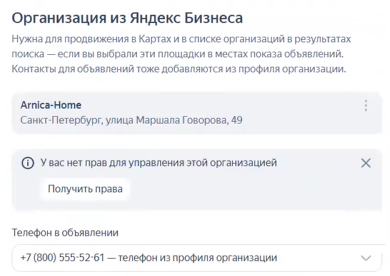{width=390px height=276px}

**5\. Места показов:** уберите все галочки, оставьте только РСЯ (Рекламная сеть Яндекса)

**6\. Стратегия:**

-  **Максимум конверсий** с оплатой за конверсии.

-  Цель: **«Покупка на Ozon»** (требуется подключение Ozon Performance API).

-  Ограничения расхода - Доля рекламных расходов (DRR): **10%**.

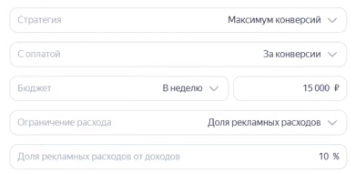{width=391px height=191px}

-  Добавьте **Ozon Performance API.** После его добавления должен автоматически подтянуться счетчик Ozon.

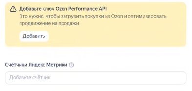{width=393px height=187px}

**7\. Директ помогает:** отключаем все галочки для прозрачности статистики.

**8\. Включаем мониторинг сайта.**

Введите название группы, например : «Ретаргетинг».

**8\. География показов:** Россия (исключая р.Крым)

:::lab 

Можно включить авторетаргетинг.

:::

**9\. Аудитория:** В блоке «Сегменты аудитории» выберите созданные ранее сегменты из Метрики.

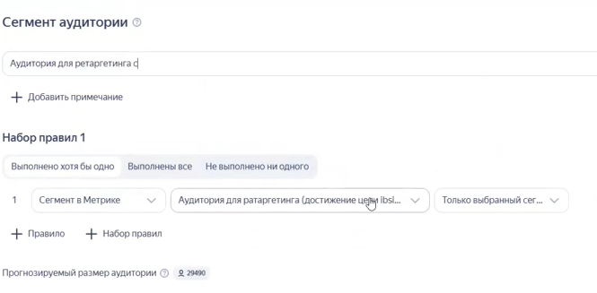{width=665px height=327px}

:::lab 

Можно включить настройку по сбору аудитории.

:::

**10\. Объявления:**

-  Выбираем те же самые ссылки.

-  Загрузите тексты и визуализацию из подготовленной таблицы.

-  КНастройте **смарт-центры** для изображений, чтобы важные элементы не обрезались.

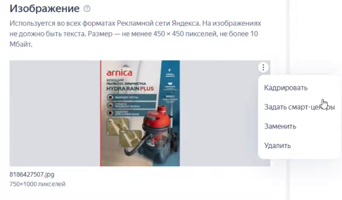{width=486px height=285px}

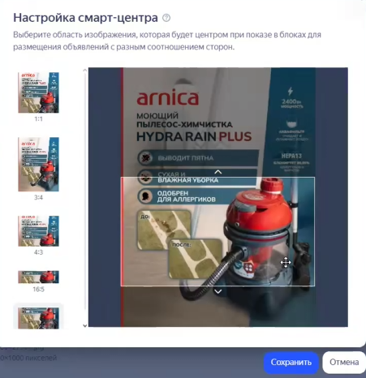{width=451px height=466px}

-  Кнопка действия: **«Узнать цену» и ссылку из блока «ссылка в объявлении»**.

-  Добавьте уточнения из таблицы.

-  Сохраните изменения.

---

:::lab 

### Важные примечания:

-  **Ozon Performance API:** Обязательно запросите доступ у клиента для корректной работы счетчика и отслеживания покупок.

-  **Быстрые ссылки:** При ведении на маркетплейс их можно не добавлять, так как основной фокус должен быть на переходе к товару.

-  **Мониторинг:** Не забудьте включить мониторинг сайта в настройках кампании.

:::