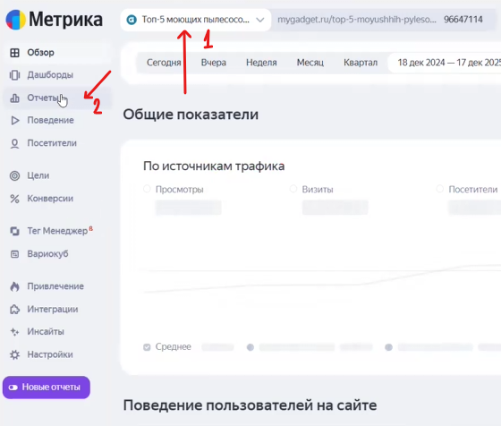
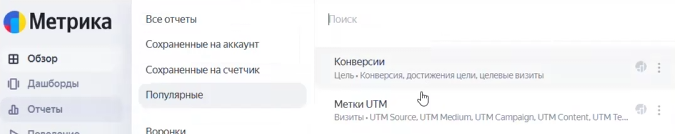
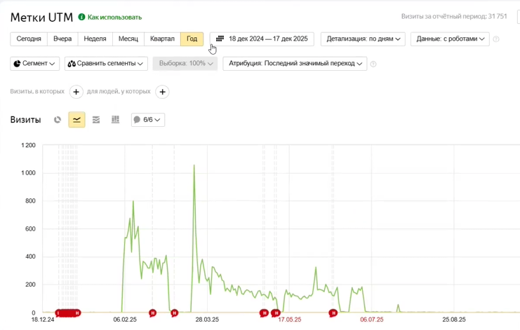

### Этап 1: Подготовка сегментов в Яндекс.Метрике

Для запуска ретаргетинга необходимо собрать аудиторию, которая уже посещала статью и проявила интерес.

1. **Выбор счетчиков:** Перейдите в счетчики Метрики, установленные на страницах с первой и второй версиями статьи.

   {width=560px height=476px}

2. **Настройка отчета:**

   -  Откройте отчет **«Источники» -> «Метки UTM»**.

      {width=675px height=134px}

   -  Выберите максимально широкий период (например, **1 год**), особенно если это первый запуск ретаргетинга.

      {width=741px height=471px}

3. **Фильтрация по целям:**

   -  Установите фильтр: **Визиты, в которых -> Поведение -> Достижение цели**.

      

   -  Для первой версии статьи выберите идентификатор цели `IBS ID = 0.2`.

      

   -  Для второй версии статьи выберите идентификатор `IBS ID = 2`.

      

4. **Сохранение сегмента:**

   -  Нажмите **«Сохранить как сегмент»**.

      

   -  Присвойте понятное название (например, «Аудитория для ретаргетинга\_0.2»).

      

5. **Проверка:** Убедитесь, что сегменты появились в списке сохраненных. Они автоматически подгрузятся в Яндекс.Директ на аккаунтах с доступом к счетчикам.

   

---

### Этап 2: Подготовка рекламных объявлений

Важно акцентировать внимание на преимуществах, которые упоминались в статье, чтобы «освежить» память пользователя.

#### Основные акценты для пылесосов (бренд Arnica):

-  **Универсальность:** Чистит любые поверхности.

   

-  **Комплектация:** 6 насадок в комплекте (включая турбощетку и насадки для влажной уборки).

   

-  **Чистота воздуха:** HEPA-фильтр 13 класса (задерживает аллергены и бактерии).

   

-  **Удобство:** Легкая очистка и возможность использования как освежителя воздуха.

   

-  **Вместительность:** Бак для жидкости до 8 литров.

   

#### Структура элементов:

-  **Заголовки:** Используйте разные модели (упоминание поверхностей, акцент на HEPA-фильтр или статус «лучший пылесос 2025 года»). Обязательно указывайте бренд или полное название модели.

   

-  **Доп. заголовки:** Не должны дублировать основной заголовок. Указывайте экспертность («лучший по мнению эксперта») или надежность магазина.

   

-  **Тексты:** Дополняйте преимущества, не упомянутые в заголовке (например, мощность или работу в труднодоступных местах).

   

-  **Уточнения:** Добавьте 4–5 кратких преимуществ (HEPA-фильтр, быстрая очистка и т.д.).

   

---

### Этап 3: Подбор визуальных материалов

Поскольку реклама ведет на маркетплейс (Ozon), лучше использовать качественные промо-материалы, а не любительские фото.

1. **Изображения:** Подготовьте минимум 3 варианта:

   -  Промо-фото с инфографикой.

      

   -  Пылесос на чистом белом фоне.

      

   -  Качественное «лайфстайл» фото (пользовательское, но яркое).

      

2. **Видео:** Используйте короткие ролики (например, из карточки товара на Ozon), показывающие процесс уборки. Оптимальный формат -- квадратный.

   

---

### Этап 4: Настройка кампании в Яндекс.Директ

1. **Создание:** Режим эксперта -> **Единая перформанс-кампания (ЕПК)**.

   

2. **Название:** По стандарту агентства (Агентство | Модель | Статья | Ретаргетинг | Оплата за конверсию).

   

3. **Ссылка:** Укажите ссылку на товар на Ozon с обязательным добавлением **UTM-меток** для отслеживания ретаргетинга.

   

4. **Стратегия:**

   -  **Максимум конверсий** с оплатой за результат.

      

   -  Цель: **«Покупка на Ozon»** (требуется подключение Ozon Performance API).

      

   -  Доля рекламных расходов (DRR): **10%**.

      

5. **Геотаргетинг:** Россия (за исключением Республики Крым).

   

6. **Аудитория:** В блоке «Сегменты аудитории» выберите созданные ранее сегменты из Метрики.

   

7. **Объявления:**

   -  Загрузите тексты и визуализацию из подготовленной таблицы.

      

   -  Настройте **смарт-центры** для изображений, чтобы важные элементы не обрезались.

      

   -  Кнопка действия: **«Узнать цену»**.

      

---

### Важные примечания:

-  **Ozon Performance API:** Обязательно запросите доступ у клиента для корректной работы счетчика и отслеживания покупок.

   

-  **Быстрые ссылки:** При ведении на маркетплейс их можно не добавлять, так как основной фокус должен быть на переходе к товару.

   

-  **Мониторинг:** Не забудьте включить мониторинг сайта в настройках кампании.