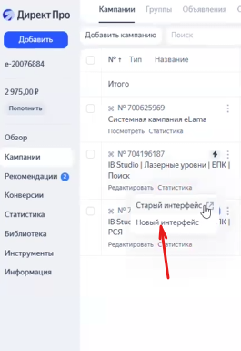
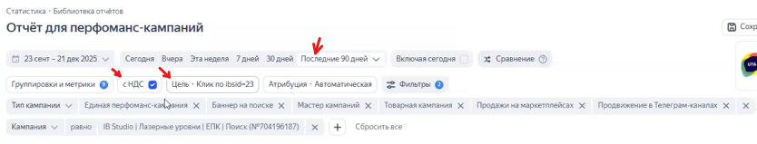
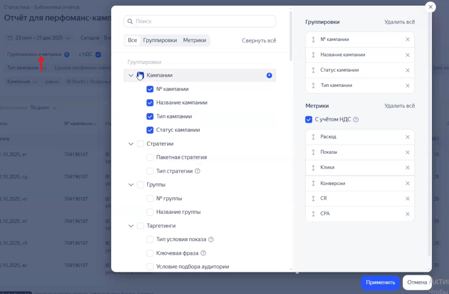
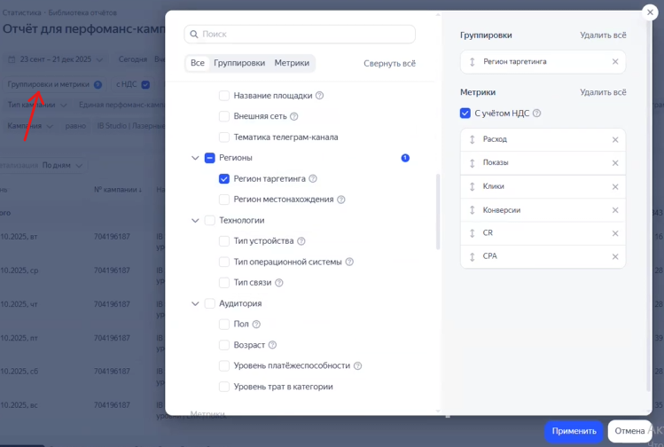
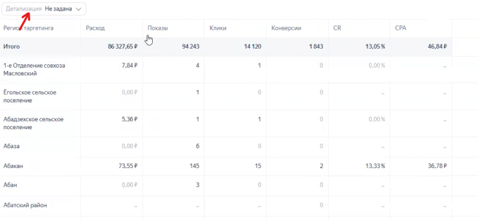
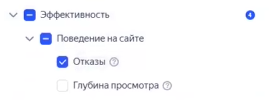
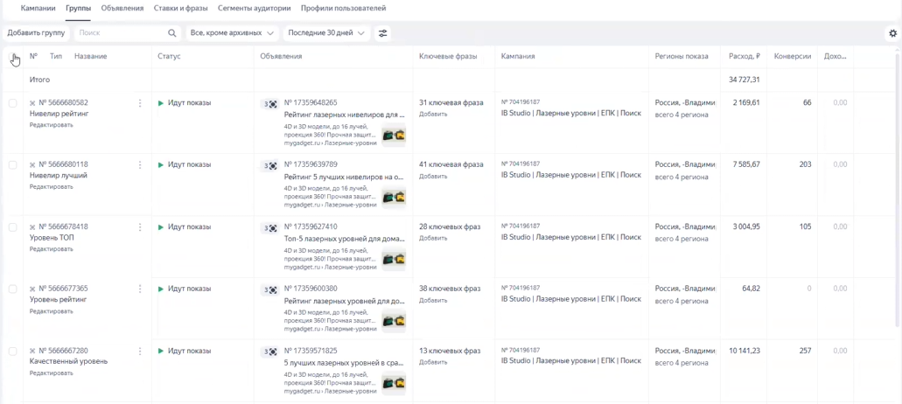
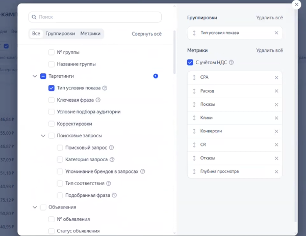
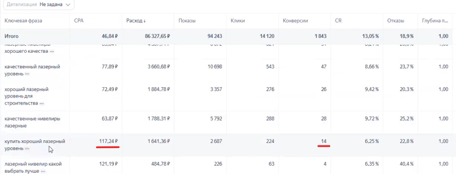

Эта инструкция детально описывает процесс анализа и внесения корректировок в рекламные кампании Яндекса по трем основным срезам: регионы, условия показа и ключевые фразы.

### 1\. Подготовка и общие настройки отчета

-  Откройте новый интерфейс «Мастер кампаний» и выберите нужную рекламную кампанию.

{width=265px height=385px}

-  Установите период анализа за все пройденное время работы кампании (например, за весь квартал).

-  Выберите отображение данных «с НДС».

-  Убедитесь, что необходимая цель подтянулась в настройки автоматически.

{width=834px height=159px}

{width=769px height=504px}

### 2\. Оптимизация в разрезе регионов

{width=749px height=504px}

Регионы таргетинга и фактического местонахождения пользователей могут отличаться, хотя часто дублируются в зависимости от настроек кампании. Анализировать следует оба этих разреза.

**Сбор статистики:**

-  В настройках детализации выберите параметр «не задано».

{width=679px height=312px}

-  Добавьте в отчет столбец «Отказы» и, при необходимости, «Глубину просмотра».

{width=269px height=100px}

-  Установите фильтр по уменьшению расхода. Это критически важно для того, чтобы отсеять регионы с маленькой выборкой данных, по которым нельзя сделать достоверные выводы.

-  Ищите регионы с аномально высокой ценой достижения цели. Например, сибирские регионы (Новосибирск, Омск) часто оказываются дорогими из-за проблем с доступностью и стоимостью логистики.

-  Игнорируйте регионы с недостаточным объемом данных. Например, если в городе было всего 4 клика и 3 конверсии, трогать его настройки пока не нужно.

**Внесение изменений:**

-  Перейдите в настройки кампании, откройте раздел групп и выберите все группы.

{width=1031px height=462px}

-  Перейдите в настройки регионов показа.

-  Выберите «Россия» и в обязательном порядке добавьте в минус-регионы Республику Крым.

-  Исключите дорогие города, найденные на этапе анализа (выбирайте именно сами города, например, Омск и Новосибирск, а не всю область целиком).

-  Сохраните изменения.

### 3\. Оптимизация в разрезе условий показа

На этом этапе проверяется эффективность работы автотаргетинга, чтобы понять, нужно ли сужать или расширять его настройки.

**Анализ данных:**

-  В отчете выберите срез «Тип условия показа» и нажмите «Применить».

{width=600px height=464px}

-  Оцените распределение бюджета. Часто большая часть трафика идет именно по автотаргетингу, при этом стоимость конверсии по нему может быть ниже, чем по ключевым фразам.

-  Не пытайтесь искусственно расширять аудиторию автотаргетинга за счет добавления новых типов запросов -- это практически гарантированно приведет к росту стоимости конверсии.

-  Снизить стоимость конверсии по фразам на этом этапе невозможно, это делается только через точечную чистку семантики.

### 4\. Оптимизация ключевых фраз

Разброс стоимости трафика по разным ключевым фразам -- это нормальное явление. Главная задача здесь -- найти и точечно исключить самые дорогие, неэффективные или нецелевые запросы.

**Сбор статистики:**

-  Переключите отчет на срез по ключевым фразам.

-  Обязательно оставьте фильтр по убыванию расхода, чтобы работать только с репрезентативной выборкой.

-  Обращайте особое внимание на фразы, стоимость конверсии по которым превышает среднюю более чем в 2 раза (например, если средняя цена 50 рублей, то фразы от 100 рублей требуют проверки).

{width=768px height=293px}

-  Коммерческие запросы (со словом «купить») обычно стоят дороже из-за аукциона. Если их стоимость становится неприемлемой, несмотря на невысокую частотность, смело удаляйте их.

-  Проверяйте фразы, по которым есть высокий расход, но нет достижений целей. Однако, если кликов по такой фразе пока мало (например, 17 кликов), статистику трогать рано.

**Внесение изменений:**

-  Определите, к какой группе объявлений относится неэффективная фраза (например, «лучший лазерный уровень» или «нивелиры лучшие»).

-  Перейдите в инструмент «Комбинатор», выберите нужную фразу и удалите ее из группы.

-  Сохраните изменения.

-  **Важное замечание:** Если кампания работает недавно и большая часть бюджета ушла на автотаргетинг, статистической выборки по конкретным фразам может просто не хватать. В таком случае нужно собрать данные на более длинном промежутке времени, после чего сделать повторные выводы, закавычить нужные запросы или провести дополнительную чистку.