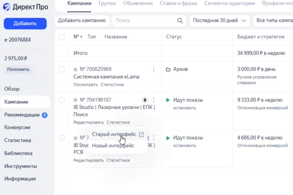
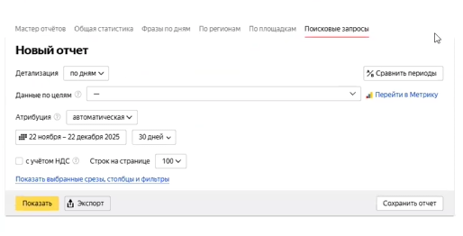
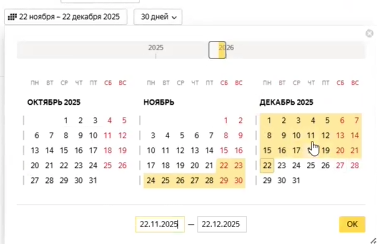
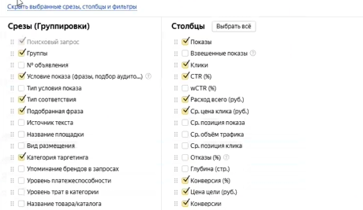
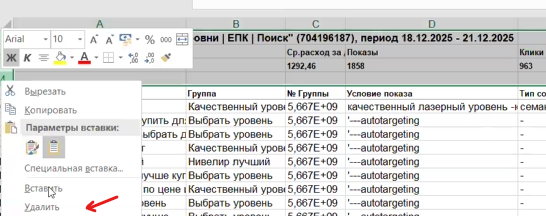
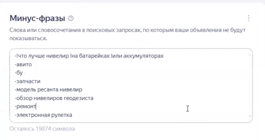

Регулярная оптимизация рекламных кампаний проводится один или два раза в неделю. Основная задача данного процесса -- отсеять нецелевой трафик, добавив неподходящие запросы в минус-фразы.

### 1\. Выгрузка поисковых запросов

-  Перейдите в старый интерфейс системы в раздел «Поисковые запросы».

{width=482px height=320px}

{width=514px height=262px}

-  Выберите необходимый период анализа: если последняя чистка была в четверг, выбирайте период с четверга по воскресенье, а в следующий раз -- с понедельника по среду или четверг.

{width=377px height=244px}

-  Дополнительные настройки в интерфейсе можно не менять, так как цель -- собрать общую массу нецелевых фраз.

{width=460px height=267px}

-  Выгрузите полученные данные в Excel-файл через кнопку «Экспорт».

-  Удалите в таблице лишние строчки и расширьте столбцы для более удобной работы с текстом.

{width=546px height=216px}

### 2\. Принципы анализа запросов

-  Откройте текстовый документ (блокнот), куда будете вписывать найденные минус-фразы.

-  Если смысл какого-либо запроса вам непонятен, обязательно проверьте, что именно он означает.

-  Сверьтесь с вашей посадочной страницей или статьей, чтобы убедиться, упоминаются ли там параметры из запроса.

-  Если после проверки запрос все еще кажется сомнительным или непонятным, лучше его исключить: безопаснее немного ограничить целевой трафик, чем привести на сайт нецелевую аудиторию.

-  Не переживайте, если в вашем блокноте будут повторяющиеся слова -- алгоритм системы самостоятельно исключит дубли при сохранении.

### 3\. Какие фразы необходимо минусовать

-  Названия брендов-конкурентов и конкретных чужих моделей как на русском, так и на английском языке.

-  Запросы из других, даже смежных товарных категорий (например, «лазерная рулетка» или «дальномер», если вы продаете лазерный уровень).

-  Характеристики или габариты, которых нет у вашего товара (например, запрос «5Д», когда ваша модель «4Д», или «маленький», когда товар стандартного размера).

-  Запросы, указывающие на то, что человек уже купил товар: «инструкция», «ошибка», «как пользоваться», поиск ремонта и эксплуатации.

-  Поиск подержанных товаров или нерелевантного ценового сегмента (например, «б/у», «Авито» или «бюджетный», если ваш товар дорогой).

-  Коммерческие запросы, связанные с торговыми площадками, на которые вы не ведете трафик.

-  Слишком специфические и узкопрофильные термины (например, «мингус-реестр»), ответов на которые нет в вашей статье.

### 4\. Какие фразы нужно оставлять

-  Прямые синонимы вашего товара (например, «лазерный уровень» и «нивелир лазерный» означают одно и то же).

-  Точные характеристики вашей модели.

-  В некоторых случаях можно оставлять запросы с брендами конкурентов, если они есть в ваших статьях-рейтингах и приносят дополнительный трафик, но за стоимостью достижения цели по ним нужно внимательно следить.

### 5\. Добавление минус-фраз в систему

-  После того как вы пройдете весь список и соберете все неподходящие запросы в блокнот, перейдите в настройки рекламной кампании.

-  Добавьте весь скопившийся список именно на уровне настроек кампании в раздел минус-фраз.

{width=442px height=234px}

-  Нажмите кнопку сохранить. На этом процесс чистки завершен.