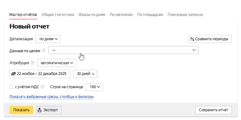
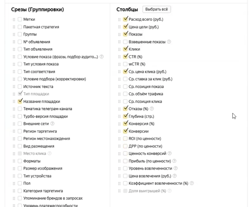
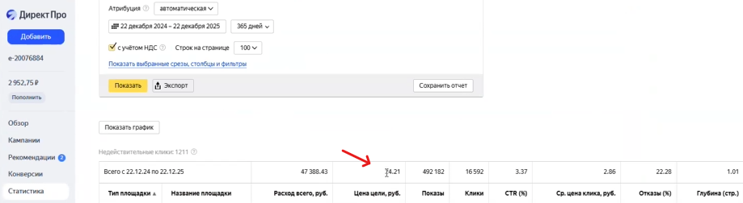
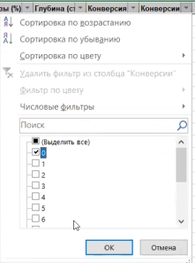
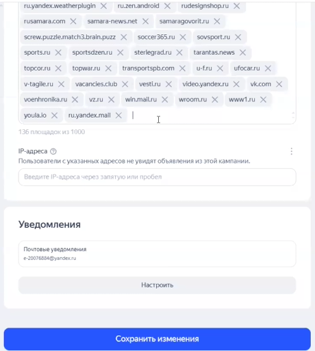

Данная инструкция описывает процесс чистки неэффективных площадок для рекламных кампаний, запущенных в РСЯ и ведущих трафик на статью.

### 1\. Выгрузка статистики

-  Откройте старый интерфейс системы (как и в случае с минус-фразами).

-  Выберите период действия кампании (весь период или хотя бы последний месяц).

{width=489px height=244px}

-  В настройках отчета выберите данные по целям и укажите соответствующую цель, например, `Клик по ibsid=23`.

-  Укажите расчет стоимости с учетом НДС за выбранный период.

-  Настройте нужные столбцы: название площадки, тип площадки, стоимость цели, расход и процент отказов. На первое место для удобства рекомендуется поставить стоимость цели и расход. Лишние столбцы необходимо убрать.

{width=496px height=408px}

{width=496px height=408px}

-  Нажмите кнопку «Показать» и экспортируйте полученный отчет в Excel.

### 2\. Подготовка файла к работе

1. Откройте скачанный Excel-файл.

2. Удалите все лишние строки в самом начале документа, чтобы они не мешали работе.

3. Установите фильтр на первую строку с заголовками столбцов.

### 3\. Отсев по слишком дорогим целям

-  Для начала определите среднюю стоимость цели за весь период (например, если средняя цена 24,21 руб., то допустимым порогом можно считать площадки со стоимостью цели до 30 руб.).

{width=919px height=252px}

-  Отфильтруйте площадки в таблице: скройте те, по которым достижений цели не было вообще.

-  Отсортируйте оставшиеся данные по убыванию цены достижения цели.

-  Найдите все площадки, где стоимость цели превышает допустимый порог (например, выше 30 руб.) -- их необходимо исключить. Выпишите их в блокнот или сразу добавляйте в настройки на уровне кампании.

-  Удалите площадки из списка в excel документе.

### 4\. Отсев по высокому расходу без конверсий

-  Сбросьте предыдущие фильтры в столбцах.

-  Теперь отфильтруйте данные так, чтобы остались только те площадки, по которым достижений цели не было.

{width=221px height=297px}

-  Сделайте сортировку по убыванию расхода.

-  Исключите площадки, расход по которым превысил стоимость допустимой конверсии (например, потрачено более 30 руб., но ни одного целевого действия не произошло).

### 5\. Отсев по аномальным отказам

1. Снова сбросьте фильтры и сделайте отбор по показателю отказов, отсортировав данные по убыванию процента отказов.

2. Оцените репрезентативность выборки: если на площадке было всего 1–2 клика и 100% отказов, это допустимо (паре человек не подошел контент).

3. Подозрение должны вызывать те площадки, где зафиксирован высокий расход, достаточное для выводов количество кликов и при этом очень высокий процент отказов.

4. Нормальным считается показатель отказов примерно до 33%. Все площадки с плохим трафиком смело выписывайте в список на удаление.

### 6\. Добавление площадок в исключения

-  Перейдите в настройки рекламной кампании (именно на уровне самой кампании).

-  Опуститесь вниз страницы до раздела добавления запрещенных площадок и вставьте собранный список.

{width=460px height=513px}

-  При добавлении могут появляться системные ошибки -- это могут быть дубли площадок, неправильное написание или попытка заблокировать сервисы Яндекса (показы в самом Яндексе полностью исключить нельзя). Все ошибочные строки нужно вручную удалить из окна добавления.

-  Если площадки не добавляются и не отображаются в списке после сохранения, это означает, что они уже были добавлены в список исключений ранее.

-  После внесения всех неэффективных площадок нажмите кнопку сохранить. На этом процесс чистки завершен.