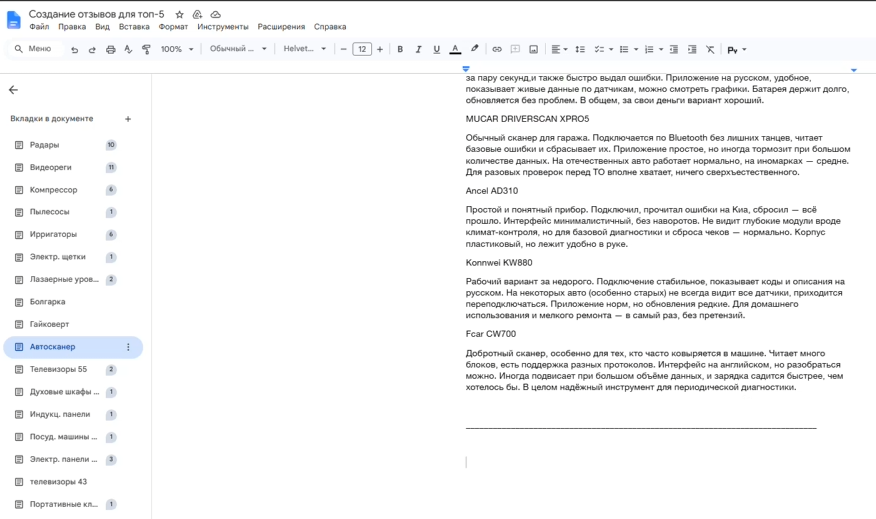
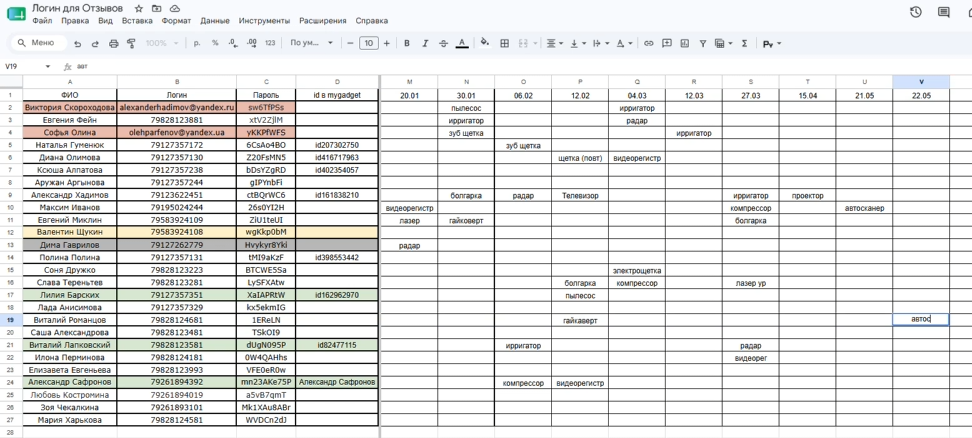
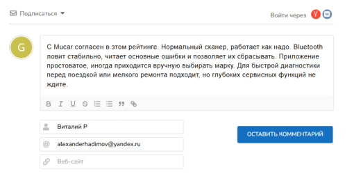
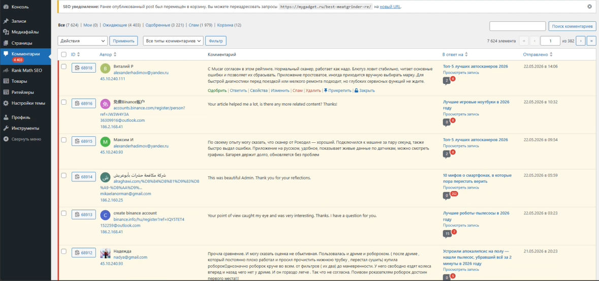
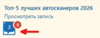
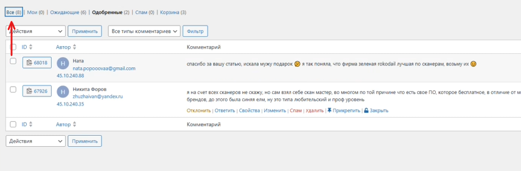
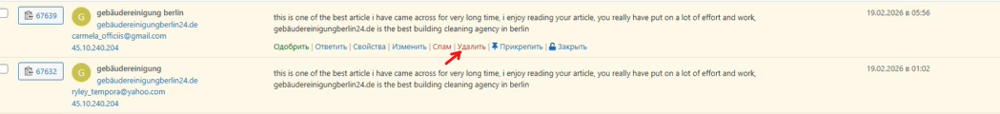

Данная инструкция описывает полный цикл работы с отзывами к статьям-рейтингам на сайте: от генерации черновиков до их самостоятельного одобрения в админке. Задачу необходимо выполнять **раз в неделю**, при этом дни и время публикаций желательно постоянно чередовать, чтобы активность выглядела естественно.

Актуальный список рейтингов, находящихся в работе, доступен в сводном файле (Google Docs).

{width=876px height=519px}

## Этап 1: Подготовка и генерация черновиков

Для оптимизации процесса рекомендуется делать черновики отзывов пакетами по 5–7 штук на будущее. Отзывы пишутся на **все** модели, представленные в рейтинге.

**Специфика контента и «очеловечивание»:**

1. **Модель заказчика:** Отзыв должен быть наиболее позитивным.

2. **Модели конкурентов:** Отзывы должны быть нейтральными. Необходимо подсвечивать некоторые слабые стороны товара, но делать это мягко, без резкой критики.

3. **Редактура нейросети:** После генерации текст обязательно нужно «очеловечить», чтобы он не казался искусственным. Следите за тем, чтобы объем отзыва не был слишком большим. Полезно переписать текст более простым языком и специально добавить пару легких опечаток, свойственных живым людям.

**Генерация через нейросети:** Используйте бесплатные варианты (например, Grok с включенным VPN или другие удобные вам нейросети). 

**Промпт (запрос) для нейросети:**

:::quote 

«Привет! Я продолжаю писать отзывы для рейтингов товаров на [mygadget.ru](http://mygadget.ru). Сейчас делаем отзывы на рейтинг *(указать категорию)*. Вот список моделей: *(перечислить модели)*. Нужно по 1 отзыву на каждую модель, один из них более позитивный (для *(указать модель заказчика)*), остальные -- нейтральные. Добавляем смайлики, живой стиль, лёгкие минусы. Примеров из прошлого чата у меня нет -- прошу сразу сформировать заново.»

:::

Все готовые черновики необходимо сохранять в специальный документ, где они распределены по папкам категорий «Топ-5».

## Этап 2: Поиск и скачивание визуала (фото/видео)

Отзывы преимущественно должны публиковаться с фотографиями. Визуал можно брать из реальных отзывов на маркетплейсе Ozon.

Так как прямое скачивание медиафайлов с Ozon сейчас заблокировано, используйте следующий алгоритм:

1. Откройте нужный отзыв с фото/видео на Ozon.

2. Нажмите правой кнопкой мыши по странице и выберите **«Просмотреть код»**.

3. Нажмите сочетание клавиш **Ctrl + F** для вызова строки поиска по коду.

4. Вбейте в поиск одну из ссылок: [`https://vr-1.ozone.ru`](https://vr-1.ozone.ru) или [`https://v.ozone.ru`](https://v.ozone.ru)

5. Найдите в коде подсвеченную ссылку на медиафайл, скопируйте её и вставьте в новую вкладку браузера.

6. На открывшемся видео или фото нажмите правую кнопку мыши и выберите **«Сохранить как...»**.

## Этап 3: Публикация отзывов на сайте

Блок для комментариев/отзывов находится в самом низу каждой страницы с рейтингом. Рекомендуется сначала раскидать подготовленные отзывы по всем нужным категориям (статьям), а уже потом переходить к их массовому одобрению.

**Алгоритм публикации:**

-  **Выбор аккаунта:** Откройте базу аккаунтов. Выберите подходящий никнейм (например, мужское имя для техники вроде автосканеров).

{width=972px height=438px}

-  **Фиксация использования:** В таблице над использованным никнеймом обязательно укажите текущую дату и категорию товара, на которую пишется отзыв. Это нужно, чтобы никнеймы не пересекались в одних и тех же категориях. Выделите эту запись цветом, чтобы сразу было видно, что аккаунт использовался.

-  **Заполнение формы:** Вставьте текст отзыва и имя. Электронную почту в форме отправки можно использовать одну и ту же, менять её каждый раз не обязательно.

{width=510px height=250px}

## Этап 4: Модерация и одобрение отзывов (Консоль)

Чтобы комментарии появились на сайте, их необходимо одобрить через административную панель.

-  Перейдите в консоль My Gadget (админка WordPress).

-  Откройте раздел **«Комментарии»**.

{width=1179px height=553px}

-  Найдите статью, в которой вы только что оставили отзывы, кликните на неё и выберите фильтр **«Все»**.

{width=144px height=55px}

-  Неодобренные комментарии будут подсвечены желтым цветом. Найдите свои отзывы и нажмите **«Одобрить»**.

{width=856px height=282px}

-  **Чистка спама:** Если в списке комментариев вы видите сторонние спам-рассылки или необоснованные негативные отзывы, их можно спокойно удалить (убрать).

{width=1049px height=120px}

-  Вернитесь на страницу со статьей и проверьте в самом низу, что ваши отзывы успешно опубликовались.