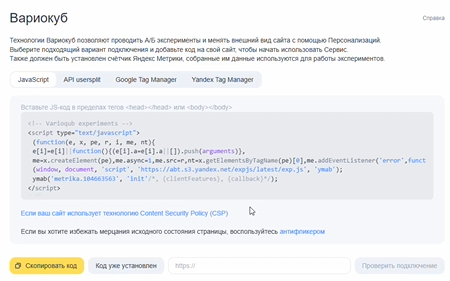
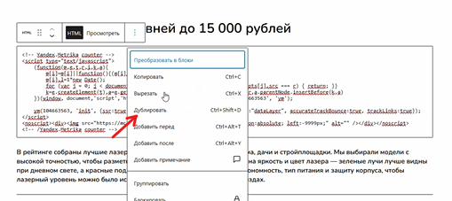
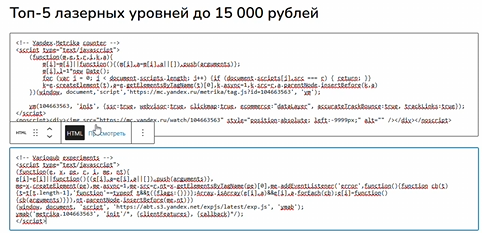
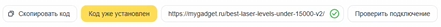
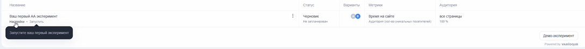
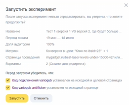
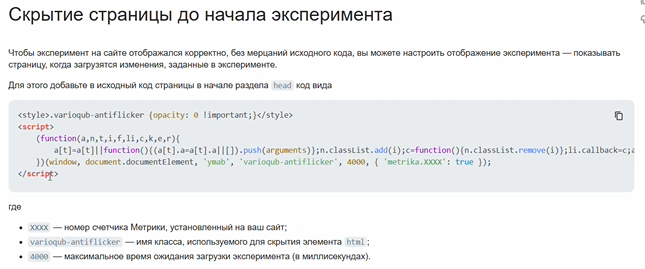
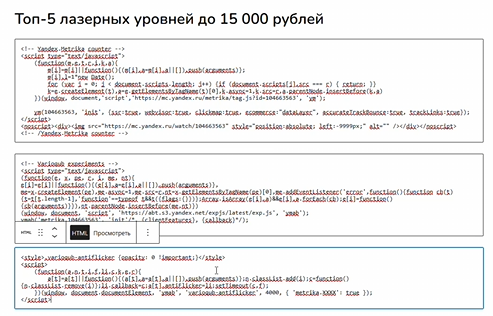

Данная инструкция описывает полный цикл настройки A/B-тестирования (по методу редиректа), при котором обе версии посадочной страницы работают через один счетчик Яндекс Метрики.

### 1\. Подготовка кампаний и кода

1. **Оставьте одну кампанию:** Отключите вторую рекламную кампанию, чтобы весь трафик шел только в рамках одной кампании на один основной счетчик.

2. **Найдите нужные страницы:** Определите страницы первой (основной) и второй (тестовой) версии статьи.

3. **Скопируйте код:** В Яндекс Метрике найдите и скопируйте код эксперимента Varioqub для нужного счетчика.

{width=450px height=281px}

### 2\. Установка счетчиков на обе версии страниц

Для корректного теста на обеих страницах должен стоять один и тот же код Метрики и один и тот же код Вариокуба.

-  Перейдите в админку сайта (например, MyGadget) и откройте первую версию страницы.

-  Добавьте HTML-блок и вставьте в него скопированный код Varioqub. Сохраните и проверьте работу ссылок.

{width=509px height=227px}

{width=482px height=233px}

```
                                 {width=441px height=27px}
```

-  Перейдите на вторую версию страницы и добавьте туда **абсолютно идентичный** код Varioqub.

-  Обязательно продублируйте код основного счетчика Метрики на вторую страницу, чтобы они работали в одной связке.

-  Проверьте обе страницы и убедитесь, что код установлен корректно.

   ### 3\. Настройка эксперимента в интерфейсе Varioqub

-  Создайте новый эксперимент и задайте понятное название (например: «Тест 1. Версия 1 vs Версия 2. Лучше конверсии и меньше визуальных отказов»).

{width=1088px height=92px}

[image:./podrobnaya-instrukciya-po-zapusku-a-b-testa-s-pom-6.png:::0,0,100,100:::357px:319px:left]

-  В настройках трафика установите равное распределение **50 на 50**.

-  Доля аудитории должна составлять **100%** (весь поступающий трафик будет делиться поровну).

-  Укажите период проведения эксперимента -- **1 месяц**.

-  Укажите страницы применения: вставьте ссылки на первую и вторую версии.

-  Регионы и платформы оставьте "все" (фильтрация аудитории происходит на уровне рекламных кампаний). Исключение поисковых роботов применять не нужно.

-  Измените базовую метрику «Время на сайте» на **«Конверсия в цели»**.

-  Выберите нужную цель (например, клик по элементу с уникальным идентификатором).

-  Добавьте метрику **«Доля визуальных отказов»**. В отличие от обычных отказов, она фиксирует отказ только в том случае, если страница успела визуально прогрузиться для пользователя.

-  Выберите тип эксперимента: **Редирект**. Это значит, что при открытии первой версии в 50% случаев система будет подставлять вторую.

-  В настройках ссылок для контрольного и тестового вариантов **удалите все символы до слеша (/)**. Например: [https://mygadget.ru](https://mygadget.ru/best-impact-wrench-for-garage/)[highlight:marine][/best-impact-wrench-for-garage/](https://mygadget.ru/best-impact-wrench-for-garage/).[/highlight] Синий фрагмент оставить.

### 4\. Синхронизация идентификаторов (ID) на второй странице

Чтобы цели корректно срабатывали на едином счетчике, идентификаторы кнопок/ссылок на тестовой странице должны совпадать с основной.

1. Откройте вторую версию страницы в админке.

2. Замените идентификаторы на те, что используются в первой версии (например, верните значение 23).

3. Обязательно проверьте и поменяйте ID в следующих местах:

   -  Сравнительные таблицы (могут открываться кодом, а не в визуальном редакторе).

   -  Товарные виджеты.

   -  SEO-версия статьи (например, с идентификатором 26), которая может находиться в самом низу страницы.

4. Сохраните изменения на странице.

### 5\. Установка кода Anti-flicker (Антимигание) и запуск

-  После сохранения настроек нажмите **«Сохранить и запустить»**.

{width=357px height=319px}

-  Система выдаст код **Varioqub Anti-flicker**, который нужен для того, чтобы подменная страница открывалась визуально корректно, без скачков. Нажмите на него и провалитесь на страницу с кодом.

{width=645px height=269px}

-  Создайте еще один HTML-блок на странице ниже предыдущих.

-  Вставьте туда код Anti-flicker. Обратите внимание: иногда требуется **вручную вписать номер счетчика** в этот код.

{width=493px height=316px}

-  Для надежности разместите этот код на обеих версиях страниц.

-  Сохраните страницы и нажмите **«Запустить»** в Varioqub.

-  Проверьте  отчет в Метрике, чтобы убедиться, что визиты и достижения целей фиксируются на обеих страницах.

:::quote 

**Важное примечание по лимитам:** Бесплатная версия Varioqub позволяет держать активными только 2 эксперимента одновременно. Поэтому для каждого нового проекта необходимо создавать отдельный счетчик Метрики на страницу, чтобы иметь возможность проводить тесты без ограничений.

:::

## 6\. Видео-урок можно посмотреть здесь.

[Ссылка](https://mygadget.bitrix24.ru/bitrix/tools/disk/focus.php?objectId=427078&cmd=show&action=showObjectInGrid&ncc=1)