## 1\. Работа с содержанием объявлений

### Формирование заголовков и текстов

-  **Соответствие семантике**: В первый заголовок (особенно на поиске) обязательно включается основное ключевое слово группы. Это подсвечивает запрос жирным шрифтом, повышает CTR и привлекательность объявления.

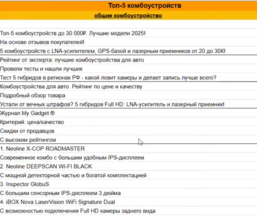{width=434px height=375px}

:::lab 

Например: если у нас название компании называется **«Топ-5 комбоустройств»**, то такое же сожержание должно быть и в **главном заголовке**. Тем временем слово **«комбоустройства»** должно быть **во всех** остальных заголовках статьи.

:::

-  **Подходы к текстам**:

   -  ***Прямой информационный***: Прямое описание темы статьи (например, «Рейтинг комбоустройств 2025»).

   -  ***Через боль или проблему***: Указание на боли пользователя, которые решает товар (например, экономия на штрафах).

   -  ***Авторитет***: Упоминание реальных тестов (например, «Тест 5 гибридов в регионах РФ»).

   -  ***Через экономию и рациональность***: Акцент на соотношении цены и качества или советы, как не переплатить.

   -  *Сегментация по цене*: Указание ценового диапазона товаров в рейтинге (например, «от 20 до 30 тысяч рублей»).

   -  *Новостной:* Используется редко, работает не всегда, можно тестировать на вновь запускаемых категориях. "(например, «Названы самые покупаемые в России смартфоны за 2025 год»).

:::info 

**Критерии выбора**: В тексте объявления (минимум в одном варианте) следует перечислять технические характеристики, по которым отбирались модели для статьи.

:::

### Дополнительные элементы

-  **Дополнительный заголовок**: Используется для подтверждения качества подборки короткими фразами: «на основе отзывов», «по мнению эксперта», «проверили все отзывы».

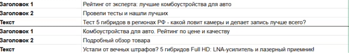{width=572px height=88px}

-  **Уточнения**: Короткие фразы о качестве товара, высоком рейтинге или упоминание журнала MyGadget с специальным значком.

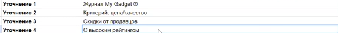{width=575px height=57px}

-  **Быстрые ссылки**:

   -  Должны содержать названия моделей с кратким описанием из статьи.

      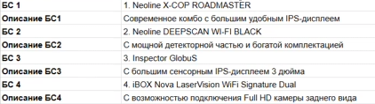{width=422px height=118px}

   -  Включают дополнительные варианты с популярными запросами: например «отзывы», «характеристики», «критерии выбора».

   -  Ссылаться для описания БС можно на блоки в статье - «критерии выбора моделей», «сравнительная таблица».

---

## 2\. Техническая настройка кампаний

### Настройка на уровне компании

-  **Объект продвижения:** Выберите ссылку на нужную нам статью

{width=405px height=271px}

-  **Организация:** выбираем MyGadget из списка. Нам не обязательно иметь права доступа для показа объявлений от имени компании.

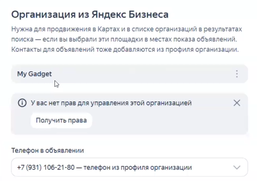{width=425px height=300px}

-  **Места показа:** базовой выбираем продвижение в поисковой выдаче и динамические места на поиске. Со временем можно делать вывод об эффективности мест показа и решать - оставлять то или иное место или нет.

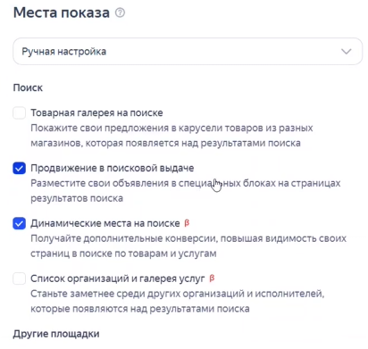{width=412px height=391px}

-  **Стратегия:** **Обычная.** Пакетную можно использовать только в некоторых случаях, когда запущенно несколько рекламных компаний. 1 компания - на поиск, 1 компания - на РСЯ.

 Базово используется **«Максимум конверсий»** с оплатой за клики. Максимум кликов - использовать как экспериментальную стратегию, если эффективность нас не устраивает.

-  **Расчет бюджета**: Для нового проекта стандартный бюджет -- 60 000 руб./мес. с НДС.

   -  Сначала сумма делится на 1.2 (убирается НДС)

   -  Затем рассчитывается недельный лимит - делим сумму без НДС на кол-во дней и умножаем на 7

   -  Соотношение расхода Поиск / РСЯ составляет 2 к 1 - полученную за неделю сумму делим на 3 и умножаем на 2 - получится бюджет на Поиск. Для РСЯ умножать на 2 не надо.

-  **Ограничения расхода:** Средняя цена конверсии

-  **Цена конверсии**: Оптимальное значение -- 30 рублей (может быть выше для дорогих категорий).

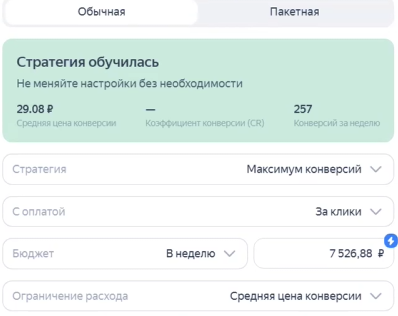{width=398px height=316px}

{width=410px height=132px}

-  **Счетчик Метрики**: Основные счетчики создаются на агентском аккаунте `ib-studioadv`, на рабочий аккаунт выдается доступ для редактирования.

-  Как выдать доступ для редактирования: Перейти в настройки - счетчик - доступ. 

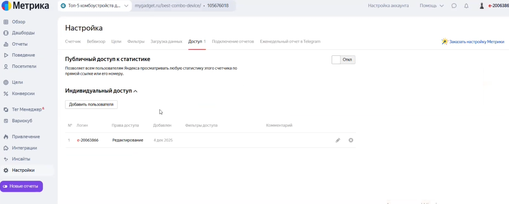{width=1160px height=464px}

Нажать добавить пользователя - в правах выбрать «Редактирование».  Указать логин и нажать кнопку «Добавить». 

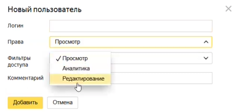{width=397px height=186px}

После этого счетчик появится в Яндекс Директе и его можно спокойно выбрать в стратегии.

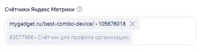{width=409px height=106px}

-  **Срок проведения кампании:** Не ограничиваем.

-  **Расписание показов:** Если нет специфических пожеланий - ставим каждый день, круглосуточно.

-  **Параметры URL:** UTM метки используем только на уровне компании.

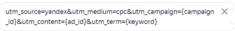{width=390px height=52px}

-  **Дополнительные элементы объявлений:** выставляются на уровне объявлений.

-  **Автоматизация**: Отключается автоматическое применение рекомендаций и оптимизация текстов под запрос (для чистоты оценки результатов).

-  **Безопасность**: Обязательно включается мониторинг сайта, чтобы трафик останавливался при сбоях.

### Дополнительные настройки

-  **Минус-фразы**: Добавляется список слов, собранных на этапе семантики.

-  **Включаем мониторинг сайта - обязательно!**

-  **Расширенный географический таргетинг:** можно, но не обязательно.

### Настройка на уровне группы

-  **География**: Вся Россия за исключением Республики Крым. Всегда учитываются исключения по регионам из брифа клиента.

-  **Сценарий группы:** Вся заинтересованная аудитория.

-  **Автотаргетинг**: На старте выбираются только «целевые» и «узкие» запросы. Бренды -- с упоминанием своего и без упоминания бренда вообще.

-  **Тематические слова:** добавляем запросы из ранее собранной семантики по группам.

### Настройка на уровне объявления

-  Добавляем ссылку на нужную нам статью.

-  Обязательно добавляем отображаемую ссылку (например: топ-комбоустройства). 

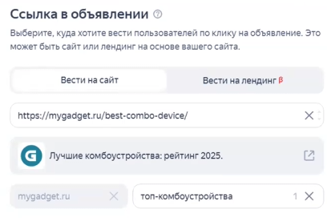{width=408px height=272px}

При добавлении отображаемой ссылки объявление выгладит более привлекательно.

{width=213px height=129px}

-  **Тексты:** вставляем содержание, которое мы ранее создавали в таблице.

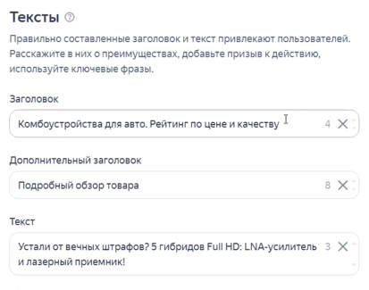{width=413px height=325px}

-  **Кнопка**: можно поэксперементировать - базово «Узнать больше». Ссылку дублируем из блока - «ссылка в объявлении».

-  **Уточнения:** добавляем из ранее составленной таблицы.

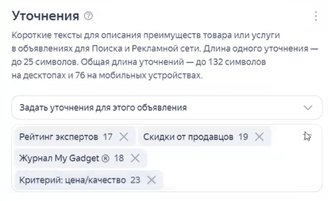{width=413px height=253px}

-  Быстрые ссылки: добавляем из ранее составленной таблицы. Во всех быстрых ссылках мы ведем на первую модель в рейтинге. 

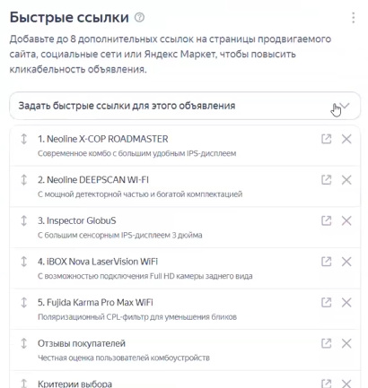{width=410px height=433px}

:::info 

**Важно**: Ссылки на модели должны вести на конкретный текст в статье через функцию «ссылка на выделенный текст». Все быстрые ссылки должны вести на товар клиента (первое место), либо разделяться между товарами клиента, если их несколько.

:::

-  Проверяем стоит ли галочка - Автоматически формировать описание для передачи в ЕРИР.

---

## 3\. Специфика РСЯ (Сети)

-  **Бюджет:** последнюю сумму не умножаем на 2, оставляем как есть.

-  **Промо-акция:** Смотрим какие ссылки, которые предоставили заказчики. Если есть скидка - можем добавить промоакцию со скидкой равной той, которая находится по ссылке. В описании акции вставьте ту площадку, которая предоставляет скидку. 

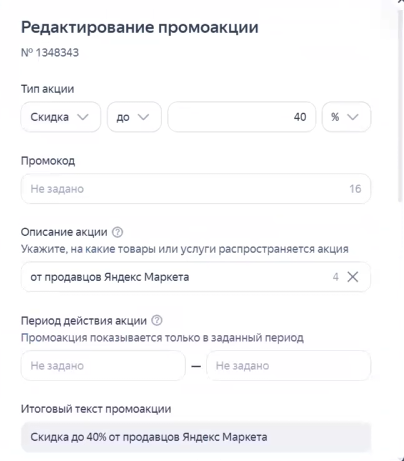{width=404px height=461px}

-  Со временем делаем выводы, какие площадки не актуальны и добавляем их в блок **«Запрет показов»** в раздел «площадки» на уровне настроек компании.

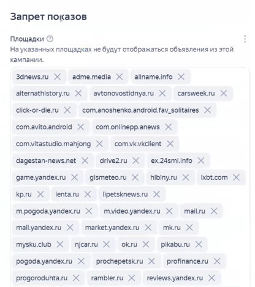{width=416px height=469px}

-  **Интересы и привычки:** на старте не используем - но со временем, можем использовать для расширения аудитории РСЯ.

-  **Визуал**: Предпочтительны «пользовательские» фото или живые снимки без агрессивной инфографики. Можно использовать обложки статьи, где видны сразу несколько товаров.

{width=410px height=319px}

-  **Карусель**: Можно добавить фото всех моделей из рейтинга, но рекомендуется скрывать названия конкурентов, чтобы не повышать их узнаваемость.

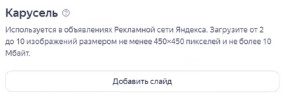{width=407px height=141px}

:::lab 

Все остальное - аналогично предыдущим настройкам.

:::