*Время прочтения - 15 мин. Норма выполнения - 90 мин.*

:::tip 

Перед началом работы найдите задачу, где есть подробности по брифу, ссылка на страницу на которой размещена статья.

:::

## 1\. Установка счетчика Яндекс.Метрики

Перед настройкой целей необходимо создать счетчик и интегрировать его в код страницы на WordPress.

[image:./ustanovka-schetchika-i-podgotovka-yatm-2.png:::0,0,100,100:92::731px:313px:center]

[image:./ustanovka-schetchika-i-podgotovka-yatm-3.png:::0,0,100,100:93::969px:312px:center]

**1\. Выбор аккаунта**: Убедитесь, что вы работаете под аккаунтом **ADV** (с него запускаются все проекты «Топ-5»).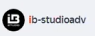{width=95px height=36px}

**2\. Нажмите кнопку «Добавить счетчик»**, если создаете новый.

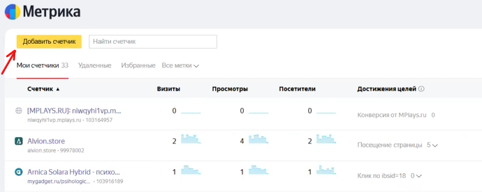{width=690px height=276px}

**3\. Создание счетчика**:

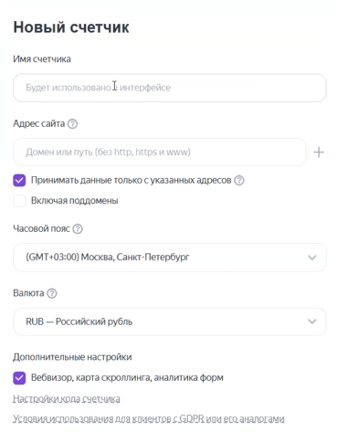{width=369px height=473px}

-  **Имя**: Дайте название по заголовку статьи (например, *«Топ-5 портативных колонок до 15 000 ₽»*). Если версий статьи несколько, добавляйте «версия 1», «версия 2».

-  **Адрес**: Укажите URL страницы без протокола (https://).

-  **Настройки**: Включите **Вебвизор** и карту скроллинга.

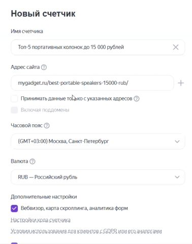{width=378px height=481px}

Нажмите **«Продолжить»** и после этого вы увидите страницу с кодом счетчика.

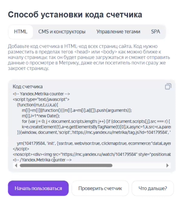{width=366px height=407px}

**4\. Установка кода на сайт**:

-  Скопируйте полученный код счетчика.

-  Перейдите в консоль WordPress нужной страницы.

-  Добавьте блок **«Произвольный HTML»** в самое начало страницы и вставьте туда код.

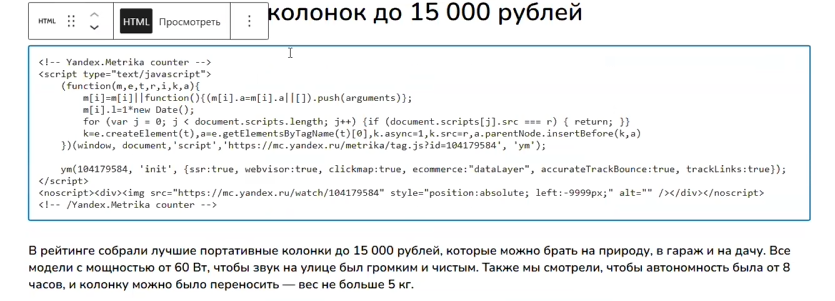{width=835px height=301px}

-  Сохраните страницу.

-  Перейдите обратно на страницу с кодом счетчика и нажмите «Начать пользоваться».

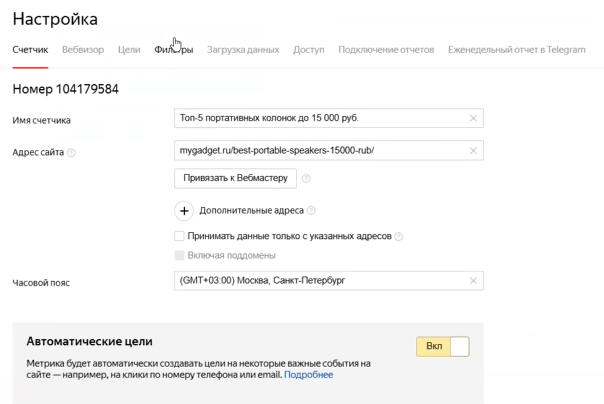{width=604px height=404px}

Вас перекинет на страницу настройки счетчика.

-  **Отключите автоматические цели**, так как мы будем делать свои.

-  **Отключите электронную коммерцию**.

-  **Активация тег-менеджера**: В настройках счетчика обязательно включите галочку **«Тег-менеджер»** и подпункт **«Пользовательский HTML»**, иначе корректная настройка будет невозможна.

После того, как внесли все настройки, пролистайте страницу вниз и сохраните их.

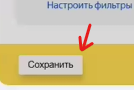{width=134px height=90px}

-  Выше кнопки сохранения находится блок проверки счетчика. Нажмите «Проверить».

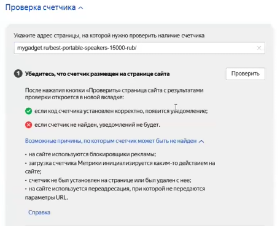{width=456px height=369px}

-  Вас перекинет на сайт со статьей. Дождитесь уведомления с подтверждением работы счетчика.

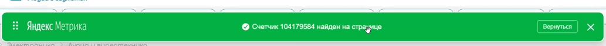{width=1033px height=80px}

Если зеленая строчка не появляется - значит счетчик не установился.

---

## 2\. Настройка главных целей в Метрике

Для корректной оптимизации рекламы требуется создать цель на клик по уникальному идентификатору клиента.

[image:./ustanovka-schetchika-i-podgotovka-yatm-14.png:::0,0,100,100:76::722px:430px:center]

**1\. Определение IBS ID**: Выясните последний свободный номер идентификатора (например, `ibsid=20`).

**2\. Создание цели на клик**:

-  Тип условия: **JavaScript-событие**.

-  Идентификатор цели: Впишите ваш номер (например, `ibsid=20`).

-  **Важно**: Скопируйте сгенерированный код цели для дальнейшего использования в тег-менеджере. (Можете создать отдельный документ или заметки в Битрикс24)

-  Нажмите «Добавить цель».

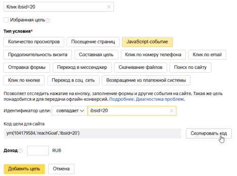{width=468px height=348px}

**3\. Базовая цель**: Сразу создайте цель типа **«Посещение страницы»**, указав URL статьи.

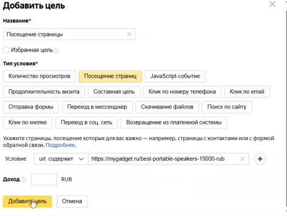{width=473px height=356px}

---

## 3\. Настройка Яндекс.Тег-менеджера (ЯТМ)

:::info 

ЯТМ используется для автоматической фиксации кликов по ссылкам, содержащим ваш IBSID.

:::

### Шаг А: Создание тега

-  Перейдите в раздел «Тег-менеджер» в настройках счетчика.

Иногда настройка тегов может быть не доступна так как требуется хотя бы 1 посещение сайта по счетчику. Зайдите на страницу, чтобы был засчитан 1 просмотр.

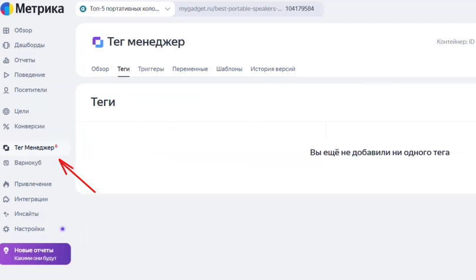{width=809px height=476px}

-  Создайте новый тег нажав на кнопку «Добавить тег» (название: *«ibsid=20»*).

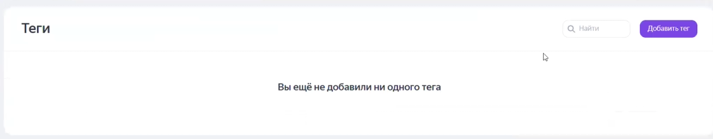{width=1037px height=203px}

-  **Тип тега**: Шаблон **«Пользовательский HTML»**.

-  **Код тега**: Используйте специальный шаблон, вставив внутрь код цели из Метрики.

   -  Код должен быть обернут в теги `<script> ... </script>`.

Например:

```
<script> 
  ym(104120813,'reachGoal','ibsid=19') 
</script>
```

{width=569px height=398px}

-  **Привязка**: В нижней части настроек тега привяжите созданный  триггер.

### Шаг Б: Создание триггера

1\. Перейдите в раздел «Тег-менеджер» в настройках счетчика.

2\. Создайте новый триггер (название: *«Клик по ibsid=20»*).

-  **Тип условия**: «Клики - только ссылки».

-  **Условие активации**: Выберите переменную `URL`, условие **«содержит»** и значение вашего ID (например, `ibsid=20`).

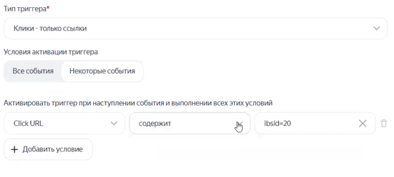{width=554px height=249px}

-  Вернитесь в тег и привяжите триггер, который только что сделали.

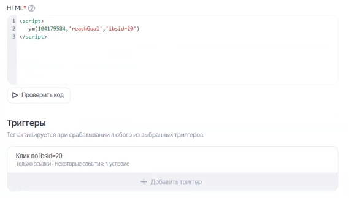{width=569px height=323px}

-  Обязательно **сохраните** изменения.

### Шаг В: Публикация

-  Нажмите кнопку **«Запустить»**, а затем **«Опубликовать»**.

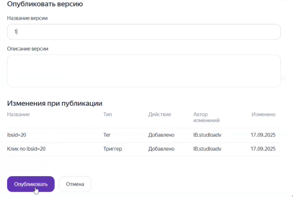{width=1026px height=201px}

{width=463px height=382px}

[image:./ustanovka-schetchika-i-podgotovka-yatm-21.png:::0,0,100,100:62::578px:390px:center]


:::info 

**Помните**: Любые изменения в ЯТМ не вступят в силу на сайте, пока вы не опубликуете новую версию контейнера.

:::

---

## 4\. Проверка и дальнейшие действия

1. **Внедрение ссылок**: После настройки аналитики необходимо заменить все ссылки клиента в статье на ссылки, содержащие `ibsid=20`.

2. **Тестирование**: Перейдите в статью и сами кликните по ссылкам клиента несколько раз.

3. **Контроль**: Через несколько часов проверьте Метрику -- в отчетах должны появиться данные по цели «`ibsid=20`». Если данные не отображаются, проверьте, был ли опубликован контейнер в ЯТМ.